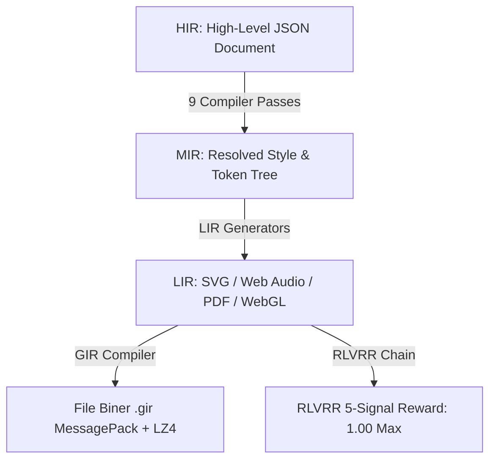

# Genesis Intermediate Representation (GIR) v1.0
## Platform TypeScript Monorepo Lintas-Domain untuk Representasi Aset Kreatif

[](#)
[](#)
[](#)

**Genesis Intermediate Representation (GIR) v1.0** adalah platform representasi data aset kreatif multi-domain yang tangguh, terstandardisasi, dan dirancang khusus untuk kolaborasi tanpa hambatan antara manusia desainer dan **Agen AI Generatif**. 

Proyek ini dibangun menggunakan arsitektur monorepo modular berkecepatan tinggi, menjamin integritas data kreatif melalui penjaminan tipe TypeScript yang ketat (`strict: true`), dan diverifikasi penuh oleh pengujian otomatis berbasis **TDD (Test-Driven Development)** dengan standar cakupan pengujian (test coverage) tinggi (≥ 80%).

---

## Pilar Utama Arsitektur

Genesis IR memadukan lima inovasi arsitektur mutakhir untuk memproses, mensinkronisasikan, mengamankan, dan menilai kualitas aset kreatif:



### 1. Pipeline Kompilasi 3-Level (HIR → MIR → LIR)
Transformasi data kreatif mengalir melalui tiga tingkat representasi:
*  **HIR (High-level IR)**: Representasi JSON ramah manusia/agen AI yang menampung deklarasi kasar dan token gaya.
*  **MIR (Mid-level IR)**: Pohon objek tervalidasi dengan style terhitung (resolved) dan dependensi terikat.
*  **LIR (Low-level IR)**: Kode/instruksi spesifik platform target untuk eksekusi visual (SVG), cetak (PDF/X), audio (Web Audio Graph), atau 3D (WebGL).

### 2. 9 Compiler Passes Sekuensial (Pass 0–8)
Proses transformasi dipisahkan secara modular ke dalam 9 pass kompilasi kaku:
1. **Pass 0**: Schema Pre-Validation (AJV validator)
2. **Pass 1**: Structural Audit & Normalization (`max_tree_depth: 64`)
3. **Pass 2**: Style Cascade & Token Resolution (Prioritas: inline → component → theme → brand)
4. **Pass 3**: Semantic Engine & Constraint Validation
5. **Pass 4**: Spatial Layout & Grid Computation (Flexbox & Grid layout)
6. **Pass 5**: Temporal Resolution & Automation Easing (Bar/beat to ms conversion)
7. **Pass 6**: Asset Binding & Binary Extraction (`asset://` URI scheme)
8. **Pass 7**: LIR Generation (Platform target dispatcher)
9. **Pass 8**: Serialization & Provenance Stamping (`x_debug` metadata)

### 3. Kolaborasi Multi-Agen Berbasis Loro CRDT (Rust + WASM)
Menjamin sinkronisasi dokumen waktu nyata tanpa konflik antara banyak peer menggunakan **Loro CRDT**:
*  Mutasi atomik terstruktur melalui instruksi **`IRDelta`** (`add`, `remove`, `replace`, `move`).
*  Resolusi konflik otomatis berbasis Last-Write-Wins (LWW).

### 4. Format Biner `.gir` & Strategi Migrasi Deklaratif
*  **Storage Efisien**: Payload dikompresi menggunakan kompresi **LZ4 block** super cepat dan diserialisasi via **MessagePack**.
*  **Integritas & Proteksi**: Header biner kaku 64-byte dilengkapi dengan SHA-256 Checksum 96-bit untuk mendeteksi manipulasi ilegal.
*  **Migrasi Aman**: Perubahan skema dikelola secara deklaratif menggunakan **5 Operator Migrasi** (`rename_field`, `remove_field`, `add_field`, `change_type`, `restructure`) yang mendukung rollback otomatis jika gagal di tengah jalan.

### 5. Gated RLVRR Reward Signal Chain
Rantai penilaian kualitas keluaran model AI secara bertahap (gated) dengan pembobotan sekuensial tetap:

$$\text{Total Reward} = 0.40 \cdot \text{Schema}(S_1) + 0.25 \cdot \text{Brand}(S_2) + 0.20 \cdot \text{Render}(S_3) + 0.10 \cdot \text{Budget}(S_4) + 0.05 \cdot \text{Semantik}(S_5)$$

*  Mendukung mekanisme **short-circuit** (jika gerbang awal gagal, evaluasi selanjutnya tidak akan diproses untuk menghemat daya komputasi).

---

## Struktur Paket Monorepo

Proyek ini terbagi menjadi 7 paket modular di dalam direktori `packages/`:

*  **`@genesis/types`**: Kontrak antarmuka (interfaces), tipe data statik, enum domain, dan konstanta kaku.
*  **`@genesis/schema`**: Skema validasi JSON Schema Draft 7, parser AJV, audit aksesibilitas, dan evaluasi semantik (Pass 0 & Pass 3).
*  **`@genesis/compiler`**: Otak kompilator pipeline (Pass 1 s.d 8), serialisasi `.gir` biner, LZ4 compressor, sistem migrasi, dan rantai reward RLVRR.
*  **`@genesis/renderer`**: Mesin layout spatial, text reflow engine, dan penghasil representasi visual/audio tingkat rendah (LIR).
*  **`@genesis/agent`**: Runtime eksekusi agen AI Generatif, kapabilitas `IRAgentContract`, log append-only `actions_taken`, dan ACL plugin.
*  **`@genesis/crdt`**: Integrasi library Loro CRDT Rust/WASM untuk rekonsiliasi peer kolaboratif.
*  **`@genesis/sdk`**: Software Development Kit terpadu sebagai pintu gerbang aplikasi pihak ketiga berinteraksi dengan pipeline Genesis IR.

---

## Memulai Cepat (Quick Start)

### Prasyarat
*  **Node.js**: Versi v18 ke atas (Direkomendasikan v20 LTS).
*  **pnpm**: Pustaka manajemen paket (versi 8 atau 9).

### Instalasi & Persiapan Workspace
Kloning repositori dan pasang seluruh dependensi monorepo secara otomatis menggunakan `pnpm`:
```bash
# Pasang dependensi
pnpm install

# Lakukan inisiasi kompilasi TypeScript (Build) seluruh paket
pnpm build
```

### Menjalankan Unit Pengujian (TDD)
Proyek ini mengunci aturan ketat cakupan pengujian minimal 80% sebelum diperbolehkan commit:
```bash
# Jalankan seluruh unit test (Vitest) secara penuh
pnpm test

# Periksa persentase cakupan pengujian (Test Coverage)
pnpm test:coverage
```

---

## Pusat Dokumentasi Teknis (`docs/`)

Untuk referensi mendalam mengenai implementasi masing-masing komponen, silakan baca dokumentasi teknis di direktori `docs/`:

*  **Pilar Arsitektur Core**:
  *  [Spesifikasi Pipeline & Passes Compiler](docs/architecture/pipeline-overview.md)
  *  [Sistem Cascade Gaya & Token Desain](docs/architecture/style-cascade-tokens.md)
  *  [Spatial Layout & Text Reflow Engine](docs/architecture/layout-reflow-engines.md)
  *  [Observability, Telemetry & Jejak Audit](docs/architecture/observability-profiling.md)
*  **Pilar 17 Spesifikasi Domain**:
  *  [Domain Vektor Visual & Cetak Cetakan Fisik](docs/domains/visual-and-graphic.md)
  *  [Domain Dokumen Paragraf & Diagram Relasional](docs/domains/document-and-diagram.md)
  *  [Domain Musik DAW & Sintesis Audio](docs/domains/music-and-audio.md)
  *  [Domain Game Sprite & Piksel Art](docs/domains/pixel-art-spec.md)
  *  [Domain Pembuatan & Metrik Font OpenType](docs/domains/font-design-spec.md)
  *  [Domain Mockup & Rendering WebGL 3D](docs/domains/mockup-3d-spec.md)
*  **Pilar Kolaborasi & Sistem Keamanan Agen**:
  *  [Rantai Sinkronisasi Loro CRDT Rust/WASM](docs/agent/loro-crdt-sync.md)
  *  [Runtime Agen AI Generatif & Kontrak Tugas](docs/agent/runtime-and-contracts.md)
  *  [Keamanan Plugin, ACL, & Token Rahasia](docs/agent/plugin-acl-security.md)
  *  [Pendaftaran 9 Built-in Tools Permanen](docs/agent/builtin-tools.md)
*  **Pilar Penyimpanan Biner & Pelatihan Reward**:
  *  [Format File Biner .gir & LZ4 Compression](docs/binary_rlvrr/gir-binary-format.md)
  *  [Skema Migrasi Deklaratif & Sistem Rollback](docs/binary_rlvrr/migration-guide.md)
  *  [Rantai Reward Gated RLVRR Model AI](docs/binary_rlvrr/rlvrr-reward-signals.md)

---

*Genesis IR Specification v1.0 — README.md* 
*Metodologi: Test-Driven Development (TDD) + Incremental Review-Driven Development*
