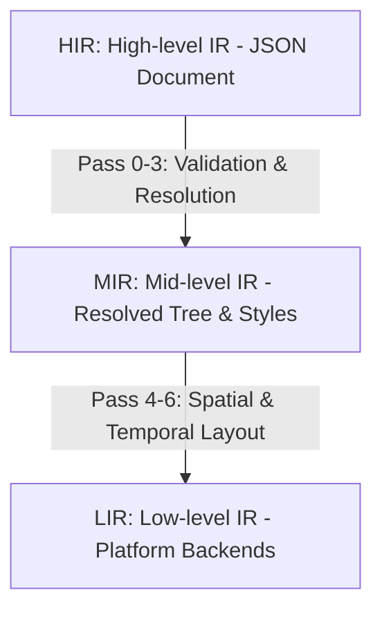

# Spesifikasi Compiler Pipeline & Passes
## Genesis IR v1.0 — Panduan Arsitektur Core

> [!NOTE]
> `@stability STABLE`
> Halaman ini mendokumentasikan spesifikasi implementasi pipeline kompilasi 3-level dan 9 pass kompilasi utama repositori Genesis IR.

---

## 🏛️ Arsitektur Pipeline 3-Level

Genesis IR menggunakan arsitektur kompilasi bertingkat (3-level AST) untuk memastikan fleksibilitas representasi lintas platform dan efisiensi eksekusi.

### 1. High-level IR (HIR)
- **Karakteristik**: Representasi berbasis dokumen JSON yang dideklarasikan langsung oleh desainer atau agen AI. Berisi deklarasi style token kasar, koordinat relatif, dan referensi aset abstrak.
- **Validasi**: Diperiksa oleh `validateHIR` menggunakan JSON Schema Draft 7 dan parser AJV.

### 2. Mid-level IR (MIR)
- **Karakteristik**: Struktur pohon di mana seluruh referensi token style (e.g. `theme://colors.primary`) telah terpecahkan menjadi nilai warna hex/RGBA/CMYK konkret, layout constraint terhitung, dan dependensi aset terverifikasi.

### 3. Low-level IR (LIR)
- **Karakteristik**: Representasi spesifik platform target (SVG untuk web, PDF/X untuk print, Audio Node Graph untuk Web Audio API, Buffer 3D WebGL).

---

## ⚙️ Spesifikasi 9 Compiler Passes (Pass 0–8)

Proses transformasi dari HIR ke LIR wajib melalui **9 pass kompilasi sekuensial** tanpa perkecualian:

### 1. Pass 0: Schema Pre-Validation (Sanity Check)
- **Tujuan**: Memastikan dokumen dasar memiliki `ir_id` UUID v4 valid, `meta.domain` terisi, dan tipe schema sesuai spec.
- **Modul**: `validateHIR()` di `@genesis/schema`.

### 2. Pass 1: Structural Audit & AST Normalization
- **Tujuan**: Memetakan struktur `objects` ke layout tree, menormalisasi tipe data default, dan memastikan batas tree depth (max 64) dipatuhi.
- **Aturan**: Keputusan #24 (`max_tree_depth: 64`).

### 3. Pass 2: Style Cascade & Token Resolution
- **Tujuan**: Menghitung cascade dari inline override ke level brand profile dan meresolusi semua token `theme://` dan `brand://`.
- **Aturan**: Keputusan #01 (cascade order: inline → component → global theme → brand profile).

### 4. Pass 3: Semantic Engine & Constraint Validation
- **Tujuan**: Validasi aturan semantik spesifik domain, deteksi siklus diagram, dan pencocokan parameter domain (e.g., sample rate audio, units per em font).
- **Modul**: `runPass3()` di `@genesis/schema`.

### 5. Pass 4: Spatial Layout & Grid Computation
- **Tujuan**: Menghitung posisi absolut piksel untuk koordinat spatial desimal menggunakan Flexbox/Grid parser.
- **Unit**: Digital (`px`), Cetak (`mm`/`pt`).

### 6. Pass 5: Temporal Resolution & Automation Easing
- **Tujuan**: Menghitung keyframe interpolation dan konversi unit timeline temporal (e.g., beat/bar ke milidetik berdasarkan BPM).
- **Aturan**: Keputusan #12 (beat/bar to ms conversion).

### 7. Pass 6: Asset Binding & Binary Extraction
- **Tujuan**: Mengambil biner dari `asset://` URI scheme, memeriksa checksum SHA-256 aset, dan memuatnya ke runtime buffer.
- **Aturan**: Keputusan #34 (wajib prefix `asset://` untuk aset eksternal).

### 8. Pass 7: LIR Generation (Target Dispatcher)
- **Tujuan**: Menghasilkan instruksi tingkat rendah (Low-level IR) spesifik platform (seperti representasi grafis SVG, Master page print, atau Web Audio Nodes).

### 9. Pass 8: Serialization & Provenance Stamping
- **Tujuan**: Mengompresi LIR ke format biner `.gir` terkompresi LZ4, mengisi profil observability kinerja, dan membubuhkan data provenance debug `x_debug`.
