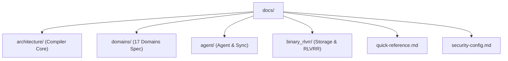

# Rencana Implementasi Dokumentasi Teknis — Genesis IR v1.0
## Peta Jalan & Arsitektur Dokumentasi Berbasis Markdown (.md)

Dokumen ini menyusun rencana pembangunan sistem dokumentasi teknis yang komprehensif, terstruktur, dan ramah bagi pengembang (human developer) maupun agen AI pendamping (AI coding agents) di workspace **Genesis Intermediate Representation (GIR) v1.0**.

---

## Arsitektur Direktori `docs/`

Struktur dokumentasi dirancang menggunakan pendekatan **Empat Pilar (Four Pillars of Docs)** untuk memisahkan konsep tingkat tinggi, spesifikasi API, referensi domain, dan instruksi operasional.

---

## Rencana Peta Konten & Berkas `.md`

### 1. `docs/architecture/` — Core Pipeline & Compiler Core
Fokus pada mekanisme internal monorepo, pipeline kompilasi HIR → MIR → LIR, sistem cascade style, dan observability.

- [x] `docs/architecture/pipeline-overview.md`
 - **Isi**: Penjelasan alur kompilasi 3 tingkat (HIR → MIR → LIR) dan fungsi dari 9 kompilasi pass (Pass 0 s.d. Pass 8).
 - **Diagram**: Visualisasi data flow dari representasi visual/audio tingkat tinggi ke bentuk akhir (SVG, Audio Graph, WebGL).
- [x] `docs/architecture/style-cascade-tokens.md`
 - **Isi**: Mekanisme style cascade order (inline → component → theme → brand profile) sesuai Keputusan Arsitektur #01, format warna (`hex`, `cmyk`, `pantone://`), dan token resolution.
- [x] `docs/architecture/layout-reflow-engines.md`
 - **Isi**: Cara kerja Flexbox & Grid computation, sistem reflow teks multi-page untuk domain `document`, serta layout dirty-tracking.
- [x] `docs/architecture/observability-profiling.md`
 - **Isi**: Penjelasan tentang CompilerProfiler, pelacakan `x_debug` provenance, audit aksesibilitas otomatis, dan mitigasi downtime.

---

### 2. `docs/domains/` — Spesifikasi 17 Domain Genesis IR
Dokumentasi mendalam mengenai aturan semantik, tipe node yang diizinkan (Keputusan #17), dan batasan unit (Keputusan #08) untuk 17 domain resmi.

- [x] `docs/domains/visual-and-graphic.md`
 - **Isi**: Spesifikasi domain `visual`, `image_edit`, `motion`, `interactive`, `packaging`, dan `signage`. Pembatasan unit (digital: `px`, cetak: `mm`/`pt`).
- [x] `docs/domains/document-and-diagram.md`
 - **Isi**: Penjelasan 14 node tipe `document` (reflow multi-halaman) dan 13 node tipe `diagram` (deteksi siklik graf menggunakan DFS dan auto-routing konektor A*).
- [x] `docs/domains/music-and-audio.md`
 - **Isi**: Spesifikasi domain `music_production` (Keputusan #12: beat/bar unit, tempo map, MIDI notes) dan integrasi sintesis Web Audio API.
- [x] `docs/domains/pixel-art-spec.md`
 - **Isi**: Spesifikasi domain `pixel_art` (Keputusan #11: data piksel biner RGBA base64 di `pixel_cel`, format warna hex, sprite sheet packing).
- [x] `docs/domains/font-design-spec.md`
 - **Isi**: Aturan ketat domain `font_design` (Keputusan #10: units_per_em hanya 1000 atau 2048, kerning class `IRKerningGroupDef`, kompilasi tabel OpenType).
- [x] `docs/domains/mockup-3d-spec.md`
 - **Isi**: Konfigurasi domain `mockup` dan `3d` (lighting, viewport, Three.js render backend, dan CSS 3D matrix transforms).

---

### 3. `docs/agent/` — Rantai Sinkronisasi Kolaboratif & Sistem Agen
Menjelaskan runtime agen, kolaborasi multi-user dengan CRDT, protokol komunikasi agen, dan sandbox plugin.

- [x] `docs/agent/loro-crdt-sync.md`
 - **Isi**: Arsitektur sinkronisasi Loro CRDT (Keputusan #38) berbasis WASM/Rust, strategi Last-Write-Wins (LWW) resolusi konflik, dan delta stack.
- [x] `docs/agent/runtime-and-contracts.md`
 - **Isi**: Kontrak kapabilitas agen (`IRAgentContract`), audit `actions_taken` yang bersifat append-only (Keputusan #19), dan eskalasi keputusan `irreversible` ke manusia (Keputusan #37).
- [x] `docs/agent/plugin-acl-security.md`
 - **Isi**: Aturan keamanan plugin (Keputusan #17: namespace `@namespace/name`, Keputusan #21: strict IR access control, isolasi sandbox, snapshot immutable).
- [x] `docs/agent/builtin-tools.md`
 - **Isi**: Daftar dan spesifikasi parameter input/output JSON Schema v7 untuk 9 registry ID built-in tools (Keputusan #40).

---

### 4. `docs/binary_rlvrr/` — Penyimpanan Biner & Gated RLVRR
Dokumentasi teknis serialisasi biner `.gir`, strategi migrasi, dan rantai pelatihan model (RLVRR).

- [x] `docs/binary_rlvrr/gir-binary-format.md`
 - **Isi**: Penjelasan struktur header 64-byte `.gir` tepat, serialisasi MessagePack, dan kompresi LZ4 block (blok 0 s.d. 2).
- [x] `docs/binary_rlvrr/migration-guide.md`
 - **Isi**: Cara merancang `IRMigrationScript` menggunakan 5 operator deklaratif tanpa kode JS bebas (Keputusan #22) dan riwayat audit migrasi.
- [x] `docs/binary_rlvrr/rlvrr-reward-signals.md`
 - **Isi**: Arsitektur gated reward signal chain (Keputusan #39) beserta urutan bobot evaluasi (Schema → Brand → Render → Budget → Semantik) dan interpretasi skor kualitas.

---

## Panduan Gaya Penulisan (Style Guide)

Demi menjaga konsistensi dokumen yang mudah dibaca oleh manusia maupun parser AI, seluruh berkas `.md` wajib mematuhi aturan berikut:

1. **Gunakan Notasi Stabilitas Kode**:
  Setiap API atau modul yang didokumentasikan wajib diberi tag stabilitas sesuai Keputusan #07:
  - `> [!NOTE]` dengan label `@stability STABLE` (hijau)
  - `> [!IMPORTANT]` dengan label `@stability BETA` (kuning)
  - `> [!WARNING]` dengan label `@stability EXPERIMENTAL / x_*` (merah)
2. **Standardisasi Diagram**:
  Gunakan diagram **Mermaid** untuk menggambarkan alur algoritma, pohon keputusan, atau arsitektur modular.
3. **Contoh Kode Konkret**:
  Setiap berkas dokumentasi harus memiliki contoh skema JSON/TypeScript yang valid dan lulus pengujian, bukan sekadar contoh pseudocode.

---

## Rencana Rilis & Milestone Dokumentasi

Pembuatan berkas dokumentasi akan berjalan secara inkremental sejajar dengan pengembangan fitur (TDD) untuk menjaga keakuratan dokumen:

| Milestone | Target Berkas Docs | Status Prioritas |
|-----------|--------------------|------------------|
| **MD1: Core & Spec** | `pipeline-overview.md`, `style-cascade-tokens.md`, `visual-and-graphic.md` | Kritis |
| **MD2: Advance Domains** | `document-and-diagram.md`, `music-and-audio.md`, `pixel-art-spec.md` | Tinggi |
| **MD3: Specialized Docs** | `font-design-spec.md`, `mockup-3d-spec.md` | Normal |
| **MD4: Agent & Sync** | `loro-crdt-sync.md`, `plugin-acl-security.md`, `builtin-tools.md` | Tinggi |
| **MD5: Storage & RLVRR** | `gir-binary-format.md`, `migration-guide.md`, `rlvrr-reward-signals.md` | Kritis |

---

## Rencana Tambahan: Milestone V2.0 (Ekspansi Renderer & Infrastruktur)

Modul-modul hasil "ROADMAP V2.0 IMPLEMENTATION CHECKLIST" yang harus segera didokumentasikan:

### 5. `docs/architecture/renderer-backends.md` (BARU)
Fokus pada rincian implementasi mesin rendering dan konversi aset level rendah (LIR).
- [ ] **PDF/X Renderer**: Integrasi `pdf-lib` dan `@pdf-lib/fontkit`, strategi `sRGB -> CMYK`, dan metadata PDF/X-4.
- [ ] **Video & Motion**: Konversi timeline via `CanvasVideoRenderer` dan eksport video menggunakan `MediaRecorder` API (`video/webm`).
- [ ] **Font Compiler**: Transformasi `svgPathToOTPath` dan kompilasi OpenType menggunakan `opentype.js`.
- [ ] **Web Audio API**: Pembentukan graf audio LIR (`OscillatorNode`, `GainNode`, filter).
- [ ] **WebGL & Three.js**: Implementasi material PBR (`MeshStandardMaterial`), pencahayaan, dan kendali tampilan (`OrbitControls`).
- [ ] **Pixel Art Packer**: Teknik bin-packing dengan `maxrects-packer` dan output JSON manifest untuk Phaser/PixiJS.

### 6. Pembaruan Dokumen Eksisting (V2.0 Update)
Dokumen lama yang wajib diperbarui kontennya agar mencerminkan transisi V2.0:
- [ ] `docs/agent/loro-crdt-sync.md`: Update penjelasan pergeseran dari fallback JS LWW (`GenesisLWWDoc`) ke Loro WASM sesungguhnya (`LoroCRDTAdapter`) serta mekanisme WebSocket layer yang lebih detail.
- [ ] `docs/binary_rlvrr/gir-binary-format.md`: Update spesifikasi penggantian metode LZ4 manual ke `lz4js`.
- [ ] `docs/architecture/observability-profiling.md`: Tambahkan bagian optimasi Native Rust WASM (`wasm-pack`) untuk profiling *hot paths* kompilasi.
- [ ] `docs/binary_rlvrr/rlvrr-reward-signals.md`: Penjelasan detail algoritma/metrik konkret untuk S3 (Render Error), S4 (Budget Accuracy), dan S5 (Semantic Quality) yang baru diimplementasikan.
