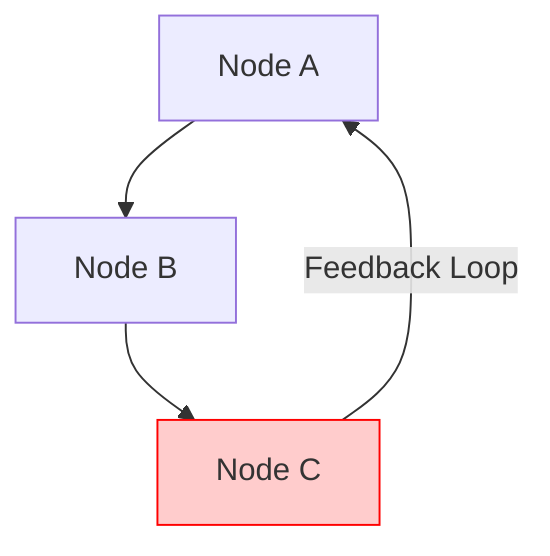

# Domain Dokumen & Diagram
## Genesis IR v1.0 — Spesifikasi Domain

> [!IMPORTANT]
> `@stability BETA`
> Halaman ini mendokumentasikan spesifikasi teknis domain `document` dan `diagram`, termasuk tipe node khusus, aliran teks dinamis, deteksi siklus grafis, dan pencarian jalur konektor (A*).

---

## 📄 Spesifikasi Domain `document`

Domain `document` ditujukan untuk penataan halaman bertekstur kaya (rich text) berskala besar seperti laporan, e-book, dan dokumen cetak multi-halaman.

### Tipe Node Khusus (Fase 10A)
- `doc_paragraph`: Node dasar untuk blok teks pragmatis.
- `doc_heading`: Menampung informasi judul dengan properti level `1` s.d. `6`.
- `doc_list` & `doc_list_item`: Sistem penyusunan daftar item terurut (ordered) maupun tidak terurut.
- `doc_code_block`: Node khusus dengan sintaks kode terformat (memerlukan parameter `language`).
- `doc_footnote`, `doc_toc` (Table of Contents), dan `doc_callout` untuk anotasi dokumen modern.

---

## 📊 Spesifikasi Domain `diagram`

Domain `diagram` menyediakan representasi visual untuk grafis berelasi, diagram alir, pemodelan data (ERD/UML), dan tata letak proses bisnis (BPMN).

### 1. Struktur Node & Relasi Edge
- `diagram_node`: Node representasi entitas/blok diagram.
- `diagram_edge`: Node konektor yang merepresentasikan relasi antarentitas. Wajib memiliki properti `source_id` dan `target_id`.
- **Dangling Reference Prevention**: Validasi Pass 3 akan menolak dokumen jika `source_id` atau `target_id` pada edge merujuk ke node yang tidak terdaftar dalam koleksi objek.

### 2. Algoritma Deteksi Siklus Graf (DFS)
Untuk beberapa jenis pemodelan proses kaku, diagram dilarang memiliki putaran tertutup (cyclic). Compiler menyertakan sub-pass evaluasi 3d berbasis **Depth First Search (DFS)** untuk mendeteksi putaran tak terbatas:

### 3. Algoritma Auto-Routing Konektor (A*)
Agar konektor/edge diagram tidak bertabrakan dengan elemen node lain secara acak, LIR generator menggunakan algoritma **A\* Pathfinding** untuk menghitung titik belok konektor (Bezier/orthogonal waypoints) dengan jarak terpendek di sekitar bounding box node lain.
