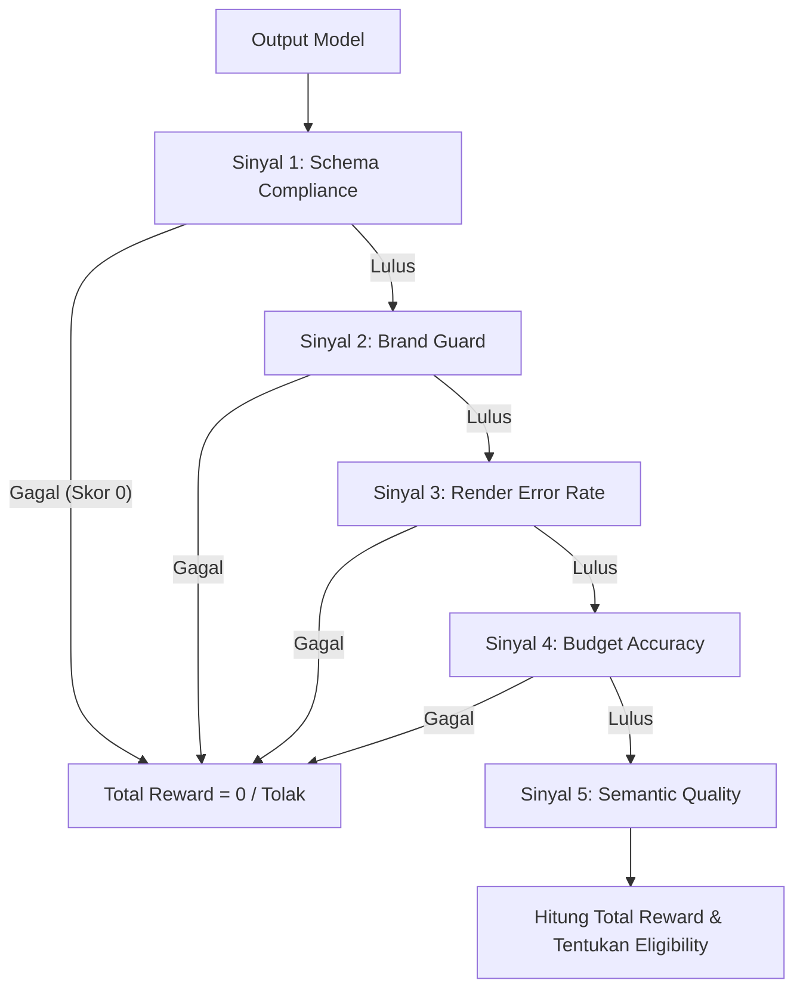
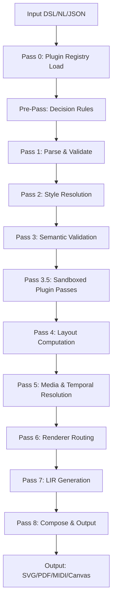

# Genesis IR Specification v1.0 — Unified Edition
## Bagian 1 & Bagian 2: Foundation & Schema Core

Dokumen ini merupakan spesifikasi formal untuk **Genesis Intermediate Representation (IR) Specification v1.0 — Unified Edition**, Spesifikasi ini dirancang sebagai standar industri untuk representasi aset kreatif multi-domain, baik untuk dikonsumsi oleh AI Agent maupun compiler platform rendering.

---

## PART 1: FOUNDATION

### 1. Filosofi & 8 Prinsip Dasar

Intermediate Representation (IR) bukan sekadar deskripsi statis tentang "bagaimana menggambar piksel di layar". IR adalah **kontrak formal** antara sistem pembuat (human atau AI agent), compiler, dan platform rendering (renderer). Kontrak ini mendefinisikan seluruh semantik dari sebuah karya kreatif—termasuk konten, kapabilitas platform, batasan (constraints), relasi antarnode, sinkronisasi waktu, logika interaksi, dan riwayat mutasi data.

Dalam edisi terpadu ini, seluruh arsitektur Genesis IR diatur oleh **8 Prinsip Dasar** berikut:

#### Prinsip 1: IR sebagai Sumber Kebenaran Tunggal (Single Source of Truth - SSoT)
Seluruh surface editor, agen kecerdasan buatan, compiler, dan renderer membaca serta menulis pada satu representasi data yang sama. Tidak ada proses sinkronisasi state eksternal yang redundan karena konsistensi dokumen dijamin secara struktural. Setiap dokumen diidentifikasi secara unik menggunakan metadata identitas mutlak.
> **Keputusan #02:** Bidang metadata `ir_id` wajib menggunakan format UUID v4 dan bersifat *immutable* (tidak dapat diubah) setelah dokumen dibuat. UUID ini berfungsi sebagai *primary key* di seluruh sistem penyimpanan dan kolaborasi.

#### Prinsip 2: Code over Pixels (Kode di Atas Piksel)
IR direpresentasikan sebagai kode deklaratif terstruktur (AST - Abstract Syntax Tree). Setiap representasi visual, audio, musik, font, atau aset game dapat diinspeksi, dimodifikasi secara terprogram, diacak (forked), dan dilacak riwayat perubahannya menggunakan version control, alih-alih disimpan sebagai biner mentah atau piksel statis.

#### Prinsip 3: Multi-Level, Satu Kontrak (HIR → MIR → LIR)
Transformasi dokumen dari maksud pengguna (user intent) hingga output pada perangkat keras diatur oleh satu kontrak skema tunggal yang dibagi menjadi tiga level abstraksi (HIR, MIR, LIR). Hal ini memisahkan logika bahasa (DSL/intent) dari kalkulasi tata letak dan instruksi rendering tingkat rendah.
> **Keputusan #04:** Arsitektur tiga level (High-level IR → Mid-level IR → Low-level IR) ditetapkan sebagai standar mutlak yang mengikat seluruh siklus hidup kompilasi dokumen Genesis.

#### Prinsip 4: Graceful Degradation over Silent Failure (Degradasi Anggun di Atas Kegagalan Senyap)
Setiap kegagalan kompilasi, konflik penggabungan data (merge conflicts), dan pelanggaran aturan semantik harus dideteksi secara eksplisit oleh validator. Dokumen yang tidak valid dilarang keras dikirim ke renderer. Sistem harus menyediakan jalur pemulihan (*recovery path*) atau perbaikan otomatis (*auto-fix*) yang terdefinisi dengan jelas.

#### Prinsip 5: Domain-Aware, Platform-Agnostic (Sadar Domain, Agnostik Platform)
Skema IR memahami semantik konten dari berbagai bidang kreatif (misalnya, perbedaan antara trek audio dan bentuk geometri visual) namun tidak bergantung pada pustaka visual atau mesin rendering tertentu. Pengetahuan spesifik mengenai cara menggambar piksel pada Web (HTML/SVG), Mobile (Skia), atau Video (FFmpeg) sepenuhnya menjadi tanggung jawab renderer.
> **Keputusan #08:** Unit ukuran dasar dokumen dikunci berdasarkan domain utama untuk menghindari ambiguitas kalkulasi: menggunakan piksel (`px`) untuk domain digital/visual, milimeter (`mm`) atau poin (`pt`) untuk domain cetak/fisik, dan bar/beat untuk domain produksi musik.

#### Prinsip 6: Pemisahan Mode vs Domain & Spec Isolation
Interaksi pengguna pada aplikasi editor diwakili oleh `IRMode`, sedangkan tipe konten semantik diwakili oleh `IRDomain`. Keduanya dipisahkan secara tegas agar satu dokumen dapat memiliki multi-mode visualisasi (misalnya, mengedit visual dalam timeline video). Kompleksitas domain khusus (seperti musik atau pixel art) diisolasi ke dalam bidang spesifikasi opsional (`music_spec`, `pixel_spec`, dll.) untuk meminimalkan overhead data.

#### Prinsip 7: Additive Extension over Modification (Ekstensi Aditif di Atas Perubahan Destruktif)
Pengembangan fitur or domain baru harus dilakukan secara aditif tanpa merusak kompatibilitas ke belakang (*backward compatibility*) dengan dokumen versi terdahulu. Perubahan yang merusak (*breaking changes*) hanya diizinkan pada pembaruan versi mayor formal.
> **Keputusan #07:** Setiap elemen skema dan API harus ditandai dengan label stabilitas yang jelas (`STABLE`, `BETA`, `x_*` untuk eksperimental, dan `DEPRECATED`) guna memandu pengembang perkakas (tooling) pihak ketiga.

#### Prinsip 8: Agent-First Design & Security by Default
Desain struktur data Genesis IR memprioritaskan kemudahan manipulasi oleh AI Agent. Struktur dokumen harus deterministik dan mudah dipetakan ke dalam konteks LLM. Keamanan dijalankan sejak awal melalui pembatasan eksekusi plugin dalam lingkungan terisolasi (*sandbox*) dan pelaporan kerentanan skema secara transparan.

---

### 2. Peta 5-Layer System

Genesis IR membagi fungsionalitas dokumen ke dalam **5 Lapisan Sistem (5-Layer System)**. Struktur ini memastikan pemisahan tanggung jawab (*separation of concerns*) yang jelas, mempermudah validasi parsial, dan memungkinkan optimasi proses kompilasi bertahap.

```
┌─────────────────────────────────────────────────────────────────────────┐
│                       LAYER 5 — INFRASTRUCTURE                          │
│     meta · tool_registry · plugin_registry_snapshot · observability     │
└────────────────────────────────────┬────────────────────────────────────┘
                                     ▼
┌─────────────────────────────────────────────────────────────────────────┐
│                         LAYER 4 — TEMPORAL                              │
│             timeline · keyframes · automation_schedules                 │
└────────────────────────────────────┬────────────────────────────────────┘
                                     ▼
┌─────────────────────────────────────────────────────────────────────────┐
│                          LAYER 3 — LOGIC                                │
│              constraints · interaction_model · variables                │
└────────────────────────────────────┬────────────────────────────────────┘
                                     ▼
┌─────────────────────────────────────────────────────────────────────────┐
│                          LAYER 2 — VISUAL                               │
│           canvas · style_context · physical · print/mockup_spec         │
└────────────────────────────────────┬────────────────────────────────────┘
                                     ▼
┌─────────────────────────────────────────────────────────────────────────┐
│                           LAYER 1 — DATA                                │
│               objects (scene tree) · data_bindings · assets             │
└─────────────────────────────────────────────────────────────────────────┘
```

#### Layer 1 — Data Layer
Lapisan terbawah yang bertanggung jawab menyimpan data mentah, struktur pohon objek, dan sumber data dinamis.
*   **Peran:** Menyediakan *ground truth* dari seluruh elemen yang didefinisikan dalam dokumen.
*   **Komponen Utama:**
    *   `objects`: Pohon node objek visual, audio, musik, dsb. (`IRNode[]`).
    *   `data_bindings`: Aturan pemetaan data eksternal (API, CSV, JSON) ke properti node.
    *   `asset_refs` / `asset_pool`: Referensi dan pool penyimpanan aset biner eksternal.

#### Layer 2 — Visual Layer
Lapisan yang mengatur ruang kerja, tampilan visual, gaya, dan properti fisik keluaran.
*   **Peran:** Menentukan estetika visual, batas area render, dan parameter fisik cetak atau mockup.
*   **Komponen Utama:**
    *   `canvas`: Dimensi, resolusi, ruang warna, dan context mode kerja (`IRCanvas`).
    *   `style_context`: Peta token desain, gaya komponen, dan style overrides per objek (Keputusan #01).
    *   `physical`: Parameter fisik cetak (bleed, safe zone) atau pencetakan 3D.
    *   `print_spec`, `mockup_spec`, `font_spec`: Spesifikasi spasial khusus domain.

#### Layer 3 — Logic Layer
Lapisan yang mengontrol validasi kualitas, batasan desain, aturan bisnis, dan logika interaktivitas.
*   **Peran:** Memastikan kepatuhan terhadap standar (seperti WCAG atau pedoman brand) serta mengelola state machine interaktif.
*   **Komponen Utama:**
    *   `constraints`: Kumpulan aturan WCAG, batasan berkas, dan pembatasan brand.
    *   `interaction_model`: State machine interaksi runtime (states, transitions, triggers, actions, variables).
    *   `tool_registry`: Registri perkakas yang dapat dipanggil secara otomatis oleh AI agent.

#### Layer 4 — Temporal Layer
Lapisan yang menangani sinkronisasi waktu, animasi, dan manajemen trek multimedia.
*   **Peran:** Menghubungkan perubahan spasial dan audial ke dalam garis waktu (timeline) yang sinkron.
*   **Komponen Utama:**
    *   `timeline`: Trek garis waktu, klip, penanda (markers), dan aturan sinkronisasi tempo (Keputusan #12).
    *   `keyframes`: Kurva animasi pelonggaran (*easing*) dan deformasi objek.
    *   `automation_schedules`: Otomatisasi parameter audio atau visual dari waktu ke waktu.

#### Layer 5 — Infrastructure Layer
Lapisan teratas yang mengelola identitas, versi, snapshot ekstensi, keamanan sandbox, dan observabilitas compiler.
*   **Peran:** Menyediakan metadata manajemen siklus hidup dokumen, pelacakan performa compiler, dan integrasi plugin.
*   **Komponen Utama:**
    *   `meta`: Data identitas, skema, mode, domain utama, dan riwayat migrasi dokumen.
    *   `plugin_registry_snapshot`: Dependencies plugin eksternal yang diikat pada dokumen.
    *   `observability` / `x_debug`: Trace logs performa kompilasi per pass dan riwayat modifikasi agen (provenance).

---

### 3. Arsitektur 3-Level IR

Transformasi data dari input deklaratif hingga menjadi instruksi rendering yang dapat dieksekusi oleh mesin diatur oleh arsitektur compiler dengan tiga tingkat representasi:

```
[ DSL Source / User Input ]
             │
             ▼
┌────────────────────────────────────────────────────────┐
│  HIR (High-Level IR) — Deklaratif & Semantik           │
│  • Media-agnostic & Style-agnostic                     │
│  • Tervalidasi penuh menggunakan skema AJV             │
│  • Fokus pada: "WHAT to design" (Maksud Desain)        │
└────────────────────────────┬───────────────────────────┘
                             │
                             ▼  [Pass 1 s.d. Pass 5]
┌────────────────────────────────────────────────────────┐
│  MIR (Mid-Level IR) — Resolved & Normalized            │
│  • Style cascade diselesaikan (Resolved Styles)        │
│  • Tata letak dihitung (Computed Layout)               │
│  • Waktu disinkronkan (Resolved Temporal Timing)       │
│  • Validasi semantik domain terpenuhi                  │
└────────────────────────────┬───────────────────────────┘
                             │
                             ▼  [Pass 6 s.d. Pass 7]
┌────────────────────────────────────────────────────────┐
│  LIR (Low-Level IR) — Platform-Specific                │
│  • Instruksi spesifik backend (DOM, PDF/X, Web Audio)  │
│  • Siap dikonsumsi langsung oleh renderer target       │
│  • Fokus pada: "HOW to render" (Instruksi Render)      │
└────────────────────────────────────────────────────────┘
```

#### Kompilasi Pipeline (Pass 0 s.d. Pass 8)
Proses transformasi dari HIR ke LIR diatur oleh **Compilation Pass Pipeline** terstruktur:
> **Keputusan #05:** Pipeline kompilasi inti terdiri dari 7 pass wajib ditambah pass persiapan dan pasca-kompilasi. Struktur pass ini dikunci untuk menjamin kompabilitas plugin compiler eksternal.

1.  **Pass 0: Pre-pass & Dependency Resolution:** Memeriksa dan memuat semua dependensi plugin yang terdaftar di `plugin_registry_snapshot`.
2.  **Pass 1: Schema Validation:** Validasi sintaksis HIR terhadap JSON Schema menggunakan pustaka AJV. Memastikan kekokohan tipe objek (`IRNodeType`) dan mendeteksi referensi ID yang menggantung (*dangling references*).
3.  **Pass 2: Style Cascade Resolution:** Menyelesaikan pewarisan gaya sesuai dengan urutan cascade (Keputusan #01). Menyelesaikan referensi token desain (`theme://`, `brand://`) ke nilai absolut.
4.  **Pass 3: Semantic Validation:** Menjalankan aturan semantik wajib dan opsional (Keputusan #07), seperti pemeriksaan rasio kontras teks WCAG, kepatuhan brand, dan kebenaran diagram teknis (BPMN/UML).
5.  **Pass 4: Layout Computation:** Menghitung posisi koordinat absolut node berdasarkan aturan Flexbox, Grid, reflow halaman cetak, atau algoritma tata letak diagram otomatis.
6.  **Pass 5: Media & Temporal Resolution:** Mengunduh dan memecahkan (*decode*) aset biner. Mengonversi penanda bar/beat pada domain musik menjadi milidetik berdasarkan peta tempo (Keputusan #12).
7.  **Pass 6: Renderer Dispatch:** Memilah pohon objek (`MIR`) ke dalam sub-pohon berdasarkan renderer target (misalnya, memisahkan trek audio dari visual video).
8.  **Pass 7: LIR Generation:** Menerjemahkan MIR yang telah selesai dihitung menjadi kode instruksi spesifik platform target (LIR), seperti tag SVG, Web Audio Graph, atau instruksi opentype.js.
9.  **Pass 8: Post-Compilation & Optimization:** Melakukan kompresi biner (LZ4/Brotli), pengepakan lembar sprite (*sprite sheet packing*), atau enkripsi metadata C2PA.

---

### 4. Tier System (Nano ⊂ Core ⊂ Full)

Genesis IR dirancang agar kompatibel dengan berbagai kapasitas perangkat komputasi, mulai dari mikrokontroler berdaya rendah hingga cluster rendering di cloud. Kompleksitas dokumen diatur melalui tiga tingkatan kompatibilitas bertingkat:

```
┌──────────────────────────────────────────────────────────┐
│  IR-Nano                                                 │
│  • < 50 baris IR, maks 100 node, kedalaman pohon maks 8   │
│  • Tanpa aset eksternal, tanpa plugin, rendering statis  │
└────────────────────────────┬─────────────────────────────┘
                             │  Subset dari
                             ▼
┌──────────────────────────────────────────────────────────┐
│  IR-Core                                                 │
│  • Berkas maks 5MB, maks 1.000 node, kedalaman pohon 32  │
│  • Peta interaksi dasar, dirty tracking, multi-halaman    │
└────────────────────────────┬─────────────────────────────┘
                             │  Subset dari
                             ▼
┌──────────────────────────────────────────────────────────┐
│  IR-Full                                                 │
│  • Tanpa batasan ukuran, maks 100.000 node, kedalaman 64 │
│  • Full plugin, real-time collab, multi-agent protocol   │
└──────────────────────────────────────────────────────────┘
```

#### Tier 1: Nano
*   **Target Perangkat:** Mikrokontroler (IoT), smart display, widget mobile mini, instant web preview statis.
*   **Batasan Kapasitas:**
    *   Ukuran berkas IR maksimum: **50 KB** (atau kurang dari 50 baris kode IR).
    *   Jumlah node objek maksimum: **100 node**.
    *   Kedalaman pohon objek (*max tree depth*): **8 tingkat**.
    *   Fitur yang dilarang: Aset eksternal dinamis (audio/video besar), pemanggilan plugin pihak ketiga, rumus data binding runtime.
*   **Profil Kompilasi:** `nano_static` (Hanya menjalankan Pass 1, Pass 2, Pass 3-mandatory, Pass 6, dan Pass 7).

#### Tier 2: Core
*   **Target Perangkat:** Browser web standar (desktop/mobile), aplikasi native iOS/Android, aplikasi perkantoran, editor desain grafis kasual.
*   **Batasan Kapasitas:**
    *   Ukuran berkas IR maksimum: **5 MB**.
    *   Jumlah node objek maksimum: **1.000 node**.
    *   Kedalaman pohon objek (*max tree depth*): **32 tingkat**.
    *   Fitur yang didukung: Multi-page context, validasi kontras WCAG, constraint brand statis, timeline temporal standar.
*   **Profil Kompilasi:** `core_incremental` (Mendukung pelacakan bagian kotor/`dirty tracking` untuk menghindari kompilasi ulang bagian yang tidak berubah).

#### Tier 3: Full
*   **Target Perangkat:** Workstation profesional, server render farm, AI Agent orchestration node, sistem manajemen konten enterprise.
*   **Batasan Kapasitas:**
    *   Ukuran berkas IR maksimum: **Tidak terbatas**.
    *   Jumlah node objek maksimum: Direkomendasikan hingga **100.000 node**.
    *   Kedalaman pohon objek (*max tree depth*): **64 tingkat** (dapat diubah melalui konfigurasi).
    *   Fitur yang didukung: Integrasi penuh plugin pihak ketiga, multi-agent communication protocol, otomatisasi audio dengan AudioWorklet, 3D viewport rendering dengan PBR material, data binding dinamis.
*   **Profil Kompilasi:** `full_pipeline` (Eksekusi seluruh pass dari Pass 0 hingga Pass 8 termasuk modifikasi data oleh sub-compiler plugin).

---

### 5. Gap Registry & Governance

Sebagai sistem yang terus berkembang (*living system*), Genesis IR menyediakan **Gap Registry** sebagai mekanisme tata kelola formal untuk mencatat, melacak, dan menyelesaikan inkonsistensi skema atau keputusan yang ditunda. Setiap celah (gap) terdaftar sebagai entri terstruktur.

#### TypeScript Interface untuk Gap Registry

```typescript
/**
 * Representasi entri formal untuk mencatat ketidaklengkapan skema atau keputusan tertunda.
 */
interface IRGapEntry {
  /** Kode unik registri dengan format "IRGAP-NNN" (e.g., "IRGAP-001") */
  id: string;

  /** Tingkat urgensi penyelesaian gap terhadap stabilitas sistem */
  severity: "critical" | "high" | "medium" | "low";

  /** Fase siklus pengembangan sistem yang diblokir oleh keberadaan gap ini */
  phase_blocking: "training" | "production" | "collaborative" | null;

  /** Status penanganan gap saat ini */
  status: "open" | "in_progress" | "resolved" | "accepted";

  /** Referensi nomor pasal atau bagian spesifikasi terkait (e.g., "§11.1 Music Spec") */
  section_ref: string;

  /** Deskripsi lengkap mengenai masalah atau inkonsistensi skema */
  description: string;

  /** Solusi alternatif sementara yang dapat digunakan pengguna sebelum gap diselesaikan */
  workaround?: string;

  /** Pengembang atau tim yang ditunjuk sebagai penanggung jawab penyelesaian gap */
  owner?: string;

  /** Target rilis versi mayor/minor skema tempat gap ini akan diselesaikan */
  target_version?: string;

  /** Versi skema resmi yang memuat resolusi permanen untuk gap ini */
  resolved_in?: string;

  /** Tanggal entri pertama kali dibuat (ISO 8601 UTC) */
  created_at: string;

  /** Tanggal pembaruan terakhir pada entri ini (ISO 8601 UTC) */
  updated_at: string;
}
```

#### Registri Celah Aktif (Active Gap Registry)

```typescript
const IR_GAP_REGISTRY_V1: IRGapEntry[] = [
  {
    id: "IRGAP-001",
    severity: "high",
    phase_blocking: "production",
    status: "resolved",
    section_ref: "§2.1.2 Metadata Context",
    description: "Tanpa bidang task_context, AI Agent harus mengirimkan keseluruhan dokumen IRDocument yang berukuran besar untuk setiap perubahan kecil, sehingga memboroskan token.",
    workaround: "Kirimkan seluruh dokumen IRDocument secara penuh ke context window LLM.",
    owner: "agent-orchestration-team",
    target_version: "1.0",
    resolved_in: "1.0",
    created_at: "2026-01-15T08:00:00Z",
    updated_at: "2026-05-30T10:00:00Z"
  },
  {
    id: "IRGAP-002",
    severity: "high",
    phase_blocking: "production",
    status: "resolved",
    section_ref: "§2.3.8 Tooling Core",
    description: "Aturan IRSemanticRule tidak terintegrasi sebagai callable tool untuk LLM, sehingga AI Agent harus melakukan komputasi kontras WCAG secara mandiri tanpa jaminan verifikasi.",
    workaround: "Sertakan deskripsi aturan WCAG secara manual di dalam system prompt AI.",
    owner: "compiler-core-team",
    target_version: "1.0",
    resolved_in: "1.0",
    created_at: "2026-01-20T09:30:00Z",
    updated_at: "2026-05-30T11:15:00Z"
  },
  {
    id: "IRGAP-003",
    severity: "medium",
    phase_blocking: "collaborative",
    status: "resolved",
    section_ref: "§2.2.4 Real-time Sync",
    description: "Tidak adanya standardisasi delta stack untuk pelacakan Undo/Redo multi-pengguna menyebabkan kegagalan sinkronisasi CRDT pada kolaborasi real-time.",
    workaround: "Lakukan sinkronisasi ulang seluruh dokumen jika terjadi konflik penyimpanan.",
    owner: "sync-collaboration-team",
    target_version: "1.0",
    resolved_in: "1.0",
    created_at: "2026-02-05T14:00:00Z",
    updated_at: "2026-05-30T12:00:00Z"
  },
  {
    id: "IRGAP-004",
    severity: "medium",
    phase_blocking: null,
    status: "open",
    section_ref: "§2.1.7 Vector DB Integration",
    description: "Belum adanya spesifikasi formal untuk memetakan dokumen IR ke dalam Vector Database untuk memori semantik jangka panjang AI Agent.",
    workaround: "Lakukan konversi dokumen IR ke dalam representasi teks Markdown biasa sebelum diindeks ke Vector DB.",
    owner: "agent-memory-team",
    target_version: "1.1",
    created_at: "2026-05-10T11:00:00Z",
    updated_at: "2026-05-28T16:45:00Z"
  }
];
```

---

### 6. Document Lifecycle

Setiap dokumen Genesis IR mematuhi siklus hidup terstruktur untuk menjamin stabilitas dokumen dalam produksi sekaligus memberikan kebebasan eksperimen pada fase draf.

```
┌───────────┐     Promosi     ┌──────────────┐     Promosi     ┌─────────────┐
│   draft   │ ──────────────> │  experiment  │ ──────────────> │   staging   │
└───────────┘                 └──────────────┘                 └──────┬──────┘
                                                                      │
                                                                      │ Lolos Gate
                                                                      ▼
┌───────────┐     Deprecate   ┌──────────────┐     Promosi     ┌─────────────┐
│  archived │ <────────────── │  deprecated  │ <────────────── │  production │
└───────────┘                 └──────────────┘                 └─────────────┘
```

1.  **Draft:** Fase penulisan bebas. Tidak ada jaminan kompatibilitas ke belakang. Skema dapat bermutasi secara radikal tanpa pemberitahuan.
2.  **Experiment:** Tahap pengujian fitur baru. Perubahan struktural diperbolehkan tetapi memerlukan pencatatan riwayat perubahan (*deprecation warning*).
3.  **Staging:** Fase kandidat rilis (*release candidate*). Dokumen harus dikunci dan dikirim ke evaluasi otomatis (*production gate*) sebelum dirilis.
4.  **Production (Active):** Status stabil untuk konsumsi komersial. Aturan Semantic Versioning berlaku penuh. Perubahan yang bersifat merusak (*breaking*) dilarang keras tanpa menaikkan versi mayor dokumen.
5.  **Deprecated:** Dokumen masih dapat dibaca oleh renderer, tetapi AI Agent dilarang menggunakannya sebagai template untuk proyek baru. Pengguna didorong untuk bermigrasi ke skema terbaru.
6.  **Archived (Frozen):** Status read-only mutlak. Kompiler dilarang melakukan kompilasi ulang (re-compile). Dokumen disimpan semata-mata untuk keperluan arsip historis.

> **Aturan Transisi Lifecycle:** Status siklus hidup dokumen bersifat searah (*forward-only*). Dokumen yang telah dipromosikan ke tingkat yang lebih tinggi (misalnya dari `staging` ke `production`) dilarang keras diturunkan kembali ke status sebelumnya (seperti `draft`).

#### TypeScript Interface untuk Siklus Hidup Dokumen

```typescript
/**
 * Status siklus hidup formal dari dokumen Genesis IR.
 */
type IRDocumentLifecycleStatus =
  | "draft"       // Iterasi bebas tanpa garansi kompatibilitas
  | "experiment"  // Fase pengujian, modifikasi memerlukan warning
  | "staging"     // Kandidat rilis yang menunggu persetujuan gate
  | "production"  // Stabil, didukung penuh, semver berlaku ketat
  | "deprecated"  // Masih didukung namun tidak direkomendasikan untuk proyek baru
  | "archived";   // Read-only mutlak, dilarang kompilasi ulang

/**
 * Persyaratan gerbang evaluasi sebelum dokumen dipromosikan ke fase Production.
 */
interface IRProductionGate {
  /** Persentase kelulusan minimum pengujian otomatis (nilai antara 0.0 s.d 1.0, e.g., 0.98) */
  evaluation_pass_rate_threshold: number;

  /** Durasi waktu minimum dokumen harus bertahan di fase staging tanpa error (dalam satuan jam) */
  minimum_test_duration_hours: number;

  /** Daftar pengenal validator otomatis (agent_id atau rule_id) yang harus menyatakan lolos */
  required_validators: string[];

  /** Nama atau ID operator manusia yang memberikan persetujuan akhir */
  approved_by?: string;

  /** Waktu persetujuan gerbang evaluasi (ISO 8601 UTC) */
  approved_at?: string;
}
```

---
---

## PART 2: SCHEMA CORE

### 1. Definisi `IRDomain`

`IRDomain` mewakili tipe konten semantik dari dokumen. Pembagian domain ini memastikan compiler dapat memilah aturan validasi dan menargetkan renderer yang tepat tanpa membebani memori dengan struktur data yang tidak relevan.
> **Keputusan #09:** Nama ke-17 domain kreatif Genesis IR dikunci setelah rilis v1.0. Perubahan pada nama domain yang sudah ada dilarang karena akan merusak kompatibilitas kunci penyimpanan (*storage keys*), pencarian plugin, dan logika perutean compiler.

#### TypeScript Type Alias untuk `IRDomain`

```typescript
/**
 * Representasi 17 domain kreatif dalam Genesis IR v1.0.
 */
type IRDomain =
  // ── DOMAIN STABLE ──
  | "visual"            // Desain vektor, ilustrasi SVG, UI layout statis
  | "image_edit"        // Manipulasi raster, filter foto, pengomposisian piksel
  | "video"             // Penyuntingan klip video multi-track, transisi, trek multi-lapisan
  | "audio"             // Trek suara tunggal/multi, perekaman podcast, penyuntingan klip audio
  | "motion"            // Animasi interaktif, micro-interaction, ekspor Lottie/Rive
  | "print"             // Dokumen cetak fisik dengan panduan warna CMYK dan area bleed
  | "signage"           // Desain media luar ruang dengan format dimensi besar
  | "packaging"         // Dieline kemasan fisik, lipatan 3D, panduan potong cetak
  | "data_viz"          // Representasi grafik data, infografis dinamis, dashboard
  | "interactive"       // Prototipe interaktif, aplikasi mikro berbasis state
  | "3d"                // Adegan tiga dimensi, material PBR, pencahayaan, viewport spatial

  // ── DOMAIN BETA ──
  | "document"          // Dokumen tulisan kaya (rich text), pemformatan paragraf, laporan
  | "music_production"  // DAW (Digital Audio Workstation), trek MIDI, instrumen virtual
  | "pixel_art"         // Aset game berbasis piksel, animasi cel, pengaturan ubin (tilemap)
  | "diagram"           // Diagram alir teknis, UML, BPMN 2.0, ERD database
  | "mockup"            // Mockup layar perangkat elektronik dengan rendering perspektif 3D
  | "font_design";      // Perancangan huruf, penyuntingan glyph kontur, pengaturan kerning
```

#### Tabel Matriks Domain

| Domain | Deskripsi Semantik | Mode Utama | Unit Standar | Renderer Backend LIR |
| :--- | :--- | :--- | :--- | :--- |
| `visual` | Ilustrasi vektor & tata letak UI statis | SVG / Vektor Editor | Piksel (`px`) | Web SVG / Canvas |
| `image_edit` | Pemrosesan gambar raster & filter bitmap | Image Editor | Piksel (`px`) | WebGL / Canvas2D |
| `video` | Penyuntingan klip video multi-track | Video Editor | Frame / Milidetik | FFmpeg Pipeline |
| `audio` | Rekaman & pengeditan waveform suara | Audio Editor | Milidetik (`ms`) | Web Audio API / WAV |
| `motion` | Animasi interaktif berbasis vektor | Motion Designer | Piksel / Milidetik | Lottie / Rive / CSS |
| `print` | Layout publikasi cetak komersial | Print Designer | Milimeter (`mm`) / Poin | PDF/X-4 / PostScript |
| `signage` | Media promosi luar ruang skala besar | Print Designer | Sentimeter (`cm`) / Inci | PDF/X / Raster High-Res |
| `packaging` | Pola lipat kemasan & pisau potong | Print Designer | Milimeter (`mm`) | PDF/X + Vector DXF |
| `data_viz` | Grafik visualisasi data interaktif | Data & Chart Editor | Piksel (`px`) | D3.js / SVG Engine |
| `interactive` | Prototipe aplikasi mini & game sederhana | Motion Designer | Piksel (`px`) | DOM / WebGL Engine |
| `3d` | Lingkungan & objek spasial tiga dimensi | 3D Viewer & Editor | Meter (`m`) / Sentimeter | Three.js / WebGL / GLB |
| `document` | Dokumen teks panjang bergaya majalah/laporan | Document Editor | Poin (`pt`) | HTML5 Document / PDF |
| `music_production` | Aransemen MIDI dan instrumen virtual (DAW) | Music DAW | Bar / Beat (Keputusan #12) | Web Audio / Synth / MIDI |
| `pixel_art` | Sprite game retro & ubin latar belakang | Game Asset Editor | Piksel Murni (`px`) | Canvas2D (No Anti-Alias) |
| `diagram` | Flowchart, UML, BPMN 2.0, ERD | Diagram Editor | Piksel (`px`) | SVG Connector Engine |
| `mockup` | Presentasi desain pada frame gadget 3D | App Mockup Designer | Piksel (`px`) | CSS 3D / Three.js WebGL |
| `font_design` | Desain huruf & pembuatan berkas OTF/TTF | Font Designer | Font Unit (em) (Keputusan #10) | opentype.js Compiler |

---

### 2. `IRMode` & `IR_MODE_DOMAIN_MAP`

`IRMode` menetapkan cara pengguna berinteraksi dengan permukaan kerja aplikasi (editor surface). Mode dan Domain dipisahkan agar sistem dapat memuat konfigurasi interaksi yang berbeda pada tipe dokumen yang sama.

#### TypeScript Definisi untuk Mode & Mapping Domain

```typescript
/**
 * Mode interaksi editor yang didukung oleh platform kreatif.
 * Nilai string di luar enum core merepresentasikan mode custom yang disuntikkan oleh plugin.
 */
type IRMode =
  | "canvas_editor"    // Editor desain vektor/layout standar
  | "video_editor"     // Editor video dengan track linier dan timeline
  | "audio_editor"     // Editor suara dengan visualisasi waveform
  | "image_editor"     // Editor pengolah piksel gambar raster
  | string;            // Mode eksternal dari plugin (format: "@namespace/mode-name")

/**
 * Konfigurasi kapabilitas dan validasi untuk setiap mode kerja.
 */
interface IRModeContext {
  /** Domain utama yang secara otomatis diaktifkan oleh mode ini */
  primary_domain: IRDomain;

  /** Daftar domain sekunder yang diperbolehkan berada dalam satu dokumen */
  secondary_domains: IRDomain[];

  /** Indikator apakah sistem wajib menyediakan antarmuka timeline temporal */
  timeline_required: boolean;

  /** Tipe canvas yang didukung untuk visualisasi data */
  canvas_types: ("standard" | "audio" | "3d" | string)[];
}

/**
 * Peta pemetaan standar dari Mode Interaksi ke Domain Konten Semantik.
 */
const IR_MODE_DOMAIN_MAP: Record<string, IRModeContext> = {
  "canvas_editor": {
    primary_domain: "visual",
    secondary_domains: ["motion", "interactive", "data_viz", "diagram", "document"],
    timeline_required: false,
    canvas_types: ["standard"]
  },
  "video_editor": {
    primary_domain: "video",
    secondary_domains: ["motion", "audio", "visual"],
    timeline_required: true,
    canvas_types: ["standard"]
  },
  "audio_editor": {
    primary_domain: "audio",
    secondary_domains: ["music_production"],
    timeline_required: true,
    canvas_types: ["audio"]
  },
  "image_editor": {
    primary_domain: "image_edit",
    secondary_domains: ["visual"],
    timeline_required: false,
    canvas_types: ["standard"]
  }
};
```

---

### 3. Skema Root `IRDocument`

`IRDocument` adalah titik masuk utama (*root schema*) dari berkas Genesis IR. Skema ini menampung metadata dokumen, sistem canvas, sistem gaya, daftar objek, dan modul spesifikasi khusus domain.

#### TypeScript Interface Lengkap `IRDocument`

```typescript
/**
 * Representasi dokumen utama Genesis IR v1.0 — Unified Edition.
 */
interface IRDocument {
  // ── METADATA DOKUMEN (Layer 5) ──
  meta: {
    /** Versi skema IR yang digunakan dokumen ini (SELALU "1.0" untuk edisi terpadu) */
    schema_version: "1.0";

    /** Versi pembaruan internal dokumen dalam format SemVer (e.g., "1.2.4") */
    ir_version: string;

    /** Kode identitas dokumen unik dan permanen (Keputusan #02: format UUID v4, immutable) */
    ir_id: string;

    /** Waktu pembuatan dokumen pertama kali (ISO 8601 UTC) */
    created_at: string;

    /** Pihak pembuat dokumen pertama kali */
    created_by: "human" | "ai_agent" | "fork" | "import";

    /** Domain utama dari dokumen (Keputusan #06: tidak boleh null/empty) */
    domain: IRDomain;

    /** Daftar domain tambahan yang aktif dalam berkas yang sama (multi-mode file) */
    active_domains?: IRDomain[];

    /** Identitas sesi aktif tempat dokumen ini sedang disunting */
    session_id: string;

    /** Referensi ir_id dokumen asal jika dokumen ini merupakan hasil pencabangan (fork) */
    parent_ir_id?: string;

    /** Referensi component_id jika dokumen ini merupakan pustaka komponen yang dapat digunakan ulang */
    component_id?: string;

    /** Klasifikasi tingkatan kapabilitas dokumen untuk menentukan profile compiler */
    tier: "nano" | "core" | "full";

    /** Status siklus hidup dokumen saat ini */
    lifecycle_status: IRDocumentLifecycleStatus;

    /** Gerbang persyaratan pelulusan dokumen sebelum dipromosikan ke tahap produksi */
    production_gate?: IRProductionGate;

    /** Batas kedalaman maksimum pohon objek untuk menghindari stack overflow (default: 64) */
    max_tree_depth: number;

    /** Ringkasan deskriptif mengenai perubahan terakhir yang dilakukan pada dokumen */
    change_summary?: string;

    /** Catatan riwayat migrasi struktur data dokumen dari versi skema terdahulu */
    migration_history?: Array<{
      from_version: string;
      to_version: string;
      migrated_at: string;
      migrated_by: "auto" | "manual" | "ai_agent";
      changes_applied: string[];
      strategy: "expand_migrate_contract" | "big_bang";
    }>;

    /** Namespace cadangan untuk metadata khusus produk (e.g., "custom_app_meta") */
    [namespace: `${string}_meta`]: unknown;
  };

  // ── SISTEM AREA KERJA (Layer 2) ──
  /** Konfigurasi ruang kerja utama dokumen, berupa standard canvas, audio viewport, atau viewport 3D */
  canvas: IRCanvas | IRAudioCanvas | IR3DViewport | IRPluginCanvas;

  // ── SISTEM GAYA & STRUKTUR (Layer 2 & Layer 1) ──
  /** Konfigurasi token desain dan aturan gaya bertingkat (cascade) */
  style_context: IRStyleContext;

  /** Pohon objek utama (Scene Tree) yang menampung seluruh node konten */
  objects: IRNode[];

  // ── VALIDASI & ATURAN LOGIKA (Layer 3) ──
  /** Aturan batasan desain, aksesibilitas WCAG, dan batasan brand dokumen */
  constraints: IRConstraintSet;

  // ── MODEL WAKTU & TIMELINE (Layer 4 - Opsional) ──
  /** Pengaturan garis waktu (timeline) untuk sinkronisasi waktu dan klip temporal */
  timeline?: IRTimeline;

  // ── MODUL SPESIFIKASI KHUSUS DOMAIN (Layer 2 - Opsional) ──
  // Bidang-bidang ini diisi sesuai dengan domain utama dokumen.
  // Jika tidak digunakan, bidang diset null untuk menghemat memori (Spec Isolation).

  /** Spesifikasi produksi musik (Digital Audio Workstation) - Aktif pada domain music_production */
  music_spec?: IRMusicSpec;

  /** Spesifikasi game asset & pixel art - Aktif pada domain pixel_art */
  pixel_spec?: IRPixelSpec;

  /** Spesifikasi desain font & metrik huruf - Aktif pada domain font_design */
  font_spec?: IRFontSpec;

  /** Spesifikasi pemetaan dan routing diagram - Aktif pada domain diagram */
  diagram_spec?: IRDiagramSpec;

  /** Spesifikasi cetak komersial, bleed, dan spot color - Aktif pada domain print, signage, packaging */
  print_spec?: IRPrintSpec;

  /** Spesifikasi mockup 3D perangkat & pencahayaan - Aktif pada domain mockup */
  mockup_spec?: IRMockupSpec;

  // ── DATA BINDINGS & INTERACTION (Layer 3 & Layer 1 - Opsional) ──
  /** Deklarasi pemetaan data dinamis dari sumber eksternal */
  data_bindings?: IRDataBinding[];

  /** Model state machine interaktif untuk runtime aplikasi/prototipe */
  interaction_model?: IRInteractionModel;

  // ── DEPENDENSI & ASET (Layer 5 & Layer 1 - Opsional) ──
  /** Grafik ketergantungan dokumen terhadap pustaka komponen eksternal */
  dependencies?: IRDependencyGraph;

  /** Kumpulan referensi aset biner (gambar, video, font) yang digunakan dokumen */
  asset_refs?: IRAssetRef[];

  /** Shared Asset Pool terintegrasi untuk pengelolaan media biner tingkat lanjut */
  asset_pool?: IRAssetPool;

  /** Konfigurasi fisik khusus cetak atau pencetakan 3D */
  physical?: IRPhysicalSpec;

  // ── EKSPERIMENTAL & OBSERVABILITAS (Layer 5) ──
  /** Lapisan saran visual transparan (Ghost Suggestions) yang dihasilkan AI Agent */
  suggestion_layers?: IRSuggestionLayer[];

  /** Penyimpanan data khusus plugin eksternal */
  plugin_data?: Record<string, unknown>;

  /** Snapshot registri plugin untuk penguncian versi dependencies compiler */
  plugin_registry_snapshot?: {
    required_plugins: Array<{
      name: `@${string}/${string}`;
      version: string;
      manifest_hash: string;
      criticality: "required" | "optional" | "enhancement";
    }>;
    registry_hash_at_creation: string;
    snapshot_at: string;
  };

  /** Konfigurasi memori dan riwayat aksi yang diambil AI Agent dalam dokumen */
  agent_context?: IRAgentContext;

  /** Pelacakan metrik kinerja compiler dan audit log mutasi dokumen */
  observability?: IRObservability;

  /** Konfigurasi pengujian canary dan peluncuran bertahap versi dokumen */
  canary_config?: IRCanaryConfig;

  /** Titik pemulihan (checkpoint) pipeline kompilasi untuk pemulihan kegagalan */
  pipeline_checkpoint?: IRPipelineCheckpoint;

  /** Registri tool AI yang di-expose ke LLM untuk sesi interaksi */
  tool_registry?: IRToolRegistry;

  /** Anotasi debug internal compiler (dihapus saat ekspor produksi) */
  x_debug?: IRDebugAnnotations;
}

/**
 * Referensi data aset biner eksternal yang diikat dalam dokumen.
 */
interface IRAssetRef {
  /** ID unik aset dalam Asset Pool */
  asset_id: string;

  /** Jenis media biner yang dirujuk */
  asset_type: "image" | "video" | "audio" | "font" | "svg" | "3d_model" | "lottie" | "rive" | "custom";

  /** Alamat URL pengunduhan aset (CDN URL) */
  url: string;

  /** Alamat lokasi berkas lokal untuk mendukung mode offline */
  local_path?: string;

  /** Kode hash SHA-256 untuk memverifikasi integritas berkas */
  checksum: string;

  /** Dimensi spasial piksel (untuk gambar/video) */
  dimensions?: {
    width: number;
    height: number;
  };

  /** Durasi waktu putar (dalam milidetik, untuk audio/video) */
  duration_ms?: number;
}
```

---

### 4. `IRCanvas` & `IRCanvasModeContext`

`IRCanvas` menetapkan karakteristik dimensi, orientasi, dan parameter mode spesifik dari ruang kerja dokumen. Khusus untuk `IRCanvas`, ia dapat memuat `mode_context` yang merupakan discriminated union dari berbagai context kerja kreatif.

#### TypeScript Interface `IRCanvas` & Konteks Mode Kerja

```typescript
/**
 * Area kerja utama untuk visualisasi dokumen (standard canvas).
 */
interface IRCanvas {
  /** Identifikasi tipe canvas (selalu "standard" untuk canvas visual) */
  canvas_type: "standard";

  /** Lebar canvas dalam satuan unit (angka positif atau "auto" untuk reflow dinamis) */
  width: number | "auto";

  /** Tinggi canvas dalam satuan unit (angka positif atau "auto" untuk reflow dinamis) */
  height: number | "auto";

  /** Platform target tempat visualisasi dokumen akan dijalankan */
  platform: PlatformTarget;

  /** Kecepatan frame per detik (FPS, untuk animasi/video/motion) */
  fps?: number;

  /** Durasi total dokumen (dalam milidetik, untuk timeline) */
  duration_ms?: number;

  /** Frekuensi sampling audio (dalam Hz, untuk pengolahan suara, e.g., 44100) */
  sample_rate?: number;

  /** Unit spasial pengukuran koordinat canvas */
  unit?: "px" | "mm" | "cm" | "in" | "pt";

  /** Resolusi cetak canvas (DPI - Dots Per Inch) */
  dpi?: number;

  /** Profil ruang warna canvas untuk konsistensi reproduksi visual */
  color_space?: "sRGB" | "CMYK" | "P3" | "Rec2020";

  /** Kebijakan penyelesaian konflik jika terjadi perbedaan resolusi DPI fisik vs canvas */
  dpi_sync_policy?: "strict" | "canvas_wins" | "physical_wins";

  /** Daftar sub-canvas (artboard) jika dokumen mendukung multi-artboard */
  artboards?: Array<{
    id: string;
    name: string;
    x: number;
    y: number;
    width: number;
    height: number;
    active?: boolean;
  }>;

  /** Mode rendering proxy (jika true, renderer akan menggunakan asset resolusi rendah saat editing) */
  proxy_mode?: boolean;

  /** ID dari template preset canvas standar yang digunakan (e.g., "print_a4", "web_hd") */
  preset_id?: string;

  /** Konteks khusus mode kerja (discriminated union) */
  mode_context?: IRCanvasModeContext;
}

/**
 * Merupakan gabungan terdiskriminasi (discriminated union) dari konteks spesifik 7 mode kerja kreatif.
 */
type IRCanvasModeContext =
  | IRPixelCanvasContext
  | IRMultiPageContext
  | IRMusicCanvasContext
  | IRFontCanvasContext
  | IRDiagramCanvasContext
  | IR3DCanvasContext
  | IRMockupCanvasContext;

// ── 1. KONTEKS PIXEL ART ──
interface IRPixelCanvasContext {
  /** Tag diskriminator tipe konteks */
  type: "pixel";
  /** Jumlah kolom piksel horizontal (rentang: 8 s.d 512) */
  pixel_width: number;
  /** Jumlah baris piksel vertikal (rentang: 8 s.d 512) */
  pixel_height: number;
  /** Skala zoom tampilan editor (persentase, e.g., 800 untuk 800%) */
  zoom_level: number;
  /** Indikator untuk menampilkan garis bantu piksel (grid) */
  show_grid: boolean;
  /** Jika true, pengguna hanya diperbolehkan menggambar menggunakan warna dari palette aktif */
  palette_locked: boolean;
  /** Struktur data palet warna pixel art aktif */
  active_palette: IRPixelPalette;
  /** Indikator apakah latar belakang canvas bersifat transparan */
  bg_transparent: boolean;
}

interface IRPixelPalette {
  /** ID unik palet warna */
  id: string;
  /** Nama palet warna (e.g., "PICO-8 Palette") */
  name: string;
  /** Nama preset warna standar yang digunakan */
  preset?: "nes" | "gameboy" | "pico8" | "cga" | "ega" | "c64" | "1bit" | "2bit" | "8bit" | "custom";
  /** Daftar kode warna dalam format hex string (Keputusan #16: hex format wajib digunakan) */
  colors: string[];
  /** Mengunci palet agar tidak dapat diubah warnanya */
  locked: boolean;
  /** Indeks warna dalam array colors yang mewakili warna latar belakang transparan */
  background_color_index?: number;
}

// ── 2. KONTEKS MULTI-PAGE (PRINT, DOCUMENT) ──
interface IRMultiPageContext {
  /** Tag diskriminator tipe konteks */
  type: "multi_page";
  /** Jumlah total halaman dalam dokumen */
  page_count: number;
  /** Halaman yang sedang aktif disunting di editor (0-based index) */
  current_page: number;
  /** Daftar Master Page (template tata letak statis) yang tersedia */
  master_pages: IRMasterPage[];
  /** Pengaturan spread view (halaman kiri-kanan berhadapan) */
  facing_pages: boolean;
  /** Jarak grid bantu baris teks dalam satuan poin (pt, 0 = dinonaktifkan) */
  baseline_grid: number;
  /** Konfigurasi kolom panduan layout untuk reflow konten */
  column_guides: IRColumnGuide[];
}

interface IRMasterPage {
  /** ID unik master page */
  id: string;
  /** Nama master page (e.g., "Master Page A - Bab Baru") */
  name: string;
  /** Daftar node objek visual statis yang digambar di semua halaman pengguna master ini */
  objects: IRNode[];
  /** Daftar indeks nomor halaman pengguna master ini */
  applied_to: number[];
}

interface IRColumnGuide {
  /** Jumlah kolom yang membagi halaman */
  columns: number;
  /** Jarak celah antar kolom (gutter) dalam satuan ukuran canvas */
  gutter: number;
  /** Jarak margin batas kiri dalam satuan ukuran canvas */
  margin_l: number;
  /** Jarak margin batas kanan dalam satuan ukuran canvas */
  margin_r: number;
}

// ── 3. KONTEKS DAW / PRODUKSI MUSIK ──
interface IRMusicCanvasContext {
  /** Tag diskriminator tipe konteks */
  type: "music";
  /** Kecepatan tempo musik (BPM - Beats Per Minute, rentang: 20 s.d 300) */
  bpm: number;
  /** Pembilang pada birama waktu (time signature numerator, e.g., 4 dalam 4/4) */
  time_sig_num: number;
  /** Penyebut pada birama waktu (time signature denominator, e.g., 4 dalam 4/4) */
  time_sig_den: number;
  /** Kunci nada dasar musik (e.g., "C", "Am", "F#m") */
  key: string;
  /** Total jumlah baris birama (bars) dalam lagu */
  total_bars: number;
  /** Resolusi kuantisasi note grid */
  quantize: "1" | "1/2" | "1/4" | "1/8" | "1/16" | "1/32" | "1/64";
  /** Nilai ayunan irama (swing) untuk efek humanize (rentang: 0 s.d 100) */
  swing: number;
}

// ── 4. KONTEKS DESAIN FONT ──
interface IRFontCanvasContext {
  /** Tag diskriminator tipe konteks */
  type: "font";
  /** Ukuran em-square standar (Keputusan #10: harus 1000 atau 2048 unit) */
  em_size: 1000 | 2048;
  /** Batas atas tinggi huruf dengan ascender dalam font units */
  ascender: number;
  /** Batas bawah tinggi huruf dengan descender dalam font units (nilai negatif) */
  descender: number;
  /** Tinggi rata-rata huruf kecil 'x' (x-height) dalam font units */
  x_height: number;
  /** Tinggi huruf kapital 'H' (cap-height) dalam font units */
  cap_height: number;
  /** Celah jarak antar baris teks (line gap) dalam font units */
  line_gap: number;
  /** Unicode codepoint glyph yang saat ini sedang disunting (e.g., "0041" untuk huruf 'A') */
  current_glyph: string;
  /** Menampilkan garis bantu metrik tipografi */
  show_guides: boolean;
  /** Menampilkan batas spasi samping kiri-kanan huruf (sidebearings) */
  show_sidebearings: boolean;
}

// ── 5. KONTEKS DIAGRAM TEKNIS ──
interface IRDiagramCanvasContext {
  /** Tag diskriminator tipe konteks */
  type: "diagram";
  /** Ukuran sel kotak grid bantu dalam satuan piksel (px) */
  grid_size: number;
  /** Mengunci objek agar menempel pada koordinat grid saat digeser */
  snap_to_grid: boolean;
  /** Mengunci objek agar sejajar dengan objek lain di sekitarnya */
  snap_to_objects: boolean;
  /** Gaya penarikan garis konektor antarnode (Keputusan #13: default "orthogonal") */
  routing_style: "orthogonal" | "curved" | "straight";
  /** Mengaktifkan algoritma penataan otomatis tata letak diagram */
  auto_layout: boolean;
}

// ── 6. KONTEKS ADEGAN 3D ──
interface IR3DCanvasContext {
  /** Tag diskriminator tipe konteks */
  type: "3d";
  /** Mesin rendering grafik runtime */
  renderer: "webgl" | "webgpu";
  /** Sudut pandang kamera dalam derajat (Field of View - FOV) */
  camera_fov: number;
  /** Jarak batas bidang terdekat kamera yang dirender */
  near_plane: number;
  /** Jarak batas bidang terjauh kamera yang dirender */
  far_plane: number;
  /** Menampilkan bidang grid bantu 3D di lantai virtual */
  show_grid: boolean;
  /** Menampilkan garis bantu sumbu koordinat X (merah), Y (hijau), Z (biru) */
  show_axes: boolean;
  /** ID aset lingkungan HDRI untuk pencahayaan adegan */
  environment: string;
}

// ── 7. KONTEKS MOCKUP ──
interface IRMockupCanvasContext {
  /** Tag diskriminator tipe konteks */
  type: "mockup";
  /** Mode proyeksi visual adegan mockup */
  view_mode: "2d_flat" | "3d_perspective";
  /** Preset skenario pencahayaan adegan mockup */
  scene_lighting: "studio" | "outdoor" | "dark" | "custom";
  /** Mengaktifkan kalkulasi rendering bayangan objek (shadows) */
  shadow_enabled: boolean;
  /** Mengaktifkan rendering pantulan cahaya virtual (reflections) */
  reflection_enabled: boolean;
}
```

#### TypeScript Interface untuk Canvas Khusus Non-Standard

```typescript
// ── CANVAS KHUSUS AUDIO ──
interface IRAudioCanvas {
  /** Identifikasi tipe canvas audio */
  canvas_type: "audio";
  /** Frekuensi sampling sinyal suara dalam Hz (e.g., 48000) */
  sample_rate: number;
  /** Resolusi bit data audio */
  bit_depth: 16 | 24 | 32;
  /** Layout pemetaan saluran speaker */
  channel_layout: "mono" | "stereo" | "5.1" | "7.1" | { type: "custom"; channels: number; layout_name: string };
  /** Durasi total rekaman audio dalam milidetik */
  duration_ms: number;
  /** Format berkas hasil ekspor suara */
  export_format: "wav" | "aiff" | "flac" | "mp3" | "aac" | "ogg";
  /** Menggunakan berkas preview audio terkompresi saat proses editing */
  proxy_mode?: boolean;
  /** Batas target kenyaringan suara (loudness) untuk kebutuhan penyiaran */
  loudness_target?: {
    standard: "EBU_R128" | "ATSC_A85" | "ITU_BS1770";
    lufs: number;
    true_peak_db: number;
  };
  /** Metadata tag ekspor biner suara */
  metadata?: {
    title?: string;
    artist?: string;
    album?: string;
    bpm?: number;
    key?: string;
  };
}

// ── VIEWPORT 3D SPASIAL ──
interface IR3DViewport {
  /** Identifikasi tipe canvas 3D */
  canvas_type: "3d";
  /** Lebar viewport dalam piksel */
  width: number;
  /** Tinggi viewport dalam piksel */
  height: number;
  /** Orientasi arah vertikal sistem koordinat */
  coordinate_system: "Y_up" | "Z_up";
  /** Satuan unit fisik dunia virtual */
  units: "meters" | "centimeters" | "millimeters" | "inches";
  /** Menggunakan resolusi geometri teroptimasi (mesh decimation) untuk preview */
  proxy_mode?: boolean;
  /** Parameter kamera perspektif/ortografis bawaan adegan */
  default_camera: {
    type: "perspective" | "orthographic";
    fov_deg?: number;
    near_clip: number;
    far_clip: number;
    position: { x: number; y: number; z: number };
    look_at: { x: number; y: number; z: number };
    up_vector: { x: number; y: number; z: number };
  };
  /** Konfigurasi pencahayaan bawaan jika tidak ada node lampu tambahan */
  default_lighting: {
    type: "unlit" | "phong" | "pbr";
    ambient_color: ColorValue;
    ambient_intensity: number;
  };
  /** Parameter performa rendering mesin grafik */
  render_settings: {
    antialiasing: "none" | "fxaa" | "msaa_2x" | "msaa_4x" | "msaa_8x";
    shadows: boolean;
    shadow_quality?: "low" | "medium" | "high";
    reflections: boolean;
    fps?: number;
    duration_ms?: number;
  };
  /** Konfigurasi latar belakang viewport */
  background:
    | { type: "color"; value: ColorValue }
    | { type: "hdri"; url: string; intensity: number }
    | { type: "transparent" };
}

// ── CANVAS CUSTOM DARI PLUGIN ──
interface IRPluginCanvas {
  /** Nama tipe canvas custom (format: "@namespace/canvas-type") */
  canvas_type: string;
  /** Namespace terdaftar dari plugin pemilik canvas */
  plugin_namespace: `@${string}/${string}`;
  /** Kumpulan properti konfigurasi custom yang dibaca oleh sub-compiler plugin */
  properties: Record<string, unknown>;
  /** Platform eksekusi target */
  platform?: PlatformTarget;
  /** Status kompresi editor proxy */
  proxy_mode?: boolean;
}
```

---

### 5. `IRStyleContext` & `DesignTokenMap`

Genesis IR menganut **Sistem Cascade Gaya Bertingkat (Style Cascade System)**. Gaya akhir yang diterapkan pada sebuah node objek diselesaikan oleh compiler pada Pass 2 berdasarkan urutan prioritas tertentu.
> **Keputusan #01:** Urutan evaluasi cascade gaya dikunci secara permanen: lokal objek (`object_overrides`) memiliki prioritas tertinggi, diikuti oleh gaya komponen (`component_styles`), dan nilai terendah berada pada token tema (`theme_tokens`).

#### TypeScript Interface untuk Sistem Style & Design Tokens

```typescript
/**
 * Konteks penyimpanan aturan visual dan token desain bertingkat.
 */
interface IRStyleContext {
  /** Nilai token dasar tema global (e.g., palette warna korporat, skala font) */
  theme_tokens: DesignTokenMap;

  /** Aturan gaya yang diikat pada pustaka komponen (diidentifikasi berdasarkan component_id) */
  component_styles: Record<string, StyleOverride>;

  /** Aturan gaya override lokal yang diikat langsung pada node (diidentifikasi berdasarkan node_id) */
  object_overrides: Record<string, StyleOverride>;

  /** Hasil kompilasi gaya absolut per node setelah cascade diselesaikan (Pass 2, readonly) */
  readonly resolved?: Record<string, StyleOverride>;
}

/**
 * Aturan modifikasi parameter visual pada level objek atau komponen.
 */
interface StyleOverride {
  /** Warna pengisi elemen (fill color) */
  fill?: ColorValue;
  /** Warna garis tepi (stroke color) */
  stroke?: ColorValue;
  /** Ketebalan garis tepi dalam satuan unit canvas */
  stroke_width?: number;
  /** Nama keluarga font tipografi */
  font_family?: string;
  /** Ukuran teks dalam satuan poin (pt) atau unit canvas */
  font_size?: number;
  /** Ketebalan teks (e.g., 400 = regular, 700 = bold) */
  font_weight?: number;
  /** Tinggi baris teks (line height ratio, e.g., 1.5) */
  line_height?: number;
  /** Jarak antar huruf teks (letter spacing) */
  letter_spacing?: number;
  /** Transparansi elemen (rentang: 0.0 s.d 1.0) */
  opacity?: number;
  /** Sudut kelengkungan persegi (corner radius) */
  corner_radius?: number;
  /** Parameter efek bayangan objek */
  box_shadow?: ShadowDef;
  /** Parameter modifikasi gaya dinamis tambahan khusus plugin/domain */
  [custom_style_property: string]: unknown;
}

/**
 * Struktur repositori token desain global dokumen.
 */
interface DesignTokenMap {
  /** Registri warna berlabel (e.g., primary, secondary, neutral-100) */
  colors: Record<string, ColorValue>;

  /** Parameter tipografi sistem */
  typography: {
    /** Pemetaan nama alias font ke berkas font aktual di Asset Pool */
    families: Record<string, string>;
    /** Skala ukuran font berlabel (e.g., "xs", "md", "xl") */
    sizes: Record<string, number>;
    /** Ketebalan font berlabel */
    weights: Record<string, number>;
    /** Tinggi baris teks berlabel */
    line_heights: Record<string, number>;
    /** Jarak spasi huruf berlabel */
    spacings: Record<string, number>;
    /** Peta ukuran optis (optical sizes, untuk variable font) */
    optical_sizes?: Record<string, number>;
    /** Pengaturan fitur OpenType opsional dalam format CSS (untuk font_design) */
    feature_settings?: Record<string, string>;
  };

  /** Skala jarak tata letak (padding/margin) berlabel */
  spacing: Record<string, number>;

  /** Skala nilai sudut melengkung berlabel */
  radii: Record<string, number>;

  /** Pustaka definisi efek bayangan */
  shadows: Record<string, ShadowDef>;

  /** Pustaka kurva pelonggaran animasi (easing curves) */
  easings: Record<string, EasingDef>;

  /** Pustaka durasi waktu animasi standar dalam milidetik */
  durations?: Record<string, number>;

  // ── TOKEN KHUSUS DOMAIN EXTENSION ──

  /** Token khusus domain musik */
  music_tokens?: {
    default_bpm: number;
    default_key: string;
    default_time_sig: string;
  };

  /** Token khusus domain pixel art */
  pixel_tokens?: {
    default_palette: string;
    default_zoom: number;
  };

  /** Token khusus domain diagram */
  diagram_tokens?: {
    node_fill: string;
    edge_stroke: string;
    font_family: string;
  };
}

/**
 * Format representasi nilai warna dalam Genesis IR.
 */
type ColorValue =
  | string                                                // Format Hex: "#4F6EF7" atau "#FFFFFF"
  | `brand://${string}`                                   // Referensi dinamis ke profil warna brand korporat
  | `theme://${string}`                                   // Referensi ke warna global theme_tokens
  | { r: number; g: number; b: number; a: number }        // Representasi RGBA (skala: r,g,b: 0-255; a: 0.0-1.0)
  | { c: number; m: number; y: number; k: number }        // Representasi CMYK (skala: 0-100, untuk domain print)
  | { h: number; s: number; l: number; a?: number }       // Representasi HSLA
  | `pantone://${string}`;                                // Referensi warna spot Pantone (e.g., "pantone://485C")

/**
 * Aturan penggambaran efek bayangan visual.
 */
interface ShadowDef {
  /** Warna bayangan */
  color: ColorValue;
  /** Pergeseran bayangan secara horizontal */
  offset_x: number;
  /** Pergeseran bayangan secara vertikal */
  offset_y: number;
  /** Radius keburaman bayangan (blur) */
  blur: number;
  /** Radius pelebaran bayangan (spread) */
  spread?: number;
  /** Tipe efek proyeksi bayangan */
  type?: "inner" | "outer";
}

/**
 * Kurva waktu pelonggaran untuk perhitungan transisi keyframe.
 */
interface EasingDef {
  /** Jenis algoritma kalkulasi kurva */
  type: "linear" | "ease_in" | "ease_out" | "ease_in_out" | "spring" | "cubic_bezier" | "step" | "elastic" | "bounce";
  /** Titik kontrol kurva Bezier pertama (wajib jika type = "cubic_bezier") */
  p1?: { x: number; y: number };
  /** Titik kontrol kurva Bezier kedua (wajib jika type = "cubic_bezier") */
  p2?: { x: number; y: number };
  /** Parameter kekakuan pegas (stiffness, wajib jika type = "spring") */
  stiffness?: number;
  /** Parameter redaman getaran (damping, wajib jika type = "spring") */
  damping?: number;
  /** Parameter berat massa (mass, wajib jika type = "spring") */
  mass?: number;
  /** Jumlah langkah transisi (steps, wajib jika type = "step") */
  steps?: number;
  /** Penentu eksekusi langkah transisi */
  step_position?: "start" | "end";
}
```

---

### 6. Matriks Validasi Bidang Domain (`IR_DOMAIN_FIELD_MATRIX`)

Untuk mendukung *Spec Isolation per Domain* (mencegah overhead data dan memperjelas tanggung jawab validasi), Genesis IR menerapkan **Matriks Validasi Bidang Domain**. Compiler menggunakan matriks ini pada Pass 1 untuk memastikan tidak ada kolom ilegal yang disisipkan ke dalam domain yang salah.

#### TypeScript Konstanta Matriks Domain

```typescript
/** Aturan status keberadaan kolom dalam dokumen IR */
type IRFieldStatus = "mandatory" | "optional" | "forbidden";

interface IRFieldRule {
  status: IRFieldStatus;
  description: string;
}

/** Representasi pemetaan kolom kritis IRDocument */
interface IRDomainFieldRules {
  meta: IRFieldRule;
  canvas: IRFieldRule;
  style_context: IRFieldRule;
  objects: IRFieldRule;
  constraints: IRFieldRule;
  timeline: IRFieldRule;
  music_spec: IRFieldRule;
  pixel_spec: IRFieldRule;
  font_spec: IRFieldRule;
  diagram_spec: IRFieldRule;
  print_spec: IRFieldRule;
  mockup_spec: IRFieldRule;
  data_bindings: IRFieldRule;
  interaction_model: IRFieldRule;
  asset_pool: IRFieldRule;
  physical: IRFieldRule;
  observability: IRFieldRule;
  tool_registry: IRFieldRule;
}

/**
 * Matriks Validasi Keberadaan Kolom Dokumen IR per Domain Kreatif.
 */
const IR_DOMAIN_FIELD_MATRIX: Record<IRDomain, IRDomainFieldRules> = {
  visual: {
    meta: { status: "mandatory", description: "Metadata pelacakan versi wajib disertakan." },
    canvas: { status: "mandatory", description: "Standard canvas visual wajib didefinisikan." },
    style_context: { status: "mandatory", description: "Style cascade system wajib dimuat." },
    objects: { status: "mandatory", description: "Scene tree objek visual wajib disertakan." },
    constraints: { status: "optional", description: "Dapat memuat aturan WCAG dan brand." },
    timeline: { status: "optional", description: "Opsional jika memuat animasi visual lokal." },
    music_spec: { status: "forbidden", description: "Spesifikasi DAW dilarang pada domain visual." },
    pixel_spec: { status: "forbidden", description: "Spesifikasi piksel dilarang pada domain visual." },
    font_spec: { status: "forbidden", description: "Spesifikasi tipografi dilarang pada domain visual." },
    diagram_spec: { status: "forbidden", description: "Spesifikasi diagram dilarang pada domain visual." },
    print_spec: { status: "forbidden", description: "Spesifikasi cetak dilarang pada domain visual." },
    mockup_spec: { status: "forbidden", description: "Spesifikasi mockup dilarang pada domain visual." },
    data_bindings: { status: "optional", description: "Mendukung mapping data ke elemen visual statis." },
    interaction_model: { status: "optional", description: "Mendukung interaksi prototype visual (state machine)." },
    asset_pool: { status: "optional", description: "Mendukung referensi aset eksternal (gambar/vektor)." },
    physical: { status: "forbidden", description: "Kalkulasi fisik dilarang pada domain visual." },
    observability: { status: "optional", description: "Log trace kompilasi untuk debugging." },
    tool_registry: { status: "optional", description: "Daftar tool AI yang relevan untuk manipulasi visual." }
  },

  image_edit: {
    meta: { status: "mandatory", description: "Metadata pelacakan versi wajib." },
    canvas: { status: "mandatory", description: "Standard canvas visual wajib." },
    style_context: { status: "mandatory", description: "Penyimpanan filter/style overrides wajib." },
    objects: { status: "mandatory", description: "Node bitmap/raster wajib." },
    constraints: { status: "optional", description: "Opsional untuk batasan ukuran berkas." },
    timeline: { status: "forbidden", description: "Timeline dilarang pada pengeditan gambar diam." },
    music_spec: { status: "forbidden", description: "Spesifikasi DAW dilarang." },
    pixel_spec: { status: "forbidden", description: "Spesifikasi piksel dilarang." },
    font_spec: { status: "forbidden", description: "Spesifikasi font dilarang." },
    diagram_spec: { status: "forbidden", description: "Spesifikasi diagram dilarang." },
    print_spec: { status: "forbidden", description: "Spesifikasi cetak dilarang." },
    mockup_spec: { status: "forbidden", description: "Spesifikasi mockup dilarang." },
    data_bindings: { status: "forbidden", description: "Data binding dilarang pada edit foto." },
    interaction_model: { status: "forbidden", description: "State machine interaktif dilarang." },
    asset_pool: { status: "mandatory", description: "Wajib memuat berkas foto mentah yang diedit." },
    physical: { status: "forbidden", description: "Aturan fisik dilarang." },
    observability: { status: "optional", description: "Pelacakan kompilasi opsional." },
    tool_registry: { status: "optional", description: "Pendaftaran tool AI opsional." }
  },

  video: {
    meta: { status: "mandatory", description: "Metadata wajib." },
    canvas: { status: "mandatory", description: "Standard canvas resolusi video wajib." },
    style_context: { status: "mandatory", description: "Penyimpanan style text/subtitle overlay wajib." },
    objects: { status: "mandatory", description: "Scene tree klip video dan audio wajib." },
    constraints: { status: "optional", description: "Aturan fps dan batasan format video." },
    timeline: { status: "mandatory", description: "Timeline wajib untuk sinkronisasi video/audio track." },
    music_spec: { status: "forbidden", description: "Spesifikasi DAW dilarang." },
    pixel_spec: { status: "forbidden", description: "Spesifikasi piksel dilarang." },
    font_spec: { status: "forbidden", description: "Spesifikasi font dilarang." },
    diagram_spec: { status: "forbidden", description: "Spesifikasi diagram dilarang." },
    print_spec: { status: "forbidden", description: "Spesifikasi cetak dilarang." },
    mockup_spec: { status: "forbidden", description: "Spesifikasi mockup dilarang." },
    data_bindings: { status: "optional", description: "Opsional untuk grafik subtitle otomatis." },
    interaction_model: { status: "forbidden", description: "Interaktivitas dilarang pada pengeditan video linear." },
    asset_pool: { status: "mandatory", description: "Wajib memuat aset video mentah dan suara." },
    physical: { status: "forbidden", description: "Dimensi fisik dilarang." },
    observability: { status: "optional", description: "Pelacakan kompilasi opsional." },
    tool_registry: { status: "optional", description: "Pendaftaran tool AI opsional." }
  },

  audio: {
    meta: { status: "mandatory", description: "Metadata wajib." },
    canvas: { status: "mandatory", description: "Canvas jenis audio wajib digunakan." },
    style_context: { status: "forbidden", description: "Sistem gaya visual dilarang pada domain audio murni." },
    objects: { status: "mandatory", description: "Scene tree berisi track/klip suara wajib." },
    constraints: { status: "optional", description: "Aturan sample rate dan kenyaringan suara." },
    timeline: { status: "mandatory", description: "Timeline wajib untuk sequencing klip suara." },
    music_spec: { status: "forbidden", description: "Spesifikasi DAW dilarang pada audio editor murni." },
    pixel_spec: { status: "forbidden", description: "Spesifikasi piksel dilarang." },
    font_spec: { status: "forbidden", description: "Spesifikasi font dilarang." },
    diagram_spec: { status: "forbidden", description: "Spesifikasi diagram dilarang." },
    print_spec: { status: "forbidden", description: "Spesifikasi cetak dilarang." },
    mockup_spec: { status: "forbidden", description: "Spesifikasi mockup dilarang." },
    data_bindings: { status: "forbidden", description: "Data binding dilarang." },
    interaction_model: { status: "forbidden", description: "Interaksi state machine dilarang." },
    asset_pool: { status: "mandatory", description: "Wajib memuat referensi berkas suara mentah." },
    physical: { status: "forbidden", description: "Dimensi fisik dilarang." },
    observability: { status: "optional", description: "Metrik audio compiler opsional." },
    tool_registry: { status: "optional", description: "Pendaftaran tool AI opsional." }
  },

  motion: {
    meta: { status: "mandatory", description: "Metadata wajib." },
    canvas: { status: "mandatory", description: "Canvas visual wajib." },
    style_context: { status: "mandatory", description: "Aturan gaya visual wajib." },
    objects: { status: "mandatory", description: "Scene tree objek visual teranimasi wajib." },
    constraints: { status: "optional", description: "Aturan limitasi durasi dan performa." },
    timeline: { status: "mandatory", description: "Timeline wajib untuk interpolasi keyframe." },
    music_spec: { status: "forbidden", description: "Spesifikasi DAW dilarang." },
    pixel_spec: { status: "forbidden", description: "Spesifikasi piksel dilarang." },
    font_spec: { status: "forbidden", description: "Spesifikasi font dilarang." },
    diagram_spec: { status: "forbidden", description: "Spesifikasi diagram dilarang." },
    print_spec: { status: "forbidden", description: "Spesifikasi cetak dilarang." },
    mockup_spec: { status: "forbidden", description: "Spesifikasi mockup dilarang." },
    data_bindings: { status: "optional", description: "Opsional untuk input data ke properti animasi." },
    interaction_model: { status: "optional", description: "Opsional untuk animasi interaktif (Rive style)." },
    asset_pool: { status: "optional", description: "Diperlukan jika menyertakan aset gambar eksternal." },
    physical: { status: "forbidden", description: "Dimensi fisik dilarang." },
    observability: { status: "optional", description: "Pelacakan kompilasi opsional." },
    tool_registry: { status: "optional", description: "Pendaftaran tool AI opsional." }
  },

  print: {
    meta: { status: "mandatory", description: "Metadata wajib." },
    canvas: { status: "mandatory", description: "Canvas dengan unit fisik (mm/in/pt) wajib." },
    style_context: { status: "mandatory", description: "Aturan warna CMYK/Pantone wajib." },
    objects: { status: "mandatory", description: "Scene tree layout halaman cetak wajib." },
    constraints: { status: "optional", description: "Aturan preflight cetak (min DPI, ink limit)." },
    timeline: { status: "forbidden", description: "Timeline dilarang pada media cetak statis." },
    music_spec: { status: "forbidden", description: "Spesifikasi DAW dilarang." },
    pixel_spec: { status: "forbidden", description: "Spesifikasi piksel dilarang." },
    font_spec: { status: "forbidden", description: "Spesifikasi font dilarang." },
    diagram_spec: { status: "forbidden", description: "Spesifikasi diagram dilarang." },
    print_spec: { status: "mandatory", description: "Spesifikasi halaman print cetak wajib disertakan." },
    mockup_spec: { status: "forbidden", description: "Spesifikasi mockup dilarang." },
    data_bindings: { status: "forbidden", description: "Data binding dinamis dilarang." },
    interaction_model: { status: "forbidden", description: "Interaktivitas dilarang." },
    asset_pool: { status: "mandatory", description: "Aset eksternal resolusi tinggi wajib disertakan." },
    physical: { status: "mandatory", description: "Konfigurasi bleed dan margin fisik wajib." },
    observability: { status: "optional", description: "Log preflight cetak." },
    tool_registry: { status: "optional", description: "Pendaftaran tool AI opsional." }
  },

  signage: {
    meta: { status: "mandatory", description: "Metadata wajib." },
    canvas: { status: "mandatory", description: "Canvas skala besar wajib." },
    style_context: { status: "mandatory", description: "Aturan gaya visual wajib." },
    objects: { status: "mandatory", description: "Scene tree baliho/billboard wajib." },
    constraints: { status: "optional", description: "Aturan preflight cetak luar ruang." },
    timeline: { status: "optional", description: "Opsional jika papan reklame berupa layar LED digital." },
    music_spec: { status: "forbidden", description: "Spesifikasi DAW dilarang." },
    pixel_spec: { status: "forbidden", description: "Spesifikasi piksel dilarang." },
    font_spec: { status: "forbidden", description: "Spesifikasi font dilarang." },
    diagram_spec: { status: "forbidden", description: "Spesifikasi diagram dilarang." },
    print_spec: { status: "mandatory", description: "Spesifikasi cetak papan baliho wajib." },
    mockup_spec: { status: "forbidden", description: "Spesifikasi mockup dilarang." },
    data_bindings: { status: "forbidden", description: "Data binding dilarang." },
    interaction_model: { status: "forbidden", description: "Interaktivitas dilarang." },
    asset_pool: { status: "mandatory", description: "Aset eksternal wajib." },
    physical: { status: "mandatory", description: "Konfigurasi bleed fisik wajib." },
    observability: { status: "optional", description: "Metrik preflight opsional." },
    tool_registry: { status: "optional", description: "Pendaftaran tool AI opsional." }
  },

  packaging: {
    meta: { status: "mandatory", description: "Metadata wajib." },
    canvas: { status: "mandatory", description: "Canvas dimensi 2D/3D unfold wajib." },
    style_context: { status: "mandatory", description: "Aturan warna cetak wajib." },
    objects: { status: "mandatory", description: "Scene tree layout kemasan wajib." },
    constraints: { status: "optional", description: "Aturan ink coverage cetak kemasan." },
    timeline: { status: "forbidden", description: "Timeline dilarang." },
    music_spec: { status: "forbidden", description: "Spesifikasi DAW dilarang." },
    pixel_spec: { status: "forbidden", description: "Spesifikasi piksel dilarang." },
    font_spec: { status: "forbidden", description: "Spesifikasi font dilarang." },
    diagram_spec: { status: "forbidden", description: "Spesifikasi diagram dilarang." },
    print_spec: { status: "mandatory", description: "Spesifikasi pisau potong kemasan wajib." },
    mockup_spec: { status: "forbidden", description: "Spesifikasi mockup dilarang." },
    data_bindings: { status: "forbidden", description: "Data binding dilarang." },
    interaction_model: { status: "forbidden", description: "Interaktivitas dilarang." },
    asset_pool: { status: "mandatory", description: "Aset gambar kemasan wajib." },
    physical: { status: "mandatory", description: "Parameter material kotak/kemasan wajib." },
    observability: { status: "optional", description: "Log preflight kemasan." },
    tool_registry: { status: "optional", description: "Pendaftaran tool AI opsional." }
  },

  data_viz: {
    meta: { status: "mandatory", description: "Metadata wajib." },
    canvas: { status: "mandatory", description: "Standard canvas visual wajib." },
    style_context: { status: "mandatory", description: "Gaya visual chart wajib." },
    objects: { status: "mandatory", description: "Scene tree berisi diagram/chart wajib." },
    constraints: { status: "optional", description: "Validasi keterbacaan data." },
    timeline: { status: "optional", description: "Opsional jika grafik memiliki transisi animasi." },
    music_spec: { status: "forbidden", description: "Spesifikasi DAW dilarang." },
    pixel_spec: { status: "forbidden", description: "Spesifikasi piksel dilarang." },
    font_spec: { status: "forbidden", description: "Spesifikasi font dilarang." },
    diagram_spec: { status: "forbidden", description: "Spesifikasi diagram dilarang." },
    print_spec: { status: "forbidden", description: "Spesifikasi cetak dilarang." },
    mockup_spec: { status: "forbidden", description: "Spesifikasi mockup dilarang." },
    data_bindings: { status: "mandatory", description: "Aturan pemetaan data ke grafik wajib." },
    interaction_model: { status: "optional", description: "Opsional untuk tooltip interaktif." },
    asset_pool: { status: "optional", description: "Opsional jika memuat berkas dataset statis." },
    physical: { status: "forbidden", description: "Dimensi fisik dilarang." },
    observability: { status: "optional", description: "Metrik visualisasi opsional." },
    tool_registry: { status: "optional", description: "Pendaftaran tool AI opsional." }
  },

  interactive: {
    meta: { status: "mandatory", description: "Metadata wajib." },
    canvas: { status: "mandatory", description: "Standard canvas visual wajib." },
    style_context: { status: "mandatory", description: "Aturan gaya visual wajib." },
    objects: { status: "mandatory", description: "Scene tree antarmuka wajib." },
    constraints: { status: "optional", description: "Constraint target sentuh minimum." },
    timeline: { status: "optional", description: "Opsional jika memuat animasi transisi state." },
    music_spec: { status: "forbidden", description: "Spesifikasi DAW dilarang." },
    pixel_spec: { status: "forbidden", description: "Spesifikasi piksel dilarang." },
    font_spec: { status: "forbidden", description: "Spesifikasi font dilarang." },
    diagram_spec: { status: "forbidden", description: "Spesifikasi diagram dilarang." },
    print_spec: { status: "forbidden", description: "Spesifikasi cetak dilarang." },
    mockup_spec: { status: "forbidden", description: "Spesifikasi mockup dilarang." },
    data_bindings: { status: "optional", description: "Opsional untuk sinkronisasi state." },
    interaction_model: { status: "mandatory", description: "State machine interaksi wajib didefinisikan." },
    asset_pool: { status: "optional", description: "Aset gambar/suara antarmuka opsional." },
    physical: { status: "forbidden", description: "Dimensi fisik dilarang." },
    observability: { status: "optional", description: "Log interaksi runtime." },
    tool_registry: { status: "optional", description: "Pendaftaran tool AI opsional." }
  },

  "3d": {
    meta: { status: "mandatory", description: "Metadata wajib." },
    canvas: { status: "mandatory", description: "Canvas jenis 3D Viewport wajib digunakan." },
    style_context: { status: "mandatory", description: "Aturan gaya PBR material wajib." },
    objects: { status: "mandatory", description: "Scene tree objek 3D wajib." },
    constraints: { status: "optional", description: "Aturan limitasi poligon GPU." },
    timeline: { status: "optional", description: "Opsional jika objek memiliki animasi skeletal." },
    music_spec: { status: "forbidden", description: "Spesifikasi DAW dilarang." },
    pixel_spec: { status: "forbidden", description: "Spesifikasi piksel dilarang." },
    font_spec: { status: "forbidden", description: "Spesifikasi font dilarang." },
    diagram_spec: { status: "forbidden", description: "Spesifikasi diagram dilarang." },
    print_spec: { status: "forbidden", description: "Spesifikasi cetak dilarang." },
    mockup_spec: { status: "forbidden", description: "Spesifikasi mockup dilarang." },
    data_bindings: { status: "forbidden", description: "Data binding dilarang." },
    interaction_model: { status: "optional", description: "Opsional untuk interaksi kamera 3D." },
    asset_pool: { status: "mandatory", description: "Wajib memuat berkas GLB/texture eksternal." },
    physical: { status: "optional", description: "Opsional untuk kalkulasi pencetakan 3D." },
    observability: { status: "optional", description: "Metrik GPU render opsional." },
    tool_registry: { status: "optional", description: "Pendaftaran tool AI opsional." }
  },

  document: {
    meta: { status: "mandatory", description: "Metadata wajib." },
    canvas: { status: "mandatory", description: "Canvas layout halaman cetak/digital wajib." },
    style_context: { status: "mandatory", description: "Sistem tipografi bergaya paragraf wajib." },
    objects: { status: "mandatory", description: "Scene tree berisi paragraf, heading, tabel wajib." },
    constraints: { status: "optional", description: "Constraint jumlah kata dan aksesibilitas teks." },
    timeline: { status: "forbidden", description: "Timeline dilarang pada dokumen teks statis." },
    music_spec: { status: "forbidden", description: "Spesifikasi DAW dilarang." },
    pixel_spec: { status: "forbidden", description: "Spesifikasi piksel dilarang." },
    font_spec: { status: "forbidden", description: "Spesifikasi font dilarang." },
    diagram_spec: { status: "forbidden", description: "Spesifikasi diagram dilarang." },
    print_spec: { status: "forbidden", description: "Spesifikasi cetak majalah dilarang." },
    mockup_spec: { status: "forbidden", description: "Spesifikasi mockup dilarang." },
    data_bindings: { status: "optional", description: "Opsional untuk pembuatan laporan otomatis." },
    interaction_model: { status: "forbidden", description: "Interaktivitas dilarang." },
    asset_pool: { status: "optional", description: "Diperlukan jika menyertakan ilustrasi gambar." },
    physical: { status: "optional", description: "Opsional jika dicetak fisik." },
    observability: { status: "optional", description: "Metrik audit dokumen." },
    tool_registry: { status: "optional", description: "Pendaftaran tool AI opsional." }
  },

  music_production: {
    meta: { status: "mandatory", description: "Metadata wajib." },
    canvas: { status: "mandatory", description: "Canvas jenis audio/music wajib digunakan." },
    style_context: { status: "forbidden", description: "Sistem gaya visual dilarang." },
    objects: { status: "mandatory", description: "Scene tree MIDI clip dan track wajib." },
    constraints: { status: "optional", description: "Aturan sample rate dan jumlah track musik." },
    timeline: { status: "mandatory", description: "Timeline wajib untuk sinkronisasi tempo lagu." },
    music_spec: { status: "mandatory", description: "Spesifikasi DAW dan instrumen virtual wajib disertakan." },
    pixel_spec: { status: "forbidden", description: "Spesifikasi piksel dilarang." },
    font_spec: { status: "forbidden", description: "Spesifikasi font dilarang." },
    diagram_spec: { status: "forbidden", description: "Spesifikasi diagram dilarang." },
    print_spec: { status: "forbidden", description: "Spesifikasi cetak dilarang." },
    mockup_spec: { status: "forbidden", description: "Spesifikasi mockup dilarang." },
    data_bindings: { status: "forbidden", description: "Data binding dilarang." },
    interaction_model: { status: "forbidden", description: "State machine interaksi dilarang." },
    asset_pool: { status: "mandatory", description: "Wajib memuat sampel suara drum/instrumen." },
    physical: { status: "forbidden", description: "Dimensi fisik dilarang." },
    observability: { status: "optional", description: "Pelacakan kompilasi audio." },
    tool_registry: { status: "optional", description: "Pendaftaran tool AI opsional." }
  },

  pixel_art: {
    meta: { status: "mandatory", description: "Metadata wajib." },
    canvas: { status: "mandatory", description: "Canvas visual pixel grid wajib." },
    style_context: { status: "forbidden", description: "Gaya visual modern dilarang pada pixel art retro." },
    objects: { status: "mandatory", description: "Scene tree pixel layers dan cels wajib." },
    constraints: { status: "optional", description: "Aturan kunci warna palet." },
    timeline: { status: "mandatory", description: "Timeline wajib untuk animasi sprite frame." },
    music_spec: { status: "forbidden", description: "Spesifikasi DAW dilarang." },
    pixel_spec: { status: "mandatory", description: "Spesifikasi palet warna retro dan frames wajib." },
    font_spec: { status: "forbidden", description: "Spesifikasi font dilarang." },
    diagram_spec: { status: "forbidden", description: "Spesifikasi diagram dilarang." },
    print_spec: { status: "forbidden", description: "Spesifikasi cetak dilarang." },
    mockup_spec: { status: "forbidden", description: "Spesifikasi mockup dilarang." },
    data_bindings: { status: "forbidden", description: "Data binding dilarang." },
    interaction_model: { status: "forbidden", description: "State machine dilarang." },
    asset_pool: { status: "optional", description: "Opsional jika memuat rujukan tileset." },
    physical: { status: "forbidden", description: "Dimensi fisik dilarang." },
    observability: { status: "optional", description: "Pelacakan frame render." },
    tool_registry: { status: "optional", description: "Pendaftaran tool AI opsional." }
  },

  diagram: {
    meta: { status: "mandatory", description: "Metadata wajib." },
    canvas: { status: "mandatory", description: "Canvas jenis diagram wajib digunakan." },
    style_context: { status: "mandatory", description: "Aturan gaya visual konektor wajib." },
    objects: { status: "mandatory", description: "Scene tree diagram nodes dan edges wajib." },
    constraints: { status: "optional", description: "Aturan validasi notasi BPMN/UML." },
    timeline: { status: "forbidden", description: "Timeline dilarang." },
    music_spec: { status: "forbidden", description: "Spesifikasi DAW dilarang." },
    pixel_spec: { status: "forbidden", description: "Spesifikasi piksel dilarang." },
    font_spec: { status: "forbidden", description: "Spesifikasi font dilarang." },
    diagram_spec: { status: "mandatory", description: "Spesifikasi algoritma routing diagram wajib." },
    print_spec: { status: "forbidden", description: "Spesifikasi cetak dilarang." },
    mockup_spec: { status: "forbidden", description: "Spesifikasi mockup dilarang." },
    data_bindings: { status: "optional", description: "Opsional untuk diagram berbasis data dinamis." },
    interaction_model: { status: "optional", description: "Opsional untuk diagram interaktif." },
    asset_pool: { status: "optional", description: "Opsional jika memuat custom icon libraries." },
    physical: { status: "forbidden", description: "Dimensi fisik dilarang." },
    observability: { status: "optional", description: "Kalkulator kompleksitas graf." },
    tool_registry: { status: "optional", description: "Pendaftaran tool AI opsional." }
  },

  mockup: {
    meta: { status: "mandatory", description: "Metadata wajib." },
    canvas: { status: "mandatory", description: "Canvas jenis mockup wajib digunakan." },
    style_context: { status: "mandatory", description: "Aturan gaya material visual wajib." },
    objects: { status: "mandatory", description: "Scene tree mockup props wajib." },
    constraints: { status: "optional", description: "Aturan validasi rasio aspek layar." },
    timeline: { status: "optional", description: "Opsional jika terdapat animasi perputaran kamera." },
    music_spec: { status: "forbidden", description: "Spesifikasi DAW dilarang." },
    pixel_spec: { status: "forbidden", description: "Spesifikasi piksel dilarang." },
    font_spec: { status: "forbidden", description: "Spesifikasi font dilarang." },
    diagram_spec: { status: "forbidden", description: "Spesifikasi diagram dilarang." },
    print_spec: { status: "forbidden", description: "Spesifikasi cetak dilarang." },
    mockup_spec: { status: "mandatory", description: "Spesifikasi frame gadget dan scene lighting wajib." },
    data_bindings: { status: "forbidden", description: "Data binding dilarang." },
    interaction_model: { status: "forbidden", description: "State machine interaksi dilarang." },
    asset_pool: { status: "mandatory", description: "Wajib memuat tangkapan layar (screenshot) aplikasi." },
    physical: { status: "forbidden", description: "Dimensi fisik dilarang." },
    observability: { status: "optional", description: "Log rendering mockup." },
    tool_registry: { status: "optional", description: "Pendaftaran tool AI opsional." }
  },

  font_design: {
    meta: { status: "mandatory", description: "Metadata wajib." },
    canvas: { status: "mandatory", description: "Canvas jenis font wajib digunakan." },
    style_context: { status: "forbidden", description: "Sistem gaya visual dilarang pada domain desain font." },
    objects: { status: "mandatory", description: "Scene tree berisi kontur glyph wajib." },
    constraints: { status: "optional", description: "Aturan verifikasi kelengkapan karakter latin." },
    timeline: { status: "forbidden", description: "Timeline dilarang." },
    music_spec: { status: "forbidden", description: "Spesifikasi DAW dilarang." },
    pixel_spec: { status: "forbidden", description: "Spesifikasi piksel dilarang." },
    font_spec: { status: "mandatory", description: "Spesifikasi metrik font dan kerning wajib." },
    diagram_spec: { status: "forbidden", description: "Spesifikasi diagram dilarang." },
    print_spec: { status: "forbidden", description: "Spesifikasi cetak dilarang." },
    mockup_spec: { status: "forbidden", description: "Spesifikasi mockup dilarang." },
    data_bindings: { status: "forbidden", description: "Data binding dilarang." },
    interaction_model: { status: "forbidden", description: "Interaktivitas dilarang." },
    asset_pool: { status: "optional", description: "Opsional jika memuat template eksternal." },
    physical: { status: "forbidden", description: "Dimensi fisik dilarang." },
    observability: { status: "optional", description: "Metrik kompilasi pustaka font." },
    tool_registry: { status: "optional", description: "Pendaftaran tool AI opsional." }
  }
};
```

---

### 7. Spesifikasi `IRAssetPool` & Resolusi URI `asset://`

Ketika dokumen IR bekerja dengan media biner eksternal (seperti gambar raster, rekaman audio, berkas font TTF, atau berkas 3D GLB), data biner tersebut dilarang keras disematkan langsung sebagai string panjang (seperti base64) di dalam properti node (kecuali pada domain khusus `pixel_art` (Keputusan #11)).

Genesis IR menerapkan **Shared Asset Pool** dengan skema pengalamatan khusus `asset://` untuk memastikan efisiensi token, kebersihan struktur data, keamanan, dan kemampuan pengerjaan offline.

#### TypeScript Interface untuk `IRAssetPool`

```typescript
/**
 * Registri terpusat untuk mengelola seluruh aset biner eksternal dalam dokumen.
 */
interface IRAssetPool {
  /** ID unik pool aset */
  pool_id: string;

  /** ID proyek tempat pool ini bernaung */
  project_id: string;

  /** Daftar aset kreatif yang terdaftar dalam pool */
  assets: IRAsset[];

  /** Konfigurasi penyimpanan cloud tempat berkas fisik diletakkan */
  storage_config: {
    /** Penyedia layanan penyimpanan awan (e.g., "s3", "r2", "local") */
    provider: "s3" | "r2" | "local" | string;
    /** Nama bucket penyimpanan */
    bucket: string;
    /** Domain dasar CDN untuk pengunduhan berkas (e.g., "https://cdn.genesis.design") */
    cdn_base_url: string;
    /** Wilayah geografis server (optional) */
    region?: string;
  };
}

/**
 * Representasi terstruktur dari berkas aset kreatif tunggal.
 */
interface IRAsset {
  /** ID unik aset (UUID v4) */
  id: string;

  /** Nama berkas manusiawi (e.g., "hero_background.webp") */
  name: string;

  /** Klasifikasi tipe media biner */
  type: IRAssetType;

  /** Tipe MIME standar internet (e.g., "image/webp") */
  mime_type: string;

  /**
   * Alamat URI internal dokumen.
   * Wajib mengikuti pola "asset://[id]". Penggunaan alamat URL lengkap dilarang pada node.
   */
  ref: `asset://${string}`;

  /**
   * URL absolut hasil kompilasi.
   * Diisi secara otomatis oleh compiler pada Pass 5 dengan menggabungkan cdn_base_url dan id.
   */
  url: string;

  /** Ukuran berkas fisik dalam satuan byte */
  size_bytes: number;

  /** Waktu unggah pertama kali (ISO 8601 UTC) */
  created_at: string;

  /** ID pengguna atau ID AI Agent pengunggah berkas */
  uploaded_by: string;

  /** URL gambar preview berukuran kecil (thumbnail) */
  thumbnail?: string;

  /** Batasan domain kreatif yang diizinkan mengonsumsi aset ini */
  usable_in?: IRDomain[];

  /** Varian kompresi berkas (e.g., untuk proxy rendering resolusi rendah) */
  variants?: Array<{
    /** Label peruntukan varian */
    label: "proxy" | "full" | "thumbnail" | string;
    /** URL absolut varian */
    url: string;
    /** Tipe MIME varian */
    mime_type: string;
    /** Ukuran berkas varian */
    size_bytes?: number;
  }>;

  /** Metadata dimensi atau karakteristik audio/video berdasarkan jenis aset */
  meta?: IRAssetMeta;
}

/** Klasifikasi tipe biner yang didukung */
type IRAssetType =
  | "image_raster"   // JPG, PNG, WebP, TIFF
  | "image_vector"   // Berkas SVG statis
  | "video_clip"     // MP4, MOV, WebM
  | "audio_clip"     // MP3, WAV, AAC, FLAC
  | "font"           // TTF, OTF, WOFF2
  | "lottie"         // Animasi JSON Lottie
  | "lut"            // LUT file (.cube) untuk grading warna
  | "icc_profile"    // Profil kalibrasi warna ICC
  | "template"       // Template dokumen IR eksternal
  | string;          // Tipe kustom dari plugin

/** Metadata penjelas parameter teknis internal aset */
type IRAssetMeta =
  | { type: "image_raster"; width: number; height: number; dpi?: number; color_space?: string }
  | { type: "video_clip";   width: number; height: number; fps: number; duration_ms: number; has_audio: boolean }
  | { type: "audio_clip";   duration_ms: number; sample_rate: number; channels: number; bitrate?: number }
  | { type: "font";         family: string; weight: number; style: "normal" | "italic" }
  | { type: "lut";          strength_range: [number, number] };
```

#### Spesifikasi Mekanisme Resolusi URI `asset://`

Resolusi URI merupakan salah satu pilar kestabilan dokumen. Alamat statis `asset://<id>` berfungsi sebagai lapisan isolasi (decoupling layer) agar pemindahan berkas antar-bucket CDN atau pergantian server storage lokal tidak merusak integritas link di dalam dokumen.

Proses resolusi dikelola oleh compiler melalui tahapan berikut:

```
[ Properti Node: properties.src = "asset://123-abc" ]
                         │
                         ▼
┌────────────────────────────────────────────────────────┐
│  PASS 1 & PASS 3: Validasi Referensi                   │
│  • Cari asset.id "123-abc" di IRAssetPool.assets       │
│  • JIKA tidak ditemukan -> Lempar IRSchemaError        │
│  • JIKA usable_in bertentangan -> Lempar IRValidationError│
└────────────────────────┬───────────────────────────────┘
                         │ Lolos Validasi
                         ▼
┌────────────────────────────────────────────────────────┐
│  PASS 5: Resolusi URL Absolut                          │
│  • Baca storage_config.cdn_base_url                    │
│  • JIKA proxy_mode == true && variants["proxy"] ada    │
│    -> Set node.properties.url = variants["proxy"].url  │
│  • JIKA normal                                         │
│    -> Set node.properties.url = cdn_base_url + "123-abc"│
└────────────────────────┬───────────────────────────────┘
                         │ Resolved
                         ▼
[ Node Rendering: properties.url = "https://cdn.../123-abc" ]
```

1.  **Validasi Referensi (Pass 1 & Pass 3):**
    *   Setiap kali kompiler menemukan properti string dengan skema `asset://<id>`, compiler akan melakukan pencarian ke dalam daftar `IRAssetPool.assets`.
    *   Jika ID tidak terdaftar, compiler menghentikan kompilasi dengan error `REGISTRY_RESOLUTION_FAILED` untuk menghindari kegagalan render senyap (*silent failure*).
    *   Pemeriksaan domain (`usable_in`) dijalankan: jika aset berjenis `audio_clip` disematkan pada properti visual node di dokumen berdomain `visual`, compiler akan mengeluarkan warning atau error.
2.  **Resolusi URL Absolut (Pass 5):**
    *   Compiler membaca `storage_config` dari pool aset.
    *   Jika konfigurasi `proxy_mode` pada canvas aktif dan aset memiliki varian resolusi rendah dengan label `"proxy"`, compiler akan menyematkan URL proxy tersebut pada properti runtime node.
    *   Jika tidak, compiler menggabungkan `cdn_base_url` dengan `id` aset (atau nama berkas terenkripsi hash) untuk menghasilkan alamat URL publik absolut (e.g., `https://cdn.genesis.design/assets/123-abc.webp`). Properti `url` pada objek `IRAsset` kemudian diisi dengan nilai ini.
3.  **Kebijakan Sinkronisasi Offline & Cache:**
    *   Pada lingkungan terputus (*offline/local*), compiler mendeteksi keberadaan properti `local_path`.
    *   Jika `local_path` valid dan berkas fisik ditemukan pada sistem penyimpanan lokal, compiler akan me-resolve URI `asset://` ke path lokal (e.g., `file:///home/user/.genesis/cache/123-abc.webp`) sebagai pengganti URL CDN.
    *   Keamanan integritas data dipelihara dengan mencocokkan checksum SHA-256 berkas cache lokal dengan kolom `checksum` pada data registri aset sebelum dikirim ke renderer.

---

## Part 3: Node System

### 3.1 Ringkasan Sistem Node
Sistem Node dalam Genesis IR Specification v1.0 menyusun seluruh elemen desain dalam struktur pohon hirarkis terpadu (Node Tree). Versi ini mengintegrasikan seluruh elemen universal dengan tipe node khusus domain (Domain Nodes) ke dalam satu sistem terpadu. 

Setiap objek di dalam kanvas direpresentasikan oleh interface `IRNode` dengan penentuan tipe semantik melalui properti `type` bertipe `IRNodeType` (Keputusan #17). Hal ini memastikan kejelasan semantik dan memungkinkan mesin penyusun (compiler engine) melakukan validasi struktural pada Pass 1 untuk membatasi jenis node yang diizinkan dalam suatu domain melalui pemetaan `IR_ALLOWED_NODE_TYPES_BY_DOMAIN`.

---

### 3.2 IRNodeType
Berikut adalah spesifikasi lengkap tipe data union `IRNodeType` yang mencakup 90+ tipe node universal dan spesifik domain (Keputusan #17).

```typescript
/**
 * @stable
 * Tipe data union yang mendefinisikan seluruh node yang sah di seluruh domain Genesis IR v1.0.
 * Gabungan dari node universal dan node spesifik domain.
 */
type IRNodeType =
  // ── UNIVERSAL / EXISTING STABLE ───────────────────────────────────
  | "text"                // [STABLE] Blok teks generik
  | "image"               // [STABLE] Referensi gambar raster
  | "shape"               // [STABLE] Bentuk primitif vektor standar (rect, ellipse, dll)
  | "path"                // [STABLE] Jalur vektor bebas (path)
  | "group"               // [STABLE] Pengelompokan logis node (container tanpa bounding box sendiri)
  | "frame"               // [STABLE] Kanvas sekunder dengan bounding box dan sistem koordinat sendiri
  | "video_clip"          // [STABLE] Klip video
  | "audio_clip"          // [STABLE] Klip audio generik (single source)
  | "audio_track"         // [STABLE] Jalur pencampuran audio (multi-clip container)
  | "svg_path"            // [STABLE] Path data berbasis d-attribute standar SVG
  | "chart"               // [STABLE] Komponen diagram visualisasi data (bar, line, pie, dll)
  | "table"               // [STABLE] Komponen tabel terstruktur untuk grid data
  | "embed"               // [STABLE] Sematan konten atau aplikasi pihak ketiga
  | "animation"           // [STABLE] Blok instruksi animasi penentu perubahan properti
  | "lottie"              // [STABLE] Animasi vektor berbasis Lottie JSON
  | "particle_system"     // [BETA] Sistem simulasi partikel (efek api, salju, dll)
  | "shader_effect"       // [BETA] Efek visual berbasis fragment shader kustom
  | "gradient"            // [STABLE] Isian warna gradien (linear, radial, conic)
  | "blur_effect"         // [STABLE] Efek visual blur (gaussian, backdrop, dll)
  | "shadow_effect"       // [STABLE] Efek bayangan (drop shadow, inner shadow)
  | "data_table"          // [BETA] Tabel penampung data dinamis dengan binding database
  | "map"                 // [BETA] Komponen visualisasi peta geografis
  | "gauge"               // [BETA] Komponen indikator nilai visual (meteran)
  | "button"              // [STABLE] Komponen tombol interaktif UI
  | "slider"              // [STABLE] Komponen penggeser interaktif UI
  | "toggle"              // [STABLE] Komponen sakelar interaktif UI
  | "hotspot"             // [STABLE] Area interaktif transparan untuk navigasi cepat
  | "form_field"          // [STABLE] Komponen input form interaktif (text field, dropdown)
  | "flex_container"      // [STABLE] Wadah penata letak otomatis berbasis algoritma CSS Flexbox
  | "grid_container"      // [STABLE] Wadah penata letak otomatis berbasis algoritma CSS Grid
  | "masonry_container"   // [BETA] Wadah penata letak otomatis berbasis aliran tinggi kolom (masonry)
  | "artboard"            // [STABLE] Halaman/area gambar mandiri di dalam kanvas besar
  | "boolean_shape"       // [STABLE] Geometri hasil operasi boolean (union, subtract, intersect, exclude)
  | "symbol_instance"     // [STABLE] Salinan instansiasi yang merujuk pada Master Component
  | "mesh_gradient"       // [BETA] Gradasi warna kompleks menggunakan grid koordinat mesh

  // ── DOCUMENT EDITOR (document domain) ──────────────────────────────
  | "doc_paragraph"       // [STABLE] Blok paragraf tulisan standar dalam dokumen
  | "doc_heading"         // [STABLE] Baris judul atau heading (H1 hingga H6) dalam dokumen
  | "doc_list"            // [STABLE] Wadah pembungkus daftar item (bullet, numbered, checklist)
  | "doc_list_item"       // [STABLE] Butir item tunggal di dalam daftar
  | "doc_callout"         // [BETA] Blok kotak info bertema khusus (tip, warning, info, danger)
  | "doc_code_block"      // [STABLE] Blok penulisan kode program dengan pewarnaan sintaksis
  | "doc_math_block"      // [STABLE] Blok penulisan rumus matematika berbasis format LaTeX
  | "doc_table"           // [STABLE] Tabel data tekstual sederhana dalam dokumen
  | "doc_toggle"          // [BETA] Blok lipat (accordion) yang dapat di-expand/collapse
  | "doc_divider"         // [STABLE] Garis horizontal pemisah konten atau pemisah halaman
  | "doc_embed_asset"     // [STABLE] Blok penyemat aset media di dalam alur dokumen
  | "doc_footnote"        // [BETA] Catatan kaki halaman dokumen
  | "doc_toc"             // [BETA] Blok daftar isi otomatis (table of contents)

  // ── PRINT & PACKAGING (print, signage, packaging domains) ──────────
  | "print_text_frame"    // [STABLE] Frame pembatas teks cetak dengan tautan aliran (flow link)
  | "print_image_frame"   // [STABLE] Frame pembatas gambar cetak dengan panduan proporsi (fill/fit)
  | "print_master_ref"    // [STABLE] Penunjuk atau penampung halaman induk (master page)
  | "print_dieline"       // [STABLE] Batas pemotongan atau pelipatan pisau kemasan (dieline) (Keputusan #14)
  | "print_fold_line"     // [STABLE] Petunjuk garis lipat (fold line) pada cetakan kemasan
  | "print_cut_line"      // [STABLE] Petunjuk garis potong (cut line) pada cetakan kemasan
  | "print_bleed_guide"   // [STABLE] Penunjuk batas area buang cetak (bleed zone)
  | "print_safe_guide"    // [STABLE] Penunjuk batas area aman konten penting (safe zone)
  | "spot_color_area"     // [BETA] Bidang pewarnaan khusus menggunakan tinta spot (Pantone)

  // ── DIAGRAM (diagram domain) ──────────────────────────────────────
  | "diagram_node"        // [STABLE] Simbol utama atau bentuk dasar diagram
  | "diagram_edge"        // [STABLE] Garis hubung konektor antar node diagram (Keputusan #13)
  | "diagram_label"       // [STABLE] Teks label penjelasan pada garis hubung diagram
  | "diagram_swimlane"    // [STABLE] Lajur pemisah alur aktivitas (swimlane) dalam bagan
  | "diagram_group"       // [STABLE] Pengelompokan visual transparan elemen diagram
  | "erd_entity"          // [STABLE] Tabel representasi entitas pada ERD (Entity Relationship Diagram)
  | "erd_relation"        // [STABLE] Garis hubungan relasi entitas pada ERD
  | "uml_class"           // [STABLE] Kotak kelas UML (Unified Modeling Language)
  | "uml_lifeline"        // [STABLE] Lifeline pada diagram sequence UML
  | "uml_message"         // [STABLE] Garis pesan antar lifeline pada sequence UML
  | "bpmn_element"        // [BETA] Elemen peristiwa, aktivitas, atau gerbang keputusan BPMN 2.0
  | "bpmn_pool"           // [BETA] Kontainer utama proses bisnis (pool) BPMN
  | "bpmn_lane"           // [BETA] Sub-kontainer pembagian peran kerja (lane) BPMN

  // ── MUSIC / DAW (music_production domain) ──────────────────────────
  | "music_track"         // [BETA] Jalur pengoperasian instrumen MIDI atau track audio
  | "music_clip"          // [BETA] Wadah klip sampel suara atau pola not balok MIDI
  | "music_note"          // [BETA] Elemen not nada MIDI tunggal (Keputusan #12)
  | "music_automation"    // [BETA] Garis kurva otomatisasi nilai parameter
  | "music_marker"        // [BETA] Penanda penunjuk waktu lagu pada bar tertentu
  | "music_instrument"    // [BETA] Penampung parameter instrumen virtual (synthesizer)

  // ── PIXEL ART (pixel_art domain) ───────────────────────────────────
  | "pixel_layer"         // [STABLE] Lapisan raster pixel art
  | "pixel_frame"         // [STABLE] Frame tunggal dalam susunan timeline animasi piksel
  | "pixel_cel"           // [STABLE] Potongan piksel hasil perpotongan frame dan layer (Keputusan #11)
  | "sprite_tag"          // [STABLE] Label pengelompokan animasi (misal: "idle", "run")
  | "tileset"             // [STABLE] Kumpulan tile ubin (grid) untuk map editor
  | "tilemap_layer"       // [STABLE] Layer penampung susunan ubin peta
  | "tile_ref"            // [STABLE] Referensi penunjuk satu tile ke tileset

  // ── 3D (3d domain) ────────────────────────────────────────────────
  | "mesh_3d"             // [STABLE] Geometri 3D (primitif maupun impor eksternal)
  | "light_3d"            // [STABLE] Sumber cahaya dalam ruang 3D (point, directional, spot)
  | "camera_3d"           // [STABLE] Kamera penentu sudut pandang rendering 3D
  | "material_3d"         // [STABLE] Penentu karakteristik material visual mesh 3D (PBR)
  | "scene_3d"            // [STABLE] Root kontainer dari seluruh objek dalam scene 3D
  | "bone_3d"             // [BETA] Tulang kerangka rigging animasi model 3D
  | "environment_3d"      // [BETA] Konfigurasi pencahayaan HDRI eksternal sekeliling ruang 3D

  // ── FONT DESIGN (font_design domain) ───────────────────────────────
  | "glyph"               // [BETA] Karakter/simbol font tunggal (Keputusan #10)
  | "glyph_component"     // [BETA] Kontur bentuk komposit reusable (misal: aksen diakritik)
  | "font_guideline"      // [BETA] Garis bantu batas metrik font (baseline, ascender, x-height)
  | "kerning_pair"        // [BETA] Aturan jarak horizontal spasial antara sepasang glif (Keputusan #15)
  | "kerning_group"       // [BETA] Aturan kelompok glif yang memiliki karakteristik kerning sama

  // ── MOCKUP (mockup domain) ─────────────────────────────────────────
  | "device_frame"        // [BETA] Model fisik 3D/2D perangkat digital (iPhone, iPad, MacBook)
  | "screen_content"      // [BETA] Konten visual yang ditaruh di dalam layar mockup
  | "mockup_scene"        // [BETA] Root kontainer penataan mockup scene
  | "mockup_prop"         // [BETA] Objek properti dekoratif (meja, gelas, tanaman)
  | "mockup_background"   // [BETA] Latar belakang scene mockup

  // ── PLUGIN EXTENSIONS ──────────────────────────────────────────────
  | `@${string}/${string}` // [STABLE] Tipe data kustom dengan namespace resmi untuk plugin
  | string;               // [EXPERIMENTAL] String kustom (x_custom)
```

---

### 3.3 IRNode Base Schema
Setiap node di dalam dokumen IR harus mengimplementasikan interface `IRNode` secara utuh. Terdapat pemisahan yang jelas antara data geometri (`geometry`), visual overrides (`style`), logika transisi (`keyframes`), logika interaksi (`interaction`), aksesibilitas (`accessibility`), dan payload konten domain (`content`) yang bertipe discriminated union (Keputusan #18).

```typescript
/**
 * @stable
 * Skema dasar untuk semua node dalam pohon dokumen (Node Tree) Genesis IR.
 */
interface IRNode {
  // ── IDENTITY ──────────────────────────────────────────────────────
  /** [STABLE] UUID v4 unik, bersifat immutable setelah node dibuat */
  id: string;
  /** [STABLE] Tipe node yang menentukan skema validasi berikutnya (Keputusan #17) */
  type: IRNodeType;
  /** [STABLE] Nama human-readable untuk identifikasi di antarmuka editor */
  name?: string;
  /** [STABLE] Domain fungsional node ini. Jika kosong, akan mewarisi domain dari dokumen induk */
  domain?: IRDomain;

  // ── GEOMETRY ──────────────────────────────────────────────────────
  /** [STABLE] Data spasial dan geometris node (opsional untuk node non-visual seperti music_note) */
  geometry?: IRGeometry;

  // ── STYLE ─────────────────────────────────────────────────────────
  /** [STABLE] Override gaya visual lokal, akan dimerge dengan token global pada Pass 2 */
  style?: StyleOverride;

  // ── CHILDREN ──────────────────────────────────────────────────────
  /** [STABLE] Daftar node anak untuk node bertipe penampung (group, frame, scene_3d, dll) */
  children?: IRNode[];

  // ── RELATIONS ─────────────────────────────────────────────────────
  /** [STABLE] ID dari node induk (parent) dalam hirarki tree */
  parent_id?: string;
  /** [STABLE] Referensi spesifik apabila node merupakan instance dari master component */
  component_ref?: IRComponentRef;

  // ── TEMPORAL ──────────────────────────────────────────────────────
  /** [STABLE] Kumpulan keyframe animasi yang terikat pada properti node ini */
  keyframes?: IRKeyframe[];
  /** [STABLE] Kontrak penyelarasan waktu antar elemen multi-track */
  sync_contract?: IRSyncContract;

  // ── CONTENT ───────────────────────────────────────────────────────
  /** [STABLE] Konten spesifik per domain atau tipe node (Keputusan #18) */
  content?: IRNodeContent;

  // ── CONSTRAINTS ───────────────────────────────────────────────────
  /** [STABLE] Batasan geometris dan interaksi tingkat objek */
  constraints?: IRNodeConstraints;

  // ── INTERACTION ───────────────────────────────────────────────────
  /** [STABLE] Logika event handling untuk interaktivitas pengguna */
  interaction?: IRNodeInteraction;

  // ── ACCESSIBILITY ─────────────────────────────────────────────────
  /** [STABLE] Konfigurasi aksesibilitas bagi assistive technology */
  accessibility?: IRNodeAccessibility;

  // ── META ──────────────────────────────────────────────────────────
  /** [STABLE] Jika true, objek dikunci dari seleksi visual di UI editor */
  locked?: boolean;
  /** [STABLE] Menentukan visibilitas node saat rendering (default: true) */
  visible?: boolean;
  /** [STABLE] Transparansi node (0.0 hingga 1.0) */
  opacity?: number;
  /** [STABLE] Mode pencampuran lapisan warna (blend mode) */
  blend_mode?: IRBlendMode;
  /** [STABLE] Tag label bebas untuk kemudahan kueri, pengelompokan, atau filtering */
  tags?: string[];
  /** [STABLE] Waktu pembuatan node dalam format ISO 8601 */
  created_at?: string;
  /** [STABLE] Waktu pembaruan terakhir node dalam format ISO 8601 */
  updated_at?: string;
  /** [STABLE] Pihak pembuat node, berguna untuk kolaborasi agen */
  created_by?: "human" | "ai_agent";
}

/**
 * @stable
 * Interface geometris untuk memosisikan objek di ruang 2D dan 3D.
 */
interface IRGeometry {
  /** [STABLE] Posisi koordinat horizontal X relatif terhadap induk (dalam unit kanvas) */
  x: number;
  /** [STABLE] Posisi koordinat vertikal Y relatif terhadap induk (dalam unit kanvas) */
  y: number;
  /** [STABLE] Lebar objek (dalam unit kanvas) */
  width: number;
  /** [STABLE] Tinggi objek (dalam unit kanvas) */
  height: number;
  /** [STABLE] Sudut rotasi searah jarum jam (dalam derajat, 0 - 360) */
  rotation?: number;
  /** [STABLE] Skala pembesaran sumbu X (default: 1) */
  scale_x?: number;
  /** [STABLE] Skala pembesaran sumbu Y (default: 1) */
  scale_y?: number;
  /** [BETA] Sudut kemiringan (skew) sumbu X */
  skew_x?: number;
  /** [BETA] Sudut kemiringan (skew) sumbu Y */
  skew_y?: number;
  /** [BETA] Matriks transformasi 2D kustom untuk perhitungan kompleks */
  transform?: IRMatrix2D;
  /** [STABLE] Melakukan pencerminan horizontal */
  flip_x?: boolean;
  /** [STABLE] Melakukan pencerminan vertikal */
  flip_y?: boolean;
  
  // Properti spasial tambahan khusus untuk domain 3D
  /** [STABLE] Posisi koordinat kedalaman Z (untuk mesh_3d, light_3d, dll) */
  z?: number;
  /** [STABLE] Sudut rotasi sumbu X dalam derajat (3D) */
  rotation_x?: number;
  /** [STABLE] Sudut rotasi sumbu Y dalam derajat (3D) */
  rotation_y?: number;
  /** [STABLE] Sudut rotasi sumbu Z dalam derajat (3D) */
  rotation_z?: number;
}

/**
 * @stable
 * Representasi raw matrix 2D untuk transformasi affine 3x2.
 */
interface IRMatrix2D {
  a: number;
  b: number;
  c: number;
  d: number;
  tx: number;
  ty: number;
}

/**
 * @stable
 * Penunjuk referensi instansiasi komponen.
 */
interface IRComponentRef {
  /** [STABLE] ID unik dari Master Component asal */
  component_id: string;
  /** [STABLE] Versi komponen yang direferensikan (format semver) */
  version: string;
  /** [STABLE] Nilai properti kustom yang di-override khusus instansiasi ini */
  overrides?: Record<string, unknown>;
}

/**
 * @stable
 * Definisi keyframe untuk animasi properti temporal.
 */
interface IRKeyframe {
  /** [STABLE] Waktu aktif keyframe (dalam milidetik atau beats) */
  time: number;
  /** [STABLE] Jalur properti node yang ditargetkan (misal: "geometry.x") */
  property: string;
  /** [STABLE] Nilai target properti pada waktu terkait */
  value: unknown;
  /** [STABLE] Fungsi transisi kemiringan (misal: "ease-in", "cubic-bezier(0.25, 0.1, 0.25, 1)") */
  easing?: string;
}

/**
 * @stable
 * Interface pengontrol batasan geometris tingkat node.
 */
interface IRNodeConstraints {
  /** [STABLE] Lebar minimum yang diperbolehkan ketika di-resize */
  min_width?: number;
  /** [STABLE] Lebar maksimum yang diperbolehkan ketika di-resize */
  max_width?: number;
  /** [STABLE] Tinggi minimum yang diperbolehkan ketika di-resize */
  min_height?: number;
  /** [STABLE] Tinggi maksimum yang diperbolehkan ketika di-resize */
  max_height?: number;
  /** [STABLE] Menahan agar perbandingan lebar dan tinggi tetap proporsional */
  aspect_ratio_locked?: boolean;
  /** [STABLE] Mencegah perubahan posisi objek secara visual */
  position_locked?: boolean;
  /** [STABLE] Mencegah perubahan dimensi lebar dan tinggi objek */
  size_locked?: boolean;
  /** [STABLE] Mencegah perubahan isi konten dalam node */
  content_locked?: boolean;
}

/**
 * @stable
 * Interface pemicu interaksi pengguna pada tingkat node.
 */
interface IRNodeInteraction {
  /** [STABLE] Aksi yang dieksekusi saat klik/tap */
  on_click?: IRAction;
  /** [STABLE] Aksi yang dieksekusi saat kursor melayang di atas area node */
  on_hover?: IRAction;
  /** [STABLE] Aksi yang dieksekusi saat node menerima fokus navigasi keyboard */
  on_focus?: IRAction;
  /** [STABLE] Apakah node dapat diseret oleh kursor pengguna */
  draggable?: boolean;
  /** [STABLE] Apakah node dapat bertindak sebagai drop target */
  droppable?: boolean;
  /** [STABLE] Jenis kursor CSS yang dimunculkan (misal: "pointer", "not-allowed") */
  cursor?: string;
}

/**
 * @stable
 * Penentu aksi interaktif di dalam engine.
 */
interface IRAction {
  /** [STABLE] Jenis navigasi atau pemicu sistem */
  type: "navigate" | "toggle_state" | "play_animation" | "open_modal" | "scroll_to" | "custom";
  /** [STABLE] ID node target yang akan dimanipulasi */
  target_id?: string;
  /** [STABLE] Parameter tambahan yang disertakan dalam pemanggilan aksi */
  payload?: Record<string, unknown>;
}

/**
 * @stable
 * Pilihan filter pencampuran warna antar layer.
 */
type IRBlendMode =
  | "normal" | "multiply" | "screen" | "overlay"
  | "darken" | "lighten" | "color_dodge" | "color_burn"
  | "hard_light" | "soft_light" | "difference" | "exclusion"
  | "hue" | "saturation" | "color" | "luminosity"
  | "dissolve" | "plus_darker" | "plus_lighter";

/**
 * @stable
 * Tipe data pembungkus style cascading lokal.
 */
interface StyleOverride {
  /** [STABLE] Warna isian latar belakang/bentuk */
  fill?: ColorValue;
  /** [STABLE] Warna garis tepi */
  stroke?: ColorValue;
  /** [STABLE] Ketebalan garis tepi dalam piksel/unit */
  stroke_width?: number;
  /** [STABLE] Gaya garis tepi (solid, dashed, dotted) */
  stroke_style?: "solid" | "dashed" | "dotted";
  /** [STABLE] Ukuran teks (font size) */
  font_size?: number;
  /** [STABLE] Berat ketebalan teks (font weight) */
  font_weight?: number;
  /** [STABLE] Jarak spasi antar baris (line height) */
  line_height?: number;
  /** [STABLE] Jarak spasi antar huruf (letter spacing) */
  letter_spacing?: number;
  [key: string]: unknown;
}

/**
 * @stable
 * Tipe data representasi warna fleksibel.
 */
type ColorValue =
  | string                                          // Format HEX "#RRGGBB" atau "#RRGGBBAA"
  | `brand://${string}`                             // Referensi token warna brand profile
  | `theme://${string}`                             // Referensi token warna tema global
  | { r: number; g: number; b: number; a: number }  // Representasi RGBA (0 - 255, alpha 0 - 1)
  | { c: number; m: number; y: number; k: number }  // Representasi warna cetak CMYK (0 - 100)
  | { h: number; s: number; l: number; a?: number } // Representasi warna HSL
  | `pantone://${string}`;                          // Referensi warna Pantone spot color (print)
```

---

### 3.4 IR_ALLOWED_NODE_TYPES_BY_DOMAIN
Untuk mencegah kontaminasi dan penyalahgunaan struktur data, Pass 1 compiler melakukan validasi struktural yang membatasi tipe node apa saja yang diperbolehkan di setiap domain dari 17 domain terdaftar. Mapping ini dikunci demi integritas sistem (Keputusan #17).

```typescript
/**
 * @stable
 * Mapping validasi static Pass 1 yang membatasi IRNodeType apa saja yang sah per domain.
 * Dokumen yang melanggar pemetaan ini akan ditolak langsung saat parsing awal.
 */
const IR_ALLOWED_NODE_TYPES_BY_DOMAIN: Record<IRDomain, IRNodeType[]> = {
  visual: [
    "text", "image", "shape", "path", "group", "frame", "svg_path",
    "gradient", "blur_effect", "shadow_effect", "flex_container",
    "grid_container", "masonry_container", "artboard", "boolean_shape",
    "symbol_instance", "mesh_gradient", "chart", "table", "data_table",
    "gauge", "map", "button", "slider", "toggle", "hotspot", "form_field"
  ],
  image_edit: [
    "image", "group", "frame", "shape", "path", "svg_path", "gradient",
    "blur_effect", "shadow_effect", "mesh_gradient"
  ],
  video: [
    "video_clip", "audio_clip", "audio_track", "image", "text", "shape",
    "path", "svg_path", "group", "frame", "animation", "lottie",
    "particle_system", "gradient", "blur_effect", "shader_effect"
  ],
  audio: [
    "audio_clip", "audio_track", "group"
  ],
  motion: [
    "path", "shape", "text", "image", "group", "frame", "svg_path",
    "animation", "lottie", "particle_system", "shader_effect",
    "gradient", "blur_effect", "shadow_effect"
  ],
  print: [
    "path", "shape", "text", "image", "group", "frame", "svg_path",
    "gradient", "shadow_effect", "print_text_frame", "print_image_frame",
    "print_master_ref", "print_bleed_guide", "print_safe_guide",
    "spot_color_area"
  ],
  signage: [
    "path", "shape", "text", "image", "group", "frame", "svg_path",
    "gradient", "shadow_effect", "print_text_frame", "print_image_frame",
    "print_bleed_guide", "print_safe_guide", "spot_color_area"
  ],
  packaging: [
    "path", "shape", "text", "image", "group", "frame", "svg_path",
    "gradient", "shadow_effect", "print_dieline", "print_fold_line",
    "print_cut_line", "print_bleed_guide", "print_safe_guide",
    "spot_color_area"
  ],
  data_viz: [
    "chart", "table", "data_table", "map", "gauge", "text", "shape",
    "path", "svg_path", "image", "group", "frame"
  ],
  interactive: [
    "button", "slider", "toggle", "hotspot", "form_field", "flex_container",
    "grid_container", "masonry_container", "shape", "path", "svg_path",
    "text", "image", "group", "frame", "animation", "lottie"
  ],
  "3d": [
    "scene_3d", "mesh_3d", "light_3d", "camera_3d", "bone_3d",
    "environment_3d", "material_3d"
  ],
  document: [
    "doc_paragraph", "doc_heading", "doc_list", "doc_list_item",
    "doc_callout", "doc_code_block", "doc_math_block", "doc_table",
    "doc_toggle", "doc_divider", "doc_embed_asset", "doc_footnote",
    "doc_toc", "image", "table", "group", "frame"
  ],
  music_production: [
    "music_track", "music_clip", "music_note", "music_automation",
    "music_marker", "music_instrument"
  ],
  pixel_art: [
    "pixel_layer", "pixel_frame", "pixel_cel", "sprite_tag", "tileset",
    "tilemap_layer", "tile_ref"
  ],
  diagram: [
    "diagram_node", "diagram_edge", "diagram_label", "diagram_swimlane",
    "diagram_group", "erd_entity", "erd_relation", "uml_class",
    "uml_lifeline", "uml_message", "bpmn_element", "bpmn_pool", "bpmn_lane",
    "text", "shape", "path", "svg_path"
  ],
  mockup: [
    "mockup_scene", "device_frame", "screen_content", "mockup_prop",
    "mockup_background", "image", "video_clip"
  ],
  font_design: [
    "glyph", "glyph_component", "font_guideline", "kerning_pair",
    "kerning_group"
  ]
};
```

---

### 3.5 IRNodeContent
Payload data khusus untuk isi internal dari node didefinisikan sebagai discriminated union `IRNodeContent` dengan pembeda properti `kind`. Struktur payload didefinisikan secara eksplisit dan wajib berisi seluruh parameter yang dibutuhkan masing-masing domain (Keputusan #18).

```typescript
/**
 * @stable
 * Discriminated union untuk membungkus payload spesifik data node berdasarkan properti kind.
 */
type IRNodeContent =
  | IRTextContent
  | IRImageContent
  | IRShapeContent
  | IRSVGPathContent
  | IRVideoContent
  | IRAudioContent
  | IRChartContent
  | IRDocContent
  | IRDiagramNodeContent
  | IRDiagramEdgeContent
  | IRMusicTrackContent
  | IRMusicNoteContent
  | IRPixelCelContent
  | IRMesh3DContent
  | IRGlyphContent
  | IRDeviceFrameContent
  | IRPrintTextFrameContent;

// 1. TEXT CONTENT
/**
 * @stable
 * Payload untuk teks bebas (universal).
 */
interface IRTextContent {
  kind: "text";
  /** [STABLE] Teks mentah tanpa formatting markup */
  raw: string;
  /** [STABLE] Spans untuk pemformatan kata parsial kustom di dalam satu blok teks */
  rich_text?: IRRichTextSpan[];
  /** [STABLE] ID referensi aset font di Asset Pool */
  font_ref?: string;
  /** [STABLE] Perataan horizontal teks */
  text_align: "left" | "center" | "right" | "justify";
  /** [STABLE] Perataan vertikal teks di dalam bounding box */
  vertical_align?: "top" | "middle" | "bottom";
  /** [STABLE] Aturan penanganan luapan teks jika melampaui geometri wadah */
  overflow?: "visible" | "hidden" | "scroll" | "chain";
  /** [STABLE] ID node print_text_frame tujuan aliran teks selanjutnya jika overflow bernilai 'chain' */
  chain_to?: string;
}

/**
 * @stable
 * Representasi potongan rich text berformat khusus.
 */
interface IRRichTextSpan {
  /** [STABLE] Teks karakter */
  text: string;
  /** [STABLE] Override gaya khusus untuk potongan teks ini */
  style?: StyleOverride;
  /** [STABLE] URL tautan jika teks bertindak sebagai hyperlink */
  link?: string;
  /** [STABLE] Penanda anotasi gaya bawaan */
  annotation?: "bold" | "italic" | "underline" | "strike" | "code" | "highlight";
}

// 2. IMAGE CONTENT
/**
 * @stable
 * Payload konten gambar raster.
 */
interface IRImageContent {
  kind: "image";
  /** [STABLE] ID referensi aset gambar di Asset Pool */
  asset_id: string;
  /** [STABLE] Aturan pengisian gambar di dalam kotak pembatas geometri */
  fit: "fill" | "fit" | "crop" | "tile" | "none";
  /** [STABLE] Titik fokus koordinat (0.0 - 1.0) untuk menjaga area crop penting */
  focal_point?: { x: number; y: number };
  /** [STABLE] Daftar operasi filter gambar non-destructive yang diaplikasikan */
  filters?: IRImageFilter[];
}

/**
 * @stable
 * Jenis filter grafis raster.
 */
interface IRImageFilter {
  /** [STABLE] Jenis filter visual */
  type: "brightness" | "contrast" | "saturation" | "hue" | "blur" | "sharpen" | "noise" | "vignette" | "curves" | "levels" | "color_balance" | "threshold" | "sepia" | "invert";
  /** [STABLE] Parameter intensitas filter (bisa berupa angka tunggal atau array kurva) */
  value: number | IRCurvesData;
}

/**
 * @stable
 * Detail pemetaan kurva filter warna.
 */
interface IRCurvesData {
  rgb: [number, number][];
  r?: [number, number][];
  g?: [number, number][];
  b?: [number, number][];
}

// 3. SHAPE CONTENT
/**
 * @stable
 * Payload untuk bentuk vektor geometri dasar.
 */
interface IRShapeContent {
  kind: "shape";
  /** [STABLE] Jenis bentuk primitif */
  shape_type: "rect" | "ellipse" | "polygon" | "star" | "arrow" | "line" | "triangle" | "custom";
  /** [STABLE] Radius lengkungan sudut (bisa berupa angka tunggal atau array 4 sisi [top-left, top-right, bottom-right, bottom-left]) */
  corner_radius?: number | [number, number, number, number];
  /** [STABLE] Jumlah sisi geometri (berlaku untuk polygon) */
  sides?: number;
  /** [STABLE] Rasio jari-jari dalam terhadap jari-jari luar (berlaku untuk star) */
  star_ratio?: number;
}

// 4. SVG PATH CONTENT
/**
 * @stable
 * Payload untuk kurva bezier SVG kompleks.
 */
interface IRSVGPathContent {
  kind: "svg_path";
  /** [STABLE] String data geometri path standar SVG d-attribute */
  d: string;
  /** [STABLE] Aturan penentuan pengisian area dalam kurva */
  fill_rule: "nonzero" | "evenodd";
  /** [STABLE] Jenis interpolasi path (Cubic vs Quadratic) */
  path_type: "cubic" | "quadratic";
}

// 5. VIDEO CONTENT
/**
 * @stable
 * Payload klip media video.
 */
interface IRVideoContent {
  kind: "video_clip";
  /** [STABLE] ID referensi aset video di Asset Pool */
  asset_id: string;
  /** [STABLE] Waktu mulai klip video dipotong dalam timeline (milidetik) */
  in_point_ms: number;
  /** [STABLE] Waktu akhir klip video dipotong dalam timeline (milidetik) */
  out_point_ms: number;
  /** [STABLE] Volume suara bawaan klip video (0.0 - 1.0) */
  volume: number;
  /** [STABLE] Status bisu suara video */
  muted: boolean;
  /** [STABLE] Apakah video terus memutar ulang secara berulang */
  loop: boolean;
  /** [STABLE] Nilai rasio kecepatan pemutaran video (default: 1.0) */
  playback_speed: number;
}

// 6. AUDIO CONTENT
/**
 * @stable
 * Payload klip media suara.
 */
interface IRAudioContent {
  kind: "audio_clip";
  /** [STABLE] ID referensi aset audio di Asset Pool */
  asset_id: string;
  /** [STABLE] Waktu mulai pemutaran audio dalam milidetik */
  in_point_ms: number;
  /** [STABLE] Waktu akhir pemutaran audio dalam milidetik */
  out_point_ms: number;
  /** [STABLE] Kekuatan volume suara (0.0 - 1.0) */
  volume: number;
  /** [STABLE] Status bisu audio */
  muted: boolean;
  /** [STABLE] Saluran pan spasial penyeimbang kiri-kanan (-1.0 hingga 1.0) */
  pan: number;
  /** [STABLE] Memutar suara secara terus-menerus */
  loop: boolean;
}

// 7. CHART CONTENT
/**
 * @stable
 * Payload untuk diagram grafik visualisasi data.
 */
interface IRChartContent {
  kind: "chart";
  /** [STABLE] Tipe grafik visualisasi */
  chart_type: "bar" | "line" | "pie" | "scatter" | "radar" | "area";
  /** [STABLE] ID referensi ke runtime data binding penyedia data series */
  data_provider_id: string;
  /** [STABLE] Nama kolom data penentu sumbu horizontal X */
  x_axis_field: string;
  /** [STABLE] Daftar kolom data penentu nilai sumbu vertikal Y */
  y_axis_fields: string[];
  /** [STABLE] Menampilkan legenda identifikasi warna seri data */
  show_legend: boolean;
  /** [STABLE] Menampilkan garis grid bantu */
  show_gridlines: boolean;
  /** [STABLE] Palet daftar warna representasi grafis masing-masing series */
  color_palette: string[];
}

// 8. DOCUMENT CONTENT
/**
 * @stable
 * Payload untuk penulisan artikel dan penataan teks terformat di dalam document editor.
 */
interface IRDocContent {
  kind: "doc";
  /** [STABLE] Jenis blok penulisan dokumen */
  doc_type: "paragraph" | "heading" | "list" | "callout" | "code_block" | "math_block" | "doc_table" | "toggle" | "divider" | "embed_asset" | "footnote" | "toc";
  /** [STABLE] Level kedalaman judul (1 - 6, hanya untuk heading) */
  level?: 1 | 2 | 3 | 4 | 5 | 6;
  /** [STABLE] Jenis butir daftar list */
  list_style?: "bullet" | "numbered" | "checklist";
  /** [STABLE] Status centang item daftar checklist */
  checked?: boolean;
  /** [STABLE] Jenis bahasa pemrograman untuk syntax highlighter code block */
  language?: string;
  /** [STABLE] Penulisan string rumus LaTeX matematika */
  latex?: string;
  /** [BETA] Tipe kotak dekorasi callout */
  callout_type?: "tip" | "info" | "warning" | "danger";
  /** [STABLE] ID aset media eksternal yang disematkan di tulisan */
  embed_asset_id?: string;
  /** [STABLE] Nama paragraph style yang diwariskan dokumen */
  paragraph_style?: string;
  /** [STABLE] Nama character style yang diterapkan langsung */
  char_style?: string;
  /** [STABLE] Potongan spans rich text di dalam blok teks ini */
  spans?: IRRichTextSpan[];
}

// 9. DIAGRAM NODE CONTENT
/**
 * @stable
 * Payload untuk elemen bentuk visual diagram.
 */
interface IRDiagramNodeContent {
  kind: "diagram_node";
  /** [STABLE] Nama visual bentuk preset diagram (misal: "process", "decision") */
  shape_preset: string;
  /** [STABLE] Jenis notasi spesifik diagram */
  notation: "flowchart" | "bpmn" | "uml" | "erd";
  /** [STABLE] Teks label utama di dalam bentuk diagram */
  label: string;
  /** [STABLE] Konfigurasi atribut khusus untuk notasi ERD Entity */
  attributes?: IRDiagramAttribute[];
  /** [STABLE] Daftar ID port konektor yang tersedia pada permukaan bentuk */
  port_ids?: string[];
}

/**
 * @stable
 * Atribut kolom data untuk ERD.
 */
interface IRDiagramAttribute {
  /** [STABLE] Nama kolom data */
  name: string;
  /** [STABLE] Tipe data kolom (misal: "INT", "VARCHAR") */
  type: string;
  /** [STABLE] Aturan kekhususan kolom data */
  constraints: ("PK" | "FK" | "NN" | "UQ" | "AI")[];
}

// 10. DIAGRAM EDGE CONTENT
/**
 * @stable
 * Payload untuk garis penghubung diagram.
 */
interface IRDiagramEdgeContent {
  kind: "diagram_edge";
  /** [STABLE] ID node asal koneksi */
  source_node_id: string;
  /** [STABLE] ID node tujuan koneksi */
  target_node_id: string;
  /** [STABLE] ID port asal spesifik pada node sumber */
  source_port_id?: string;
  /** [STABLE] ID port tujuan spesifik pada node target */
  target_port_id?: string;
  /** [STABLE] Pola visual jalur kabel/garis (Keputusan #13) */
  line_style: "orthogonal" | "curved" | "straight";
  /** [STABLE] Ketebalan garis hubung */
  stroke_width: number;
  /** [STABLE] Nilai warna garis hubung */
  stroke_color: ColorValue;
  /** [STABLE] Ujung penunjuk hiasan pangkal garis */
  arrow_head_start?: "none" | "arrow" | "diamond" | "circle";
  /** [STABLE] Ujung penunjuk hiasan akhir garis */
  arrow_head_end?: "none" | "arrow" | "diamond" | "circle";
}

// 11. MUSIC TRACK CONTENT
/**
 * @beta
 * Payload untuk konfigurasi track musik di dalam DAW.
 */
interface IRMusicTrackContent {
  kind: "music_track";
  /** [BETA] Tipe pengoperasian channel track */
  track_type: "audio" | "midi" | "bus" | "master";
  /** [BETA] Besar penguatan volume audio track (0.0 - 1.0) */
  volume: number;
  /** [BETA] Nilai panning panning spasial track (-1.0 hingga 1.0) */
  pan: number;
  /** [BETA] Mute status track */
  muted: boolean;
  /** [BETA] Solo status track */
  solo: boolean;
  /** [BETA] ID instrumen synthesizer virtual jika track bertipe MIDI */
  instrument_id?: string;
  /** [BETA] Daftar ID penunjuk plugin efek audio yang dipasang secara berurutan */
  plugin_effects?: string[];
}

// 12. MUSIC NOTE CONTENT
/**
 * @beta
 * Payload spesifik untuk satu not musik MIDI (Keputusan #12).
 */
interface IRMusicNoteContent {
  kind: "music_note";
  /** [BETA] Nomor nada not MIDI (0 - 127, misal: 60 = Middle C) */
  pitch: number;
  /** [BETA] Kekuatan pukulan nada not (0 - 127) */
  velocity: number;
  /** [BETA] Ketukan mulai dibunyikan (relatif terhadap klip, bernilai desimal) (Keputusan #12) */
  start_beat: number;
  /** [BETA] Durasi bunyi not ditahan dalam satuan ketukan desimal (Keputusan #12) */
  duration_beats: number;
  /** [BETA] Saluran data port MIDI (0 - 15) */
  channel?: number;
  /** [BETA] Nilai lekukan nada pitchbend (-8192 hingga 8191) */
  pitchbend?: number;
  /** [BETA] Nilai aftertouch key (0 - 127) */
  aftertouch?: number;
}

// 13. PIXEL CEL CONTENT
/**
 * @stable
 * Payload untuk unit piksel cel pada perpotongan layer x frame (Keputusan #11).
 */
interface IRPixelCelContent {
  kind: "pixel_cel";
  /** [STABLE] Data piksel mentah ter-serialize base64 dari Uint8ClampedArray RGBA flat (Keputusan #11) */
  pixels: string;
  /** [STABLE] Lebar dimensi cel dalam piksel (8 - 512) (Keputusan #10 extension) */
  width: number;
  /** [STABLE] Tinggi dimensi cel dalam piksel (8 - 512) (Keputusan #10 extension) */
  height: number;
  /** [STABLE] Geseran posisi X cel relatif terhadap kanvas induk (untuk crop transparan) */
  offset_x?: number;
  /** [STABLE] Geseran posisi Y cel relatif terhadap kanvas induk */
  offset_y?: number;
}

// 14. 3D MESH CONTENT
/**
 * @stable
 * Payload geometri bentuk objek ruang 3D.
 */
interface IRMesh3DContent {
  kind: "mesh_3d";
  /** [STABLE] Sumber asal usul penyedia bentuk mesh */
  source: "primitive" | "imported" | "svg_extrude" | "text_3d";
  /** [STABLE] Jenis bentuk geometri dasar bawaan jika source = 'primitive' */
  primitive?: "box" | "sphere" | "cylinder" | "cone" | "torus" | "plane" | "capsule";
  /** [STABLE] Peta parameter ukuran mesh primitif (misal: radius, segmentasi) */
  primitive_params?: Record<string, number>;
  /** [STABLE] ID referensi aset model 3D di Asset Pool jika source = 'imported' */
  asset_id?: string;
  /** [STABLE] String data geometri path SVG jika source = 'svg_extrude' */
  svg_path?: string;
  /** [STABLE] Ukuran tebal penarikan kedalaman ekstrusi visual 3D */
  extrude_depth?: number;
  /** [STABLE] Karakter teks yang dijadikan model 3D jika source = 'text_3d' */
  text_3d_content?: string;
  /** [STABLE] ID node material_3d penentu permukaan mesh */
  material_id?: string;
}

// 15. GLYPH CONTENT
/**
 * @beta
 * Payload untuk karakter tunggal font editor (Keputusan #10).
 */
interface IRGlyphContent {
  kind: "glyph";
  /** [BETA] Kode Unicode decimal penunjuk karakter (misal: 65 untuk 'A') */
  unicode: number;
  /** [BETA] Nama identitas unik glif */
  glyph_name: string;
  /** [BETA] Lebar horizontal ketukan maju glif dalam satuan font unit (Keputusan #10) */
  advance_width: number;
  /** [BETA] Batas ruang kosong tepi kiri glif (left side bearing) */
  lsb: number;
  /** [BETA] Batas ruang kosong tepi kanan glif (right side bearing) */
  rsb: number;
  /** [BETA] Kontur bidang kurva vector pembentuk huruf (Keputusan #14) */
  contours: IRSVGPathContent[];
  /** [BETA] Komponen penyusun untuk pembentukan glyph gabungan (komposit) */
  components?: IRGlyphComponentRef[];
  /** [BETA] Jangkauan nama blok Unicode */
  unicode_range?: string;
}

// 16. DEVICE FRAME CONTENT
/**
 * @beta
 * Payload mockup frame perangkat fisik digital.
 */
interface IRDeviceFrameContent {
  kind: "device_frame";
  /** [BETA] Nama pengenang perangkat (device) bawaan library (misal: "iphone_16_pro_max") */
  device_id: string;
  /** [BETA] Varian warna fisik casing mockup */
  color_variant: string;
  /** [BETA] Sudut pengambilan gambar rendering mockup */
  view_angle: "front" | "side" | "angle_45" | "angle_30" | "angle_60" | "custom";
  /** [BETA] Rotasi rotasi manual (jika view_angle = "custom") */
  custom_rotation?: { x: number; y: number; z: number };
  /** [BETA] Area koordinat penempatan layar visual konten di dalam mockup frame */
  screen_area: IRGeometry;
  /** [BETA] ID node screen_content yang diproyeksikan ke dalam layar mockup */
  screen_content_id?: string;
}

// 17. PRINT TEXT FRAME CONTENT
/**
 * @stable
 * Payload untuk frame kontainer teks cetak.
 */
interface IRPrintTextFrameContent {
  kind: "print_text_frame";
  /** [STABLE] Daftar konten dokumen berformat yang mengalir di dalam frame cetak ini */
  text_content: IRDocContent[];
  /** [STABLE] ID node print_text_frame berikutnya tempat mengalirkan teks yang meluap */
  overflow_to?: string;
  /** [STABLE] Jumlah pembagian kolom artikel (1 hingga 4) */
  columns: number;
  /** [STABLE] Jarak sela (gutter) pemisah kolom */
  column_gutter: number;
  /** [STABLE] Padding spasial dari batas luar garis frame cetak */
  inset: { top: number; right: number; bottom: number; left: number };
  /** [STABLE] Menyejajarkan aliran baris teks terhadap baseline grid halaman global */
  baseline_grid_align: boolean;
}
```

---

### 3.6 IRNodeAccessibility
Kepatuhan aksesibilitas dideklarasikan secara eksplisit pada setiap node melalui properti `accessibility` bertipe `IRNodeAccessibility`. Hal ini memudahkan generator eksternal (misal: HTML exporter) menyusun tag semantik HTML5 dan ARIA (Keputusan #20).

```typescript
/**
 * @stable
 * Interface pengatur opsi aksesibilitas untuk dibaca oleh screen reader atau alat bantu navigasi.
 */
interface IRNodeAccessibility {
  /** [STABLE] ARIA role untuk mendefinisikan tipe elemen secara semantik bagi assistive technology (misal: "button", "slider", "grid") */
  role?: string;
  /** [STABLE] Label tekstual alternatif yang digunakan pembaca layar (misal: "Simpan data") */
  label?: string;
  /** [STABLE] Deskripsi rinci tambahan tentang kegunaan atau status dari node ini */
  description?: string;
  /** [STABLE] Status pengumuman perubahan dinamis (live region) pada pembaca layar */
  live?: "polite" | "assertive" | "off";
  /** [STABLE] Indeks urutan navigasi keyboard (tabIndex) */
  tabIndex?: number;
  /** [STABLE] Apakah node ini dapat menerima fokus keyboard (focusable) secara langsung */
  focusable?: boolean;
}
```

---
---

## Part 4: Constraint & Validation

### 4.1 Ringkasan Sistem Constraint
Untuk menjamin hasil output IR sesuai dengan standar kegunaan, spesifikasi teknis platform, dan panduan identitas merek (Brand Guidelines), dokumen IR mendefinisikan sistem validasi berbasis constraint (Keputusan #20). Aturan validasi dipisah menjadi tiga level:
1. **Platform & Brand Constraints** (melalui objek konfigurasi `IRConstraintSet`).
2. **Semantic Rules Engine** (melalui penulisan DSL deklaratif `IRSemanticRule` yang dieksekusi pada Pass 3).
3. **Mandatory Rules** (aturan semantik mendasar yang tidak dapat dinonaktifkan oleh pengguna untuk memastikan kesehatan dokumen).

---

### 4.2 IRConstraintSet
Interface `IRConstraintSet` merupakan kontainer deklarasi aturan validasi dokumen secara global. Ini mencakup aturan aksesibilitas WCAG, batas berkas platform, dan konfigurasi batasan khusus untuk 7 domain terdaftar.

```typescript
/**
 * @stable
 * Interface penampung aturan validasi generik, brand guidelines, platform limits,
 * dan batasan khusus domain (domain-specific constraints).
 */
interface IRConstraintSet {
  /** [STABLE] ID profil brand yang aktif dan dirujuk untuk validasi design token */
  brand_profile_id?: string;

  /** [STABLE] Aturan aksesibilitas WCAG (Keputusan #20) */
  accessibility?: {
    /** [STABLE] Tingkat kepatuhan WCAG yang ditargetkan */
    wcag_level: "A" | "AA" | "AAA";
    /** [STABLE] Rasio kontras warna teks minimum (misal: 4.5 untuk AA) */
    min_contrast_ratio?: number;
    /** [STABLE] Mengharuskan warna yang aman untuk penyandang buta warna */
    color_blind_safe?: boolean;
    /** [STABLE] Ukuran font terkecil yang diizinkan dalam satuan piksel */
    font_size_min?: number;
    /** [STABLE] Ukuran target sentuh minimum (dalam piksel) untuk platform seluler/web */
    min_touch_target_px?: number;
    /** [STABLE] Apakah animasi harus dimatikan jika pengguna mengaktifkan preferensi "prefers-reduced-motion" */
    animation_safe?: boolean;
    /** [STABLE] Urutan pembacaan elemen oleh pembaca layar */
    reading_order?: string[];
    /** [STABLE] Mengharuskan struktur penulisan kalimat yang sederhana (plain language) */
    plain_language?: boolean;
    /** [STABLE] Pengecualian aturan aksesibilitas resmi yang terdokumentasi agar tidak menyembunyikan kesalahan secara diam-diam */
    documented_exceptions?: Array<{
      node_id: string;
      rule_id: string;
      reason: string;
      approved_by: string;
      expires_at?: string; // Format ISO 8601
    }>;
    /** [STABLE] Assistive technology yang harus lolos uji */
    target_assistive_tech?: ("VoiceOver" | "NVDA" | "JAWS" | "TalkBack")[];
  };

  /** [STABLE] Mengharuskan dokumen memiliki metadata keaslian konten C2PA */
  c2pa_required?: boolean;
  /** [STABLE] Batas ukuran file output atau representasi IR (dalam Kilobytes) */
  max_file_size_kb?: number;
  /** [STABLE] Jumlah objek node maksimum dalam sebuah dokumen tree */
  max_objects?: number;

  /** [STABLE] Daftar aturan semantik tambahan yang dikonfigurasi per dokumen (di luar aturan wajib) */
  semantic_rules?: IRSemanticRule[];
  /** [STABLE] Aturan batasan tata letak (layout constraints) seperti align, pin, distribute */
  layout_constraints?: IRLayoutConstraint[];

  // ── Brand Constraints ────────────────────────────────────────────────
  /** [STABLE] Aset font yang diizinkan untuk digunakan di seluruh dokumen (berdasarkan asset_id) */
  allowed_fonts?: string[];
  /** [STABLE] Nama token warna yang diizinkan sesuai dengan palet brand (DesignTokenMap) */
  allowed_colors?: string[];

  // ── Domain-Specific Constraints ──────────────────────────────────────
  /** [STABLE] Batasan khusus domain cetak (Print) */
  print_constraints?: IRPrintConstraints;
  /** [BETA] Batasan khusus domain produksi musik (Music) */
  music_constraints?: IRMusicConstraints;
  /** [STABLE] Batasan khusus domain pixel art (Pixel) */
  pixel_constraints?: IRPixelConstraints;
  /** [BETA] Batasan khusus domain desain font (Font) */
  font_constraints?: IRFontConstraints;
  /** [STABLE] Batasan khusus domain grafis 3D (3D) */
  three_d_constraints?: IRThreeDConstraints;
  /** [STABLE] Batasan khusus domain diagram dan bagan alir (Diagram) */
  diagram_constraints?: IRDiagramConstraints;
  /** [BETA] Batasan khusus domain scene mockup (Mockup) */
  mockup_constraints?: IRMockupConstraints;
}

// ── DETAIL DOMAIN SPECIFIC CONSTRAINT INTERFACES ─────────────────────

/**
 * @stable
 * Aturan batasan khusus untuk domain cetak (Print).
 */
interface IRPrintConstraints {
  /** [STABLE] Kepadatan piksel minimum per inci (DPI) untuk pencetakan (default: 300) */
  min_dpi: number;
  /** [STABLE] Ruang warna yang diperbolehkan untuk pencetakan (CMYK wajib untuk offset) */
  color_mode: "CMYK" | "RGB" | "spot";
  /** [STABLE] Total limit cakupan tinta (Total Ink Limit) dalam persen (misal: 300% untuk offset, 240% untuk inkjet) */
  max_ink_coverage: number;
  /** [STABLE] Mengharuskan penggunaan panduan bleed untuk cetak tanpa batas tepi */
  require_bleed: boolean;
  /** [STABLE] Ukuran minimal bleed zone dalam satuan milimeter (mm) */
  bleed_min_mm: number;
}

/**
 * @beta
 * Aturan batasan khusus untuk domain produksi musik (Music) (Keputusan #12).
 */
interface IRMusicConstraints {
  /** [BETA] Nilai tempo minimum (BPM) yang didukung oleh DAW player (default: 20) */
  bpm_min: number;
  /** [BETA] Nilai tempo maksimum (BPM) yang didukung oleh DAW player (default: 300) */
  bpm_max: number;
  /** [BETA] Jumlah track audio/MIDI maksimal yang diperbolehkan dalam DAW */
  max_tracks: number;
  /** [BETA] Frekuensi sampling suara dalam Hertz (Hz) yang didukung */
  sample_rate: 44100 | 48000 | 96000;
  /** [BETA] Resolusi sampel audio (bit depth) */
  bit_depth: 16 | 24 | 32;
}

/**
 * @stable
 * Aturan batasan khusus untuk domain pixel art (Pixel) (Keputusan #16).
 */
interface IRPixelConstraints {
  /** [STABLE] Jika true, warna yang digunakan dilarang keras di luar palette yang aktif (Keputusan #16) */
  palette_strict: boolean;
  /** [STABLE] Jumlah frame animasi maksimum yang diizinkan pada sprite sheet */
  max_frame_count: number;
  /** [STABLE] Jumlah total piksel kanvas maksimum (width * height) untuk mencegah memory bloat */
  max_canvas_size: number;
}

/**
 * @beta
 * Aturan batasan khusus untuk domain desain font (Font) (Keputusan #10).
 */
interface IRFontConstraints {
  /** [BETA] Mengharuskan pembuatan set glyph Basic Latin lengkap (A-Z, a-z, 0-9) */
  require_basic_latin: boolean;
  /** [BETA] Mengharuskan tersedianya tanda baca standar pada font */
  require_punctuation: boolean;
  /** [BETA] Jumlah glyph maksimum dalam satu file font ekspor */
  max_glyph_count: number;
}

/**
 * @stable
 * Aturan batasan khusus untuk domain grafis 3D (3D).
 */
interface IRThreeDConstraints {
  /** [STABLE] Jumlah poligon/segitiga maksimum dalam scene 3D guna optimalisasi rendering */
  max_polygon_count: number;
  /** [STABLE] Ukuran resolusi peta tekstur maksimum dalam piksel (misal: 4096 untuk tekstur 4K) */
  max_texture_size: number;
  /** [STABLE] Mengharuskan seluruh material mesh menggunakan spesifikasi PBR (Physically Based Rendering) */
  pbr_required: boolean;
}

/**
 * @stable
 * Aturan batasan khusus untuk domain diagram dan bagan alir (Diagram) (Keputusan #13).
 */
interface IRDiagramConstraints {
  /** [STABLE] Jika true, validasi kepatuhan notasi standar (BPMN/UML) akan ditegakkan secara ketat */
  notation_strict: boolean;
  /** [STABLE] Jumlah maksimal elemen node diagram di dalam kanvas */
  max_nodes: number;
  /** [STABLE] Jumlah maksimal garis hubung (edge) konektor antar node */
  max_edges: number;
}

/**
 * @beta
 * Aturan batasan khusus untuk domain mockup scene (Mockup).
 */
interface IRMockupConstraints {
  /** [BETA] Daftar ID perangkat mockup yang diperbolehkan dalam rancangan mockup ini */
  allowed_devices?: string[];
  /** [BETA] Resolusi maksimum gambar/video screen content dalam piksel */
  max_screen_resolution_px?: number;
  /** [BETA] Mengharuskan aktifnya bayangan (shadow) demi realisme scene */
  require_shadows?: boolean;
  /** [BETA] Mengharuskan aktifnya pantulan cahaya (reflection) pada layar mockup */
  require_reflections?: boolean;
  /** [BETA] Daftar sudut pandang kamera mockup yang diizinkan */
  supported_angles?: ("front" | "side" | "angle_45" | "angle_30" | "angle_60" | "custom")[];
}

/**
 * @stable
 * Layout constraints penentu batasan posisi geometris relatif antar node.
 */
interface IRLayoutConstraint {
  /** [STABLE] ID unik aturan batasan tata letak */
  id: string;
  /** [STABLE] Jenis perilaku penataan tata letak */
  type: "pin" | "align" | "distribute" | "aspect_ratio" | "min_size";
  /** [STABLE] Daftar ID node target yang terikat oleh aturan layout ini */
  targets: string[];
  /** [STABLE] Parameter konfigurasi spesifik layout (misal: offset pin, margin) */
  params: Record<string, unknown>;
}
```

---

### 4.3 IRSemanticRule DSL Grammar
Pengevaluasian kepatuhan aturan semantik kustom diekspresikan menggunakan tata bahasa DSL deklaratif. DSL ini direpresentasikan langsung dalam Abstract Syntax Tree (AST) berbasis TypeScript, yang dievaluasi pada Pass 3 kompilasi dokumen IR (Keputusan #19).

#### Formil Grammar DSL:
1. **Expression**: Dapat berupa data literal, property access path, binary operator, unary operator, atau built-in function call.
2. **Property Access**: Menyediakan akses data internal node berdasarkan scope (`self`, `parent`, `siblings`, `document`, `canvas`, `bindings`) menggunakan dot notation string.
3. **Built-in Function**: Engine menyediakan 10 fungsi bawaan teroptimasi (Keputusan #19) untuk mendukung logika visual dan aksesibilitas.
4. **Mutation Engine**: Mendukung aksi perbaikan otomatis (`auto_fix`) dengan melakukan operasi mutasi langsung pada properti node target.

```typescript
/**
 * @stable
 * Struktur aturan semantik deklaratif penentu validasi logika dokumen.
 */
interface IRSemanticRule {
  /** [STABLE] ID unik aturan semantik (misal: "ir-wcag-text-contrast") */
  id: string;
  /** [STABLE] Cakupan pemeriksaan aturan di dalam pohon node */
  scope: "object" | "parent_child" | "siblings" | "document";
  /** [STABLE] Ekspresi kondisi evaluasi DSL yang harus bernilai boolean */
  condition: IRDSLExpression;
  /** [STABLE] Tingkat keseriusan pelanggaran aturan */
  violation: "error" | "warning" | "info";
  /** [STABLE] Pesan kesalahan human-readable yang ditampilkan jika kondisi bernilai true (terjadi pelanggaran) */
  message: string;
  /** [STABLE] Aksi perbaikan otomatis jika aturan dilanggar */
  auto_fix?: IRDSLMutation;

  // Scoping — aturan ini hanya dijalankan di lingkungan yang memenuhi kriteria berikut
  /** [STABLE] Daftar domain tempat aturan ini diaktifkan (kosong = berlaku di semua domain) */
  applies_to_domains?: IRDomain[];
  /** [STABLE] Daftar mode editor tempat aturan ini diaktifkan (kosong = berlaku di semua mode) */
  applies_to_modes?: IRMode[];
  /** [STABLE] Daftar tier fungsionalitas tempat aturan ini diaktifkan (kosong = berlaku di semua tier) */
  applies_to_tiers?: ("nano" | "core" | "full")[];
}

/**
 * @stable
 * Representasi Abstract Syntax Tree (AST) dari ekspresi logika DSL.
 */
type IRDSLExpression =
  | IRDSLLiteral
  | IRDSLPropertyAccess
  | IRDSLFunctionCall
  | IRDSLBinaryOp
  | IRDSLUnaryOp;

/**
 * @stable
 * Butir data primitif literal dalam DSL.
 */
type IRDSLLiteral =
  | { kind: "number";  value: number }
  | { kind: "string";  value: string }
  | { kind: "boolean"; value: boolean };

/**
 * @stable
 * Akses ke properti objek node berdasarkan jalur field (dot notation).
 */
interface IRDSLPropertyAccess {
  kind: "property";
  /** [STABLE] Bounding box pencarian properti */
  scope: "self" | "parent" | "siblings" | "document" | "canvas" | "bindings";
  /** [STABLE] Jalur field data pada node target (misal: "style.fill" atau "geometry.width") */
  path: string;
}

/**
 * @stable
 * Panggilan fungsi bawaan (Built-in) semantic engine yang dikunci (Keputusan #19).
 */
type IRDSLFunctionCall =
  // ── 10 BUILT-IN FUNCTIONS (Keputusan #19) ──────────────────────────
  | { kind: "fn"; name: "contrast_with";   args: [IRDSLExpression] }
  | { kind: "fn"; name: "aspect_ratio";    args: [] }
  | { kind: "fn"; name: "distance_to";     args: [IRDSLExpression] }
  | { kind: "fn"; name: "count_siblings";  args: [] }
  | { kind: "fn"; name: "is_inside";       args: [IRDSLExpression] }
  | { kind: "fn"; name: "font_size_of";    args: [IRDSLExpression] }
  | { kind: "fn"; name: "luminance";       args: [IRDSLExpression] }
  | { kind: "fn"; name: "best_contrast";   args: [IRDSLExpression, IRDSLExpression] }
  | { kind: "fn"; name: "clamp";           args: [IRDSLExpression, IRDSLExpression, IRDSLExpression] }
  | { kind: "fn"; name: "resolve_token";   args: [IRDSLExpression] }
  // ── PLUGIN FUNCTION (Escape Hatch untuk Plugin Pihak Ketiga) ──────
  | {
      kind: "plugin_fn";
      namespace: string;
      fn_name: string;
      args: IRDSLExpression[];
    };

/**
 * @stable
 * Operasi perbandingan dan aritmatika biner.
 */
interface IRDSLBinaryOp {
  kind: "binary";
  op: "==" | "!=" | ">" | "<" | ">=" | "<=" | "AND" | "OR" | "+" | "-" | "*" | "/" | "%";
  left: IRDSLExpression;
  right: IRDSLExpression;
}

/**
 * @stable
 * Operasi negasi dan tanda minus uniler.
 */
interface IRDSLUnaryOp {
  kind: "unary";
  op: "NOT" | "-";
  operand: IRDSLExpression;
}

/**
 * @stable
 * Deskripsi mutasi data untuk memperbaiki nilai properti node secara otomatis.
 */
interface IRDSLMutation {
  /** [STABLE] Target properti node yang akan diubah */
  target: IRDSLPropertyAccess;
  /** [STABLE] Operasi mutasi yang dilakukan */
  op: "set" | "multiply" | "add" | "clamp_min" | "clamp_max";
  /** [STABLE] Nilai ekspresi baru yang akan diaplikasikan */
  value: IRDSLExpression;
}
```

---

### 4.4 IR_MANDATORY_SEMANTIC_RULES
Kumpulan aturan semantik wajib (`IR_MANDATORY_SEMANTIC_RULES`) dieksekusi secara otomatis oleh compiler pada Pass 3 di semua dokumen tanpa konfigurasi tambahan (Keputusan #20). Aturan-aturan ini tidak dapat di-bypass atau dimatikan oleh pengguna demi menjaga keutuhan dokumen IR.

```typescript
/**
 * @stable
 * Kumpulan aturan semantik wajib dasar. Berjalan otomatis pada semua dokumen
 * di Pass 3 dan tidak dapat dinonaktifkan (Keputusan #20).
 */
const IR_MANDATORY_SEMANTIC_RULES: IRSemanticRule[] = [
  {
    id: "ir-wcag-text-contrast",
    scope: "parent_child",
    applies_to_domains: ["visual", "interactive", "data_viz", "motion"],
    condition: {
      kind: "binary",
      op: "<",
      left: {
        kind: "fn",
        name: "contrast_with",
        args: [{ kind: "property", scope: "parent", path: "style.fill" }]
      },
      right: { kind: "number", value: 4.5 }
    },
    violation: "error",
    message: "Teks tidak memenuhi WCAG AA contrast ratio minimum (4.5:1)",
    auto_fix: {
      target: { kind: "property", scope: "self", path: "style.fill" },
      op: "set",
      value: {
        kind: "fn",
        name: "best_contrast",
        args: [
          { kind: "property", scope: "parent", path: "style.fill" },
          { kind: "string", value: "#000000" },
          { kind: "string", value: "#FFFFFF" }
        ]
      }
    }
  },
  {
    id: "ir-object-in-canvas",
    scope: "object",
    applies_to_domains: [], // Berlaku di semua domain
    condition: {
      kind: "unary",
      op: "NOT",
      operand: {
        kind: "fn",
        name: "is_inside",
        args: [{ kind: "property", scope: "canvas", path: "id" }]
      }
    },
    violation: "warning",
    message: "Objek berada di luar canvas — mungkin tidak muncul saat export"
  },
  {
    id: "ir-image-src-required",
    scope: "object",
    applies_to_domains: [], // Berlaku di semua domain
    condition: {
      kind: "binary",
      op: "==",
      left: { kind: "property", scope: "self", path: "content.asset_id" },
      right: { kind: "string", value: "" }
    },
    violation: "error",
    message: "Image node tidak memiliki referensi aset gambar (asset_id kosong)"
  },
  {
    id: "ir-asset-ref-valid",
    scope: "object",
    applies_to_domains: [], // Berlaku di semua domain
    condition: {
      kind: "binary",
      op: "AND",
      left: {
        kind: "binary",
        op: "!=",
        left: { kind: "property", scope: "self", path: "content.asset_id" },
        right: { kind: "string", value: "" }
      },
      right: {
        kind: "unary",
        op: "NOT",
        operand: {
          kind: "fn",
          name: "resolve_token",
          args: [{ kind: "property", scope: "self", path: "content.asset_id" }]
        }
      }
    },
    violation: "error",
    message: "Referensi aset tidak valid — asset_id tidak terdaftar di Shared Asset Pool"
  },
  {
    id: "ir-video-clip-duration",
    scope: "object",
    applies_to_domains: ["video", "motion"],
    condition: {
      kind: "binary",
      op: "<=",
      left: { kind: "property", scope: "self", path: "content.out_point_ms" },
      right: { kind: "property", scope: "self", path: "content.in_point_ms" }
    },
    violation: "error",
    message: "Durasi video clip tidak valid — out_point harus lebih besar dari in_point"
  },
  {
    id: "ir-audio-silent-warning",
    scope: "object",
    applies_to_domains: ["video", "audio"],
    condition: {
      kind: "binary",
      op: "AND",
      left: {
        kind: "binary",
        op: "==",
        left: { kind: "property", scope: "self", path: "content.volume" },
        right: { kind: "number", value: 0 }
      },
      right: {
        kind: "binary",
        op: "==",
        left: { kind: "property", scope: "self", path: "content.muted" },
        right: { kind: "boolean", value: false }
      }
    },
    violation: "warning",
    message: "Audio track volume bernilai 0 namun status bisu (muted) false — cek kembali pengaturan audio"
  }
];
```

---

## PART 5: TEMPORAL, INTERACTION & DATA

Part 5 mendefinisikan model waktu, sistem kurva interpolasi untuk animasi, sinkronisasi kolaboratif multi-user, model interaksi berbasis FSM, serta mekanisme pengikatan data (data-binding) eksternal secara aman.

### §5.1 IRTimeline & IRMusicTiming

Model temporal dalam Genesis IR menyatukan sinkronisasi waktu global dan musik. `IRTimeline` bertindak sebagai pengelola status waktu, lapisan track (layer), dan kebijakan konflik status. Sementara itu, `IRMusicTiming` mendefinisikan struktur metrik berbasis birama (bar) dan beat untuk mendukung domain produksi musik dan sinkronisasi grid.

```typescript
/**
 * @stability STABLE
 * Interface utama pengelola waktu global pada dokumen yang memerlukan playback temporal
 * seperti video, audio, motion, dan music_production.
 * Rujukan keputusan conflict resolution mengacu pada Keputusan #27.
 */
interface IRTimeline {
  /** Total durasi timeline dalam satuan milidetik */
  total_duration_ms: number;

  /** Unit waktu utama yang digunakan untuk snapping dan rendering */
  time_unit: "ms" | "frames" | "beats";

  /** Beats Per Minute (BPM) global jika time_unit adalah "beats" atau untuk panduan grid */
  bpm?: number;

  /** Daftar layer track temporal yang membentuk linimasa dokumen */
  layers: IRTimelineLayer[];

  /** Kontrak sinkronisasi antar track untuk menjaga keselarasan playback */
  sync_contracts: IRSyncContract[];

  /** Penanda waktu global untuk navigasi, bab, atau pemicu transisi interaktif */
  global_markers: IRTimeMarker[];

  /** Posisi playhead saat ini dalam milidetik (di-track untuk sinkronisasi kolaboratif) */
  playhead_ms: number;

  /** Rentang loop aktif untuk kebutuhan preview playback di editor */
  loop_range?: {
    /** Waktu mulai loop dalam milidetik */
    start_ms: number;
    /** Waktu akhir loop dalam milidetik */
    end_ms: number;
  };

  /** Jika true, compiler/renderer akan menggunakan varian aset resolusi rendah (proxy) saat playback */
  proxy_mode: boolean;

  /** Kebijakan penanganan konflik jika suatu properti visual dikontrol oleh timeline dan state machine secara bersamaan (Keputusan #27) */
  conflict_resolution_policy: IRStateTimelineConflictPolicy;
}

/**
 * @stability BETA
 * Struktur waktu khusus domain musik (Keputusan #12) untuk merujuk pada ketukan (beat),
 * birama (bar), quantization, dan resolusi tick internal (PPQ).
 */
interface IRMusicTiming {
  /** Tempo dasar musik dalam satuan Beats Per Minute (BPM) */
  bpm: number;

  /** Tanda birama (Time Signature) proyek */
  time_signature: {
    /** Pembilang birama (jumlah ketukan per bar, e.g., 4) */
    numerator: number;
    /** Penyebut birama (nilai not per ketukan, e.g., 4) */
    denominator: number;
  };

  /** Nilai pembagian grid untuk perataan penempatan not (quantization) */
  grid_quantization: "1" | "1/2" | "1/4" | "1/8" | "1/16" | "1/32" | "1/64" | "1/128";

  /** Pulses Per Quarter Note (PPQ) — resolusi tick internal per beat ketukan (e.g. 960) */
  ticks_per_beat: number;

  /** Jarak pergeseran (delay/advance) awal pemutaran musik dalam hitungan tick */
  offset_ticks: number;

  /** Persentase swing (0 hingga 100) untuk memodifikasi deviasi grid genap menjadi pola swing ketukan */
  swing: number;
}

/**
 * @stability STABLE
 * Layer track dalam timeline yang mereferensikan objek desain dan memiliki keyframe properti.
 */
interface IRTimelineLayer {
  /** ID unik untuk layer timeline ini */
  layer_id: string;

  /** Tipe data kontainer layer */
  layer_type: "video" | "audio" | "animation" | "effect" | "text" | "adjustment";

  /** Referensi ke ID objek visual/audio (IRNode.id) yang dikontrol oleh layer ini */
  object_ref: string;

  /** Waktu mulai aktifnya layer pada timeline global dalam milidetik */
  start_ms: number;

  /** Waktu berakhir aktifnya layer pada timeline global dalam milidetik */
  end_ms: number;

  /** Daftar keyframe penentu perubahan properti di layer ini */
  keyframes: IRKeyframe[];

  /** Daftar transisi masuk/keluar dari klip di layer ini */
  transitions: IRTransition[];

  /** Daftar efek pengolahan media yang diterapkan di tingkat layer */
  effects: IREffect[];

  /** Jika true, suara dari layer ini akan dimatikan */
  muted?: boolean;

  /** Jika true, hanya layer solo yang akan bersuara/tampil */
  solo?: boolean;

  /** Jika true, status kunci layer aktif untuk menghindari perubahan tidak disengaja */
  locked?: boolean;

  /** Pengaturan volume audio layer (skala 0.0 - 1.0) */
  volume?: number;

  /** Waktu pre-roll (negatif atau nol) untuk mempersiapkan buffer media sebelum start_ms */
  negative_offset_ms?: number;

  /** Titik awal pergeseran offset loop jika klip diputar berulang secara seamless */
  loop_offset_ms?: number;

  /** Kebijakan penanganan tumpang tindih keyframe pada milidetik yang sama */
  keyframe_conflict_policy: "last_write_wins" | "first_write_wins" | "error";

  /** Label warna UI track untuk kolaborasi visual */
  color_label?: "red" | "orange" | "yellow" | "green" | "blue" | "purple" | "pink" | "gray";

  /** Nama grup track untuk pengelompokan di antarmuka editor */
  track_group?: string;

  /** Field read-only yang diisi Pass 5 untuk mendeteksi konflik properti dengan state machine */
  readonly state_machine_conflicts?: string[];
}

/**
 * @stability STABLE
 * Marker penanda waktu pada timeline untuk kemudahan pencarian posisi playback dan integrasi interaktif.
 */
interface IRTimeMarker {
  /** ID unik marker */
  id: string;

  /** Waktu marker dalam satuan milidetik */
  time_ms: number;

  /** Label deskripsi penanda waktu */
  label: string;

  /** Kategori marker */
  type: "chapter" | "beat" | "cue" | "custom";

  /** Warna representasi visual marker di antarmuka */
  color?: string;

  /** Jika true, marker ini dapat memicu callback event/action ketika playhead melewatinya */
  triggerable: boolean;

  /** Daftar aksi yang dipicu ketika playhead mencapai posisi marker */
  on_reach?: IRAction[];
}
```

---

### §5.2 IRKeyframe & IRAutomationCurve

Untuk mengotomasi properti visual dan audio, Genesis IR menyediakan struktur keyframe terperinci yang mencakup parameter prinsip animasi 12 prinsip Disney serta kurva automasi yang independen.

```typescript
/**
 * @stability STABLE
 * Representasi titik kunci perubahan nilai properti pada waktu tertentu dengan kurva interpolasi.
 */
interface IRKeyframe {
  /** Posisi waktu keyframe dalam milidetik */
  time_ms: number;

  /** Path properti target menggunakan dot-notation (misal: "geometry.rotation") */
  property: string;

  /** Nilai target properti pada keyframe ini */
  value: IRKeyframeValue;

  /** Definisi kurva interpolasi menuju keyframe berikutnya */
  easing: EasingType | EasingDef;

  /** Faktor modifikasi skala objek berdasarkan prinsip Squash & Stretch (Keputusan #20) */
  squash_stretch_factor?: number;

  /** Jika true, memaksa interpolasi posisi spasial mengikuti busur lengkung alami (Arcs) */
  arc_constraint?: boolean;

  /** Persentase overshoot untuk efek kelenturan akhir gerakan (Follow Through & Overlapping Action) */
  follow_through?: number;
}

/**
 * @stability STABLE
 * Union type nilai yang dapat disimpan di dalam keyframe.
 */
type IRKeyframeValue =
  | { type: "number"; value: number }
  | { type: "color"; value: ColorValue }
  | { type: "point"; value: { x: number; y: number } }
  | { type: "point3d"; value: { x: number; y: number; z: number } }
  | { type: "size"; value: { width: number; height: number } }
  | { type: "boolean"; value: boolean }
  | { type: "string"; value: string }
  | {
      type: "transform";
      value: {
        position?: { x: number; y: number; z?: number };
        rotation?: number;
        scale?: { x: number; y: number };
      };
    };

/** Tipe easing standar yang dikenali langsung oleh renderer */
type EasingType =
  | "linear"
  | "ease"
  | "ease_in"
  | "ease_out"
  | "ease_in_out"
  | "spring"
  | "bounce"
  | "step_start"
  | "step_end";

/** Definisi kurva easing khusus jika tipe easing standar tidak mencukupi */
interface EasingDef {
  /** Klasifikasi kurva */
  type: "cubic_bezier" | "spring" | "steps";
  /** Parameter pendukung kurva (e.g. [x1, y1, x2, y2] untuk cubic_bezier, [stiffness, damping] untuk spring) */
  params: number[];
}

/**
 * @stability BETA
 * Kurva automasi kontinu yang biasanya digunakan untuk modifikasi level parameter audio
 * atau efek visual berfrekuensi tinggi (misal: LFO manual).
 */
interface IRAutomationCurve {
  /** ID unik kurva automasi */
  id: string;

  /** Parameter target yang dikontrol (misal: "volume", "pan", "filter_cutoff") */
  target_param: string;

  /** ID node atau ID track yang menjadi target manipulasi */
  node_id: string;

  /** Kumpulan titik koordinat automasi penyusun kurva */
  points: IRAutomationPoint[];
}

/** Titik data pada kurva automasi */
interface IRAutomationPoint {
  /** Waktu posisi titik dalam milidetik */
  time_ms: number;

  /** Opsional posisi ketukan dalam bar (membantu visualisasi grid DAW) */
  bar?: number;

  /** Nilai numerik automasi */
  value: number;

  /** Algoritma interpolasi menuju titik data berikutnya */
  interpolation: "linear" | "curved" | "step";
}
```

---

### §5.3 IRSyncContract & Collaborative Sync (Conflict Resolution)

Mekanisme sinkronisasi memegang peran vital saat mengoperasikan berbagai track media berbeda. Di samping itu, `IRCRDTConfig` mengunci standardisasi integrasi sinkronisasi kolaboratif multi-user berbasis pustaka **Loro** (Keputusan #30) dan algoritma Move Kleppmann.

```typescript
/**
 * @stability STABLE
 * Kontrak keselarasan temporal untuk mengunci relasi playback antar elemen media yang berbeda.
 * Kebijakan penanganan underrun mengacu pada Keputusan #03.
 */
interface IRSyncContract {
  /** ID unik kontrak sinkronisasi */
  id: string;

  /** ID track/node acuan utama yang menjadi ground truth clock (master) */
  primary_track: string;

  /** Daftar ID track/node pengikut yang dipaksa tunduk pada master (slaves) */
  secondary_tracks: string[];

  /** Model keterikatan penyelarasan waktu */
  anchor_type: "absolute" | "relative_to" | "beat_sync" | "event_trigger";

  /** Kebijakan penanganan jika salah satu track mengalami kegagalan loading data / lag (Keputusan #03) */
  underrun_policy: "pause_all" | "drop_frame" | "stretch";

  /** Batas toleransi pergeseran waktu (drift) dalam milidetik sebelum aksi sinkronisasi paksa dipicu */
  drift_tolerance_ms: number;
}

/**
 * @stability BETA
 * Resolusi konflik antara kontrol otomasi timeline dan kontrol interaksi state machine.
 * Berperan penting untuk memastikan transisi properti visual berjalan konsisten (Keputusan #27).
 */
interface IRStateTimelineConflictPolicy {
  /** Strategi pemenang konflik saat satu properti diklaim oleh timeline dan state machine sekaligus */
  strategy:
    | "state_wins"    // State machine meng-override timeline (cocok untuk UI interaktif)
    | "timeline_wins" // Timeline meng-override state machine (cocok untuk motion graphic)
    | "blend"         // Melakukan interpolasi/blend nilai dari kedua sistem
    | "error";        // Menghentikan kompilasi dan melemparkan error

  /** Tahap kompilasi di mana konflik ini dianalisis dan diselesaikan */
  evaluated_at: "pass3" | "pass5";

  /** Properti yang dikecualikan dari proses deteksi konflik */
  exempt_properties?: string[];

  /** Catatan riwayat konflik yang dideteksi oleh compiler Pass 5 (read-only) */
  readonly detected_conflicts?: Array<{
    node_id: string;
    property: string;
    winner: "state" | "timeline" | "blended";
  }>;
}

/**
 * @stability EXPERIMENTAL
 * Struktur konfigurasi sinkronisasi data real-time multi-user menggunakan CRDT.
 * Loro dikunci sebagai pustaka resmi kolaborasi (Keputusan #30).
 */
interface IRCRDTConfig {
  /** Pustaka CRDT Rust+WASM resmi yang digunakan (Keputusan #30) */
  library: "loro";

  /** Algoritma penanganan konflik pergeseran struktur hirarki scene tree */
  algorithm: "kleppmann_move";

  /** Konfigurasi resolusi konflik per lapisan data */
  layers: {
    /** Penanganan tabrakan perubahan properti objek tunggal */
    property_conflicts: {
      strategy: "lww_register"; // Last Write Wins
    };
    /** Penanganan konflik pemindahan lokasi node anak dalam parent */
    tree_structure: {
      strategy: "kleppmann_plus_fractional_index";
      /** Aktifkan indeks pecahan untuk penataan urutan anak yang fleksibel */
      fractional_index: boolean;
    };
    /** Penanganan konflik logika bisnis desain */
    semantic_conflicts: {
      strategy: IRSemanticMergeStrategy;
    };
  };

  /** Waktu tunggu (ms) evaluasi aktivitas pasca merge sebelum mencatat feedback RLVRR (default: 60000ms) */
  implicit_satisfaction_window_ms: number;
}

/** Strategi penggabungan konflik logika tingkat tinggi */
interface IRSemanticMergeStrategy {
  /** Pendekatan penentuan keputusan penggabungan */
  approach:
    | "lww"               // Last Write Wins
    | "both_versions"     // Simpan kedua versi sebagai visual variants
    | "evaluate_and_pick"; // Jalankan validator otomatis (brand/WCAG) dan pilih skor tertinggi

  /** Kriteria evaluasi otomatis jika memilih pendekatan "evaluate_and_pick" */
  variant_evaluation?: {
    run_brand_guard: boolean;
    run_wcag_check: boolean;
    selection_criteria: "brand_score" | "wcag_score" | "combined";
  };

  /** Skor selisih minimal antar varian. Jika di bawah nilai ini, eskalasi ke manusia wajib dipicu */
  escalate_if_score_delta_below: number;
}
```

---

### §5.4 IRInteractionModel

Model interaktivitas didefinisikan secara deklaratif menggunakan Finite State Machine (FSM). Model ini mencakup input pointer, keyboard, gamepad, dan MIDI input.

```typescript
/**
 * @stability BETA
 * Deklarasi model interaktivitas dokumen berbasis FSM dan variabel runtime.
 */
interface IRInteractionModel {
  /** Struktur penyimpanan data variabel interaktif dokumen */
  store: IRInteractionStore;

  /** Daftar mesin state yang mengontrol siklus hidup status elemen */
  machines: IRStateMachine[];

  /** Event handler global yang tidak terikat siklus state objek tertentu */
  global_handlers: IREventHandler[];
}

/** Penyimpanan data status runtime dokumen */
interface IRInteractionStore {
  /** Pasangan nama variabel dan nilai inisialnya saat dokumen dimuat */
  initial_state: Record<string, unknown>;

  /** Skema definisi tipe data untuk validasi perubahan nilai di store */
  schema: Record<string, IRSchemaDefinition>;
}

/** Definisi rekursif tipe data variabel store */
type IRSchemaDefinition =
  | { type: "string"; description?: string; default?: string; min_length?: number; max_length?: number; enum?: string[] }
  | { type: "number"; description?: string; default?: number; minimum?: number; maximum?: number; enum?: number[] }
  | { type: "boolean"; description?: string; default?: boolean }
  | { type: "null" }
  | { type: "array"; description?: string; items: IRSchemaDefinition; min_items?: number; max_items?: number }
  | { type: "object"; description?: string; properties: Record<string, IRSchemaDefinition>; required?: string[]; additional_properties?: boolean };

/**
 * @stability BETA
 * Mesin FSM yang mengatur status (states) dan transisi perilaku suatu objek visual.
 */
interface IRStateMachine {
  /** ID objek (IRNode.id) yang dikontrol perilakunya oleh FSM ini */
  object_id: string;

  /** Map kumpulan state yang dapat dimasuki oleh objek beserta override visualnya */
  states: Record<string, IRStateProperties>;

  /** ID state pertama kali saat diaktifkan */
  initial_state: string;

  /** Daftar transisi perpindahan antar state */
  transitions: IRStateTransition[];

  /** State penanganan error jika pemicu action mengalami kegagalan */
  error_state?: {
    state_id: string;
    /** Pemulihan otomatis kembali ke state normal */
    auto_recover?: { after_ms: number; recover_to: string };
  };

  /** Tindakan compiler/runtime jika terjadi kegagalan eksekusi transisi */
  on_error?: {
    action: "stay_in_state" | "go_to_error_state" | "go_to_initial" | "log_and_continue";
    log_level?: "debug" | "info" | "warn" | "error";
  };
}

/** Properti visual dan semantik yang di-override ketika objek berada pada state ini */
interface IRStateProperties {
  /** Modifikasi visual style (misal: warna tombol menjadi abu-abu saat disabled) */
  style: StyleOverride;

  /** Modifikasi properti non-style (misal: teks tombol berubah) */
  properties?: Partial<NodeProperties>;
}

/**
 * @stability BETA
 * Aturan perpindahan dari satu state ke state lain berdasarkan pemicu (trigger) tertentu.
 */
interface IRStateTransition {
  /** ID state asal */
  from: string;

  /** ID state tujuan */
  to: string;

  /** Event pemicu perpindahan transisi */
  trigger: InteractionTrigger;

  /** Ekspresi evaluasi logika DSL (harus bernilai true agar transisi sah) */
  condition?: IRDSLExpression;

  /** Efek transisi visual antarmuka saat berpindah state */
  animation?: IRTransition;

  /** Kumpulan aksi instruksional yang dijalankan saat transisi terjadi */
  actions: IRAction[];

  /** Penanganan kegagalan eksekusi aksi transisi */
  on_action_error?: {
    behavior: "rollback" | "partial" | "go_to_error_state";
    retry?: { max_attempts: number; delay_ms: number };
  };

  /** Batas waktu maksimal tunggu eksekusi transisi (ms) */
  timeout_ms?: number;
}

/**
 * @stability BETA
 * Union tipe data pemicu interaksi, mencakup pointer mouse, keyboard, gamepad, dan MIDI controller.
 */
type InteractionTrigger =
  | { type: "click"; node_id?: string }
  | { type: "hover_enter"; node_id?: string }
  | { type: "hover_leave"; node_id?: string }
  | { type: "focus"; node_id?: string }
  | { type: "blur"; node_id?: string }
  | { type: "drag_start"; node_id?: string }
  | { type: "drag_end"; node_id?: string }
  | { type: "swipe"; direction: "left" | "right" | "up" | "down"; node_id?: string }
  | { type: "key_press"; key: string; ctrl_key?: boolean; shift_key?: boolean; alt_key?: boolean }
  | { type: "gamepad_button"; button_index: number; pressed: boolean }
  | { type: "gamepad_axis"; axis_index: number; threshold: number; comparison: "greater_than" | "less_than" }
  | { type: "midi_cc"; channel: number; controller: number; value: number }
  | { type: "midi_note_on"; channel: number; note: number; velocity_threshold?: number }
  | { type: "timer"; delay_ms: number }
  | { type: "data_change"; binding_id: string }
  | { type: "custom"; event_name: string }
  | { type: "timeline_marker"; marker_id: string }
  | { type: "timeline_end" }
  | { type: "timeline_loop" };

/**
 * @stability STABLE
 * Sistem Aksi Terstruktur. Setiap aksi memiliki klasifikasi tingkat risiko keamanan.
 * Untuk aksi berkategori "irreversible", persetujuan eksplisit user wajib bernilai true (Keputusan #29).
 */
type IRAction =
  | {
      type: "mutate_store";
      risk_level: "safe";
      requires_approval: false;
      payload: {
        key: string;
        op: "set" | "increment" | "decrement" | "toggle" | "append" | "remove";
        value?: unknown;
      };
    }
  | {
      type: "navigate";
      risk_level: "safe";
      requires_approval: false;
      payload: {
        target: string;
        transition?: IRTransition;
        replace?: boolean;
      };
    }
  | {
      type: "play_animation";
      risk_level: "safe";
      requires_approval: false;
      payload: {
        object_id: string;
        animation: string;
        loop?: boolean;
        speed?: number;
        direction?: "normal" | "reverse" | "alternate";
      };
    }
  | {
      type: "call_binding";
      risk_level: "moderate";
      requires_approval: boolean;
      payload: {
        binding_id: string;
        force?: boolean;
        params?: Record<string, unknown>;
      };
    }
  | {
      type: "emit_event";
      risk_level: "safe";
      requires_approval: false;
      payload: {
        event_name: string;
        data?: Record<string, unknown>;
        bubble?: boolean;
      };
    }
  | {
      type: "call_mcp";
      risk_level: "moderate";
      requires_approval: boolean;
      payload: {
        tool_name: string;
        params: Record<string, unknown>;
        on_result?: string;
        on_error?: "ignore" | "show_error" | "use_fallback";
      };
    }
  | {
      type: "set_style";
      risk_level: "safe";
      requires_approval: false;
      payload: {
        object_id: string;
        override: StyleOverride;
        duration?: number;
      };
    }
  | {
      type: "log";
      risk_level: "safe";
      requires_approval: false;
      payload: {
        level: "debug" | "info" | "warn" | "error";
        message: string;
        data?: Record<string, unknown>;
      };
    }
  | {
      type: "seek_timeline";
      risk_level: "safe";
      requires_approval: false;
      payload: {
        time_ms: number;
        layer_id?: string;
      };
    }
  | {
      type: "pause_timeline" | "play_timeline" | "stop_timeline";
      risk_level: "safe";
      requires_approval: false;
      payload: { layer_id?: string; from_ms?: number; reset?: boolean };
    }
  | {
      type: "delete_object";
      risk_level: "dangerous";
      requires_approval: true;
      payload: {
        object_id: string;
        checkpoint?: boolean; // default: true untuk pengamanan data
      };
    }
  | {
      type: "publish";
      risk_level: "irreversible";
      requires_approval: true; // Wajib true untuk kategori irreversible (Keputusan #29)
      payload: {
        target: string;
        version?: string;
        confirmed_by: string; // Audit trail ID penanggung jawab
      };
    }
  | {
      type: "plugin_action";
      risk_level: "moderate" | "dangerous" | "irreversible";
      requires_approval: boolean;
      payload: {
        plugin_namespace: `@${string}/${string}`;
        action_type: string;
        data: Record<string, unknown>;
        on_error?: "ignore" | "show_error" | "use_fallback" | "block";
      };
    };

/** Handler global penerima event */
interface IREventHandler {
  event_name: string;
  actions: IRAction[];
}
```

---

### §5.5 IRDataBinding & Data-Driven Content

Data-binding eksternal memetakan sumber data API ke properti desain. Demi keamanan data rahasia seperti API token, Genesis IR mengimplementasikan pola referensi rahasia `SecretRef` (Keputusan #28). Penyimpanan nilai rahasia literal di dalam dokumen dilarang keras dan akan memicu error validasi kompilasi.

```typescript
/**
 * @stability STABLE
 * Format penulisan aman untuk referensi rahasia (Keputusan #28).
 * Literal string mentah dilarang untuk menghindari kebocoran token.
 */
type SecretRef = `env:${string}` | `vault:${string}` | `secret:${string}`;

/**
 * @stability STABLE
 * Mekanisme binding data dinamis dari luar sistem untuk disuntikkan ke properti visual target.
 */
interface IRDataBinding {
  /** ID unik binding data */
  id: string;

  /** Path properti target yang diubah nilainya (e.g. "objects.title-node.content.raw") */
  target_path: string;

  /** Detail informasi sumber data eksternal */
  source: {
    /** Kategori asal data */
    type: "static" | "api_endpoint" | "mcp_tool" | "user_input" | "formula";

    /** URL endpoint, nama tool MCP, atau referensi statis */
    ref: string;

    /** Mekanisme pembaharuan data */
    refresh:
      | { mode: "once" }
      | { mode: "interval"; interval_ms: number }
      | { mode: "on_event"; event_name: string }
      | {
          mode: "reactive";
          strategy: "debounce" | "throttle" | "immediate";
          wait_ms?: number;
          max_wait_ms?: number;
        };

    /** Parameter header HTTP (dapat menggunakan format SecretRef untuk keamanan, Keputusan #28) */
    headers?: Record<string, string | SecretRef>;

    /** Parameter input MCP tool (dapat menggunakan format SecretRef, Keputusan #28) */
    mcp_params?: Record<string, unknown | SecretRef>;

    /** Kebijakan pengulangan fetch jika terjadi hambatan jaringan */
    retry?: {
      max_attempts: number;
      strategy: "linear" | "exponential" | "fixed";
      base_ms: number;
      max_delay_ms?: number;
      jitter?: boolean;
      retry_on: Array<"network_error" | "timeout" | "server_error" | "rate_limited">;
      no_retry_on: Array<"auth_error" | "not_found" | "client_error">;
    };

    /** Pencegah overload request jika endpoint terus-menerus gagal */
    circuit_breaker?: {
      enabled: boolean;
      failure_threshold: number;
      recovery_timeout_ms: number;
      success_threshold: number;
    };
  };

  /** Pendefinisian formula DSL jika type sumber adalah "formula" */
  formula_spec?: {
    expression: IRDSLExpression;
    depends_on: string[];
  };

  /** Rantai transformasi data mentah pasca loading sebelum disalurkan ke target visual */
  transforms: Array<{
    op: "filter" | "sort" | "aggregate" | "format" | "map" | "validate";
    params: Record<string, unknown>;
  }>;

  /** Nilai cadangan jika terjadi kegagalan pemuatan data mutlak */
  fallback_value?: unknown;

  /** Perilaku visual objek di editor jika proses binding mengalami crash */
  error_behavior: "use_fallback" | "hide_object" | "show_error";

  /** Pengaturan penyimpanan cache respons binding */
  cache?: {
    enabled: boolean;
    ttl_ms: number;
    key?: string;
    invalidate_on?: string;
  };
}
```

---

## PART 6: DOMAIN SPECS & LIR

Part 6 merinci detail model data khusus tingkat tinggi (HIR) untuk 7 jenis domain spesifikasi kreatif dan representasi instruksi tingkat rendah (LIR) untuk 12 jenis backend platform target.

### §6.1 Domain-Specific Specifications (HIR)

Spesifikasi domain memuat pengaturan khusus platform kreatif yang tidak dibagi secara global. Hanya satu dari spesifikasi ini yang aktif non-null di bawah root `IRDocument` berdasarkan nilai `meta.domain`.

#### 1. IRMusicSpec (Domain: music_production)
Mewakili struktur Digital Audio Workstation (DAW) lengkap dengan dukungan track MIDI, instrumen virtual synthesizer, dan rantai efek inserts.

```typescript
/**
 * @stability BETA
 * Spesifikasi formal untuk domain produksi musik dan DAW (Keputusan #12).
 */
interface IRMusicSpec {
  /** Konfigurasi dasar proyek musik */
  project: {
    /** Kecepatan ketukan dasar proyek (20 - 300 BPM) */
    bpm: number;
    /** Pembilang tanda birama */
    time_sig_num: number;
    /** Penyebut tanda birama */
    time_sig_den: number;
    /** Nada dasar musik (misal: "C", "Am", "F#") */
    key: string;
    /** Total jumlah bar pemutar */
    total_bars: number;
    /** Frekuensi sampling audio target (44100 | 48000 | 96000 Hz) */
    sample_rate: 44100 | 48000 | 96000;
    /** Kedalaman bit audio (16 | 24 | 32 bit) */
    bit_depth: 16 | 24 | 32;
  };

  /** Kumpulan track instrumen dan audio dalam DAW */
  tracks: IRMusicTrack[];

  /** Koleksi instrumen virtual synthesizer/sampler yang didaftarkan */
  instruments: IRVirtualInstrument[];

  /** Rantai efek global pada output utama (Master Bus) */
  master_effects: IRMusicEffect[];

  /** Cakupan loop ketukan playback jika diaktifkan */
  loop_region?: {
    start_bar: number;
    end_bar: number;
  };

  /** Rantai instruksi perubahan tempo di bar tertentu (Keputusan #12) */
  tempo_changes?: IRTempoChange[];
}

interface IRTempoChange {
  /** Posisi bar tempat pergantian tempo terjadi */
  at_bar: number;
  /** Nilai BPM tempo baru */
  new_bpm: number;
  /** Tipe transisi pergantian tempo */
  transition: "immediate" | "gradual";
}

interface IRMusicTrack {
  /** ID unik track */
  id: string;
  /** Nama track */
  name: string;
  /** Tipe jalur track */
  type: "audio" | "midi" | "bus" | "master";
  /** Warna representasi visual track di editor */
  color: string;
  /** Referensi ke ID instrumen virtual jika tipe track adalah "midi" */
  instrument_id?: string;
  /** Koleksi potongan media klip di sepanjang track */
  clips: IRMusicClip[];
  /** Rantai efek pemrosesan audio yang terpasang di track */
  effects: IRMusicEffect[];
  /** Jalur otomasi nilai parameter track */
  automations: IRAutomationCurve[];
  /** Output volume suara track (0.0 - 1.0) */
  volume: number;
  /** Pengaturan pan keseimbangan L/R (-1.0 hingga 1.0) */
  pan: number;
  /** Jika true, matikan suara track */
  muted: boolean;
  /** Jika true, prioritaskan suara track ini saja */
  soloed: boolean;
  /** Jika true, track dalam kondisi siap merekam input luar */
  record_arm: boolean;
  /** Pengiriman sinyal ke bus efek lain { target_bus_track_id: volume_level } */
  send_levels: Record<string, number>;
  /** ID perangkat input MIDI fisik jika ada */
  input_device?: string;
  /** ID perangkat output audio fisik target jika ada */
  output_device?: string;
}

interface IRMusicClip {
  /** ID unik klip musik */
  id: string;
  /** Tipe klip */
  type: "audio" | "midi_pattern";
  /** Nama visual klip */
  name: string;
  /** Titik bar awal pemutaran klip */
  start_bar: number;
  /** Panjang durasi klip dalam satuan bar */
  length_bars: number;
  /** Warna klip */
  color?: string;
  /** Jika true, klip tidak bersuara */
  muted: boolean;
  /** Daftar not MIDI (wajib jika type adalah "midi_pattern") */
  notes?: IRMidiNote[];
  /** Override numerator birama khusus klip ini */
  time_sig_num?: number;
  /** Override denominator birama khusus klip ini */
  time_sig_den?: number;
  /** Referensi ke ID aset audio di Asset Pool jika tipe klip adalah "audio" */
  asset_id?: string;
  /** Gain audio klip (0.0 hingga 4.0) */
  gain: number;
  /** Durasi fade in audio dalam bar */
  fade_in_bars?: number;
  /** Durasi fade out audio dalam bar */
  fade_out_bars?: number;
  /** Jika true, audio diputar terbalik */
  reverse?: boolean;
  /** Transposisi pitch audio dalam semitone (-24 hingga +24) */
  pitch_shift?: number;
  /** Kecepatan playback audio stretch (0.5 hingga 2.0) */
  time_stretch?: number;
}

interface IRMidiNote {
  /** Kunci not MIDI (0 - 127) */
  pitch: number;
  /** Kekuatan ketukan not (0 - 127) */
  velocity: number;
  /** Waktu mulai ketukan not dihitung dari awal klip */
  start_beat: number;
  /** Durasi ketukan not */
  duration_beats: number;
  /** Saluran MIDI output (0 - 15) */
  channel: number;
  /** Probabilitas not berbunyi (0.0 - 1.0) untuk eksperimen ketukan acak */
  probability?: number;
}

interface IRVirtualInstrument {
  /** ID instrumen virtual */
  id: string;
  /** Nama instrumen */
  name: string;
  /** Jenis dasar sintesis */
  type: "drum_machine" | "synthesizer" | "sampler" | "bass" | "guitar" | "piano" | "strings" | "brass" | "pad" | "synth_bass_808";
  /** ID Preset bawaan instrumen */
  preset_id?: string;
  /** Parameter oscilator synthesizer jika type adalah synthesizer */
  synth_params?: {
    oscillator_type: "sine" | "square" | "sawtooth" | "triangle";
    oscillator_detune: number;
    filter_type: "lowpass" | "highpass" | "bandpass" | "notch";
    filter_frequency: number;
    filter_q: number;
    envelope: IREnvelope;
    lfo?: IRLFO;
  };
  /** Pemetaan sampel audio jika type adalah sampler */
  sampler_params?: {
    sample_map: IRSampleMapEntry[];
    loop_mode: "none" | "loop" | "ping_pong";
  };
  /** Konfigurasi drum pad jika type adalah drum_machine */
  drum_params?: {
    pads: IRDrumPad[];
  };
}

interface IREnvelope {
  /** Waktu naik amplitudo (ms) */
  attack_ms: number;
  /** Waktu turun menuju sustain (ms) */
  decay_ms: number;
  /** Level sustain (0.0 - 1.0) */
  sustain: number;
  /** Waktu pelepasan suara pasca not dilepas (ms) */
  release_ms: number;
}

interface IRLFO {
  /** Gelombang LFO */
  type: "sine" | "square" | "sawtooth" | "random";
  /** Frekuensi LFO (Hz) */
  rate_hz: number;
  /** Amplitudo kedalaman efek LFO (0.0 - 1.0) */
  depth: number;
  /** Target efek */
  target: "pitch" | "filter" | "volume" | "pan";
}

interface IRSampleMapEntry {
  /** Batas pitch terendah sampel */
  note_low: number;
  /** Batas pitch tertinggi sampel */
  note_high: number;
  /** Pitch asli tanpa pitch shifting */
  root_note: number;
  /** ID aset audio di Asset Pool */
  asset_id: string;
}

interface IRDrumPad {
  /** ID pad (0 - 15) */
  pad_id: number;
  /** Nama instrumen pad (e.g. "Kick", "Snare") */
  name: string;
  /** ID Aset audio di Asset Pool */
  asset_id: string;
  /** Volume pad */
  volume: number;
  /** Pan pad (-1.0 hingga 1.0) */
  pan: number;
  /** Pergeseran pitch pad */
  pitch: number;
  /** Jika true, pad dimatikan suaranya */
  muted: boolean;
}

interface IRMusicEffect {
  /** ID efek */
  id: string;
  /** Tipe pemrosesan audio */
  type: "eq" | "compressor" | "limiter" | "reverb" | "delay" | "chorus" | "flanger" | "phaser" | "distortion" | "overdrive" | "bit_crusher" | "auto_tune" | "de_esser" | "stereo_widener" | "noise_gate" | "tremolo";
  /** Jika true, efek aktif memproses sinyal audio */
  enabled: boolean;
  /** Kumpulan konfigurasi parameter efek */
  params: Record<string, number | string | boolean>;
}
```

#### 2. IRPixelSpec (Domain: pixel_art)
Menyimpan representasi pixel art murni, didesain untuk aset game 2D. Data cel piksel disimpan secara ringkas menggunakan base64 dari array RGBA murni (Keputusan #11) dan palette warna dikunci menggunakan format hex (Keputusan #16).

```typescript
/**
 * @stability BETA
 * Spesifikasi domain pixel art dan animasi sprite game (Keputusan #11, Keputusan #16).
 */
interface IRPixelSpec {
  /** Dimensi grid kanvas piksel */
  canvas: {
    /** Lebar kanvas (maksimal 512 piksel, Keputusan #10 extension) */
    pixel_width: number;
    /** Tinggi kanvas (maksimal 512 piksel, Keputusan #10 extension) */
    pixel_height: number;
  };

  /** Palet warna utama pembatas lukisan (Keputusan #16) */
  palette: IRPixelPalette;

  /** Daftar layer gambar piksel */
  layers: IRPixelLayerDef[];

  /** Daftar frame pengatur animasi sprite */
  frames: IRPixelFrameDef[];

  /** Tag penunjuk gerakan animasi */
  animation_tags: IRSpriteTag[];

  /** Koleksi tileset penampung potongan tile (opsional) */
  tilesets?: IRTileset[];

  /** Koleksi peta koordinat tile (opsional) */
  tilemaps?: IRTilemap[];
}

interface IRPixelPalette {
  /** ID unik palet */
  id: string;
  /** Nama palet */
  name: string;
  /** Preset warna eksternal bawaan */
  preset?: "nes" | "gameboy" | "pico8" | "cga" | "ega" | "c64" | "1bit" | "2bit" | "8bit" | "custom";
  /** Daftar warna format hex literal (Keputusan #16) */
  colors: string[];
  /** Jika true, user dilarang melukis warna di luar palet */
  locked: boolean;
  /** Index warna yang mewakili transparansi (biasanya index 0) */
  background_color_index?: number;
}

interface IRPixelLayerDef {
  /** ID unik layer */
  id: string;
  /** Nama visual layer */
  name: string;
  /** Klasifikasi layer */
  type: "normal" | "reference" | "background";
  /** Opacity layer (rentang 0 - 255) */
  opacity: number;
  /** Jika true, layer ditampilkan */
  visible: boolean;
  /** Jika true, layer terkunci dari editing */
  locked: boolean;
  /** Tipe blending warna layer */
  blend_mode: IRBlendMode;
  /** Jika true, kuas tidak akan mempengaruhi piksel transparan di layer ini */
  lock_alpha: boolean;
}

interface IRPixelFrameDef {
  /** ID unik frame */
  id: string;
  /** Durasi pemutaran frame ini (ms) */
  duration_ms: number;
  /** Referensi cel gambar piksel di tiap layer pada frame ini */
  cels: IRPixelCelRef[];
}

interface IRPixelCelRef {
  /** ID target layer tempat cel berada */
  layer_id: string;
  /** ID node gambar bertipe pixel_cel yang menyimpan array piksel biner (Keputusan #11) */
  node_id: string;
}

interface IRSpriteTag {
  /** ID unik tag animasi */
  id: string;
  /** Nama animasi (misal: "idle", "walk", "attack") */
  name: string;
  /** Index frame awal (0-based) */
  from_frame: number;
  /** Index frame akhir (inclusive) */
  to_frame: number;
  /** Arah pemutaran animasi */
  direction: "forward" | "reverse" | "pingpong";
  /** Jumlah pemutaran ulang */
  repeat: number | "infinite";
  /** Warna penanda visual tag di UI editor */
  color: string;
}

interface IRTileset {
  /** ID unik tileset */
  id: string;
  /** Nama tileset */
  name: string;
  /** Lebar satu kotak tile (piksel) */
  tile_width: number;
  /** Tinggi satu kotak tile (piksel) */
  tile_height: number;
  /** ID aset gambar di Asset Pool */
  asset_id: string;
  /** Jumlah total tile dalam gambar */
  tile_count: number;
  /** Jumlah kolom tile pada aset gambar */
  columns: number;
  /** Informasi metadata fisika per kotak tile */
  tile_meta?: IRTileMeta[];
}

interface IRTileMeta {
  /** Index tile (0-based) */
  tile_index: number;
  /** Tipe deteksi tabrakan di game */
  collision: "none" | "full" | "slope_left" | "slope_right" | "custom";
  /** Koordinat titik polygon custom collision jika bertipe custom */
  custom_collision_polygon?: [number, number][];
  /** Label tag */
  tags?: string[];
  /** Pengaturan animasi jika tile ini bersifat bergerak */
  animation?: {
    frames: number[];
    duration_ms: number;
  };
}

interface IRTilemap {
  /** ID unik tilemap */
  id: string;
  /** Nama tilemap */
  name: string;
  /** ID tileset yang digunakan oleh peta */
  tileset_id: string;
  /** Lebar peta dalam satuan jumlah tile */
  map_width: number;
  /** Tinggi peta dalam satuan jumlah tile */
  map_height: number;
  /** Layer penyusun peta game */
  layers: IRTilemapLayer[];
}

interface IRTilemapLayer {
  /** ID unik layer tilemap */
  id: string;
  /** Nama layer */
  name: string;
  /** Tipe layer peta */
  type: "tile" | "object" | "image";
  /** Jika true, layer dirender */
  visible: boolean;
  /** Nilai transparansi layer */
  opacity: number;
  /** Array satu dimensi urutan index tile (-1 mewakili area kosong, panjang array = map_width * map_height) */
  data?: number[];
}
```

#### 3. IRFontSpec (Domain: font_design)
Memuat informasi desain font digital dengan standar EM 1000 unit (Keputusan #10) dan pendefinisian class kerning yang terstruktur (Keputusan #15).

```typescript
/**
 * @stability BETA
 * Spesifikasi pembuatan font digital (Keputusan #10, Keputusan #15).
 */
interface IRFontSpec {
  /** Nama keluarga font */
  family_name: string;

  /** Nama gaya bobot font (e.g., "Regular", "Bold Italic") */
  style_name: string;

  /** Nama gabungan lengkap font */
  full_name: string;

  /** Nama teknis font untuk PostScript */
  postscript_name: string;

  /** Versi kompilasi font */
  version: string;

  /** Deskripsi lisensi */
  description?: string;

  /** Nama perancang font */
  designer?: string;

  /** Pernyataan lisensi */
  license?: string;

  /** Skala EM unit font (dikunci 1000 atau 2048 unit, Keputusan #10) */
  units_per_em: 1000 | 2048;

  /** Pengaturan garis bantu metrik tinggi huruf */
  metrics: {
    /** Tinggi huruf dari baseline ke atas (nilai positif) */
    ascender: number;
    /** Kedalaman huruf dari baseline ke bawah (nilai negatif) */
    descender: number;
    /** Tinggi huruf kecil 'x' */
    x_height: number;
    /** Tinggi huruf kapital 'H' */
    cap_height: number;
    /** Jarak tambahan spasi antar baris */
    line_gap: number;
    /** Posisi garis bawah */
    underline_position: number;
    /** Ketebalan garis bawah */
    underline_thickness: number;
    /** Posisi garis coret */
    strikeout_position: number;
    /** Ketebalan garis coret */
    strikeout_size: number;
  };

  /** Daftar ID node bertipe glyph di dokumen ini */
  glyphs: string[];

  /** Jumlah total glyph */
  glyph_count: number;

  /** Pasangan kerning penyesuaian jarak huruf (Keputusan #15) */
  kerning_pairs: IRKerningPairDef[];

  /** Kelompok glyph yang berbagi nilai kerning sama (Keputusan #15) */
  grid_groups: IRKerningGroupDef[];

  /** Kumpulan fitur ligatur dan subtitusi teks OpenType */
  opentype_features: IROpenTypeFeature[];

  /** Sumbu variasi untuk font variabel (opsional) */
  variable_axes?: IRVariableAxis[];

  /** Kumpulan model master font untuk interpolasi variasi (opsional) */
  masters?: IRFontMaster[];

  /** Jika true, otomatis jalankan hinting biner saat export font */
  auto_hint?: boolean;
}

interface IRKerningPairDef {
  /** ID grup kiri atau karakter tunggal */
  left_class: string;
  /** ID grup kanan atau karakter tunggal */
  right_class: string;
  /** Nilai pergeseran spasi dalam satuan EM unit (negatif merapatkan huruf) */
  value: number;
}

interface IRKerningGroupDef {
  /** Nama grup */
  name: string;
  /** Sisi kontak kelompok huruf */
  side: "left" | "right";
  /** Daftar karakter unicode hex anggota grup (e.g. ["0041", "00C0"]) */
  glyphs: string[];
}

interface IROpenTypeFeature {
  /** Tag identitas 4 karakter fitur OpenType (e.g., "liga", "smcp") */
  tag: string;
  /** Nama fitur */
  name: string;
  /** Status aktif bawaan saat teks dirender */
  enabled_by_default: boolean;
  /** Daftar aturan substitusi glyph */
  rules: IROTFeatureRule[];
}

interface IROTFeatureRule {
  /** Jenis pergantian glyph */
  type: "single_sub" | "ligature_sub" | "contextual_sub" | "alternate_sub";
  /** Daftar unicode input yang memicu substitusi */
  input_glyphs: string[];
  /** Daftar unicode output hasil substitusi */
  output_glyphs: string[];
  /** Aturan pembatas sebelum/sesudah teks (opsional) */
  context?: {
    lookahead: string[];
    lookbehind: string[];
  };
}

interface IRVariableAxis {
  /** Tag sumbu variasi (e.g., "wght", "wdth") */
  tag: string;
  /** Nama sumbu visual */
  name: string;
  /** Batas minimal nilai sumbu */
  minimum: number;
  /** Nilai bawaan sumbu */
  default: number;
  /** Batas maksimal nilai sumbu */
  maximum: number;
}

interface IRFontMaster {
  /** ID unik master font */
  id: string;
  /** Nama master (e.g., "Thin", "Bold") */
  name: string;
  /** Nilai koordinat sumbu master ini { wght: 100, wdth: 75 } */
  axis_values: Record<string, number>;
  /** Pemetaan glyph override master khusus { unicode: master_glyph_node_id } */
  glyph_overrides: Record<string, string>;
}
```

#### 4. IRDiagramSpec (Domain: diagram)
Spesifikasi pembuatan diagram teknis (UML, ERD, Flowchart) dengan standardisasi algoritma routing konektor (Keputusan #13).

```typescript
/**
 * @stability BETA
 * Spesifikasi penggambaran diagram teknis dan routing relasi (Keputusan #13).
 */
interface IRDiagramSpec {
  /** Kategori diagram */
  notation: IRDiagramNotation;

  /** Algoritma tata letak otomatis */
  layout_algo: IRLayoutAlgorithm;

  /** Gaya tarikan garis konektor (dikunci "orthogonal" sebagai default, Keputusan #13) */
  routing_style: "orthogonal" | "curved" | "straight";

  /** Pengaturan grid kanvas */
  grid: {
    /** Jika true, tampilkan grid */
    enabled: boolean;
    /** Ukuran kotak grid (piksel) */
    size: number;
    /** Jika true, paksa objek menempel ke koordinat grid */
    snap: boolean;
  };

  /** Daftar library eksternal simbol diagram yang diimpor */
  active_libraries: IRShapeLibrary[];

  /** Sinkronisasi kode diagram jika diagram digenerate via kode teks (opsional) */
  source_code?: IRDiagramSourceCode;

  /** Gaya notasi diagram relasi database ERD (opsional) */
  erd_notation?: "crow_foot" | "chen" | "barker";

  /** Versi standardisasi validasi notasi BPMN (opsional) */
  bpmn_version?: "2.0";
}

type IRDiagramNotation =
  | "flowchart"
  | "erd"
  | "uml_class"
  | "uml_sequence"
  | "uml_use_case"
  | "uml_activity"
  | "uml_state"
  | "uml_component"
  | "uml_deployment"
  | "bpmn"
  | "network"
  | "org_chart"
  | "mind_map_tech"
  | "schematic"
  | "custom";

type IRLayoutAlgorithm =
  | "hierarchical_lr"  // Left to Right
  | "hierarchical_tb"  // Top to Bottom
  | "orthogonal"
  | "radial"
  | "force_directed"
  | "manual";

interface IRShapeLibrary {
  /** ID unik library */
  id: string;
  /** Nama pustaka simbol */
  name: string;
}

interface IRDiagramSourceCode {
  /** Bahasa sumber kode */
  language: "mermaid" | "plantuml" | "graphviz_dot" | "dbml";
  /** Isi kode sumber */
  code: string;
  /** Model sinkronisasi visual-kode */
  sync_mode: "bidirectional" | "code_to_visual" | "visual_to_code";
  /** Waktu terakhir dilakukan sinkronisasi */
  last_synced_at: string;
}
```

#### 5. IRPrintSpec (Domain: print, signage, packaging)
Spesifikasi tata letak media cetak fisik. Format dieline kemasan distandardisasi menggunakan data jalur koordinat SVG murni (Keputusan #14) demi kemudahan ekspor mesin cutting.

```typescript
/**
 * @stability BETA
 * Spesifikasi tata letak dokumen siap cetak fisik (Keputusan #14).
 */
interface IRPrintSpec {
  /** Klasifikasi sub-domain cetak */
  mode: "print" | "large_format" | "packaging" | "signage";

  /** Kumpulan halaman cetak dokumen */
  pages: IRPrintPage[];

  /** Master layout halaman template */
  master_pages: IRMasterPage[];

  /** Modus warna keluaran */
  color_mode: "CMYK" | "RGB" | "spot_only" | "mixed";

  /** Nama file profil warna ICC cetak */
  color_profile: string;

  /** Kebijakan rendering pemetaan gamut warna */
  rendering_intent: "perceptual" | "relative_colorimetric" | "saturation" | "absolute_colorimetric";

  /** Nilai bleed lebih batas atas (mm) */
  bleed_top_mm: number;
  /** Nilai bleed lebih batas kanan (mm) */
  bleed_right_mm: number;
  /** Nilai bleed lebih batas bawah (mm) */
  bleed_bottom_mm: number;
  /** Nilai bleed lebih batas kiri (mm) */
  bleed_left_mm: number;

  /** Batas zona aman dari tepi potong kertas (mm) */
  safe_zone_mm: number;

  /** Pengaturan cetakan tanda batas kertas di mesin pabrik */
  marks: IRPrintMarks;

  /** Daftar warna tinta spot khusus Pantone (opsional) */
  spot_colors?: IRSpotColor[];

  /** Detail cetakan lipat kemasan (wajib jika mode adalah "packaging", Keputusan #14) */
  packaging?: IRPackagingSpec;

  /** Detail cetak format lebar baliho (wajib jika mode adalah "large_format") */
  large_format?: IRLargeFormatSpec;

  /** Standar output PDF kompilasi */
  pdf_standard: "PDF_X_1a" | "PDF_X_3" | "PDF_X_4" | "PDF_standard";

  /** Jika true, gambar biner akan dikompresi di output PDF */
  compress_images: boolean;

  /** Batas maksimal resolusi gambar cetak (DPI) */
  downsample_dpi: number;
}

interface IRPrintPage {
  /** ID unik halaman */
  id: string;
  /** Urutan nomor halaman (1-based) */
  page_number: number;
  /** Rujukan ke ID Master page */
  master_id?: string;
  /** Dimensi lebar halaman fisik (mm) */
  width_mm: number;
  /** Dimensi tinggi halaman fisik (mm) */
  height_mm: number;
  /** Orientasi kertas */
  orientation: "portrait" | "landscape";
  /** Bagian bab halaman */
  section_id?: string;
  /** Kumpulan ID node (IRNode.id) yang berada di halaman ini */
  objects: string[];
}

interface IRPrintMarks {
  /** Jika true, gambarkan garis batas potong */
  crop_marks: boolean;
  /** Jika true, gambarkan tanda registrasi warna pas cetak */
  registration_marks: boolean;
  /** Jika true, cetak bar contoh gradasi warna tinta */
  color_bars: boolean;
  /** Jika true, tuliskan teks info nama proyek di luar bleed */
  page_info: boolean;
  /** Jika true, gambarkan tanda batas bleed */
  bleed_marks: boolean;
}

interface IRSpotColor {
  /** Nama tinta spot */
  name: string;
  /** Kode Pantone */
  pantone_ref: string;
  /** Pengganti nilai CMYK terdekat */
  cmyk_fallback: { c: number; m: number; y: number; k: number };
  /** Nilai visual warna dalam format LAB */
  lab: { l: number; a: number; b: number };
}

interface IRPackagingSpec {
  /** Jenis kerangka box kemasan */
  dieline_type: "box_straight_tuck" | "box_reverse_tuck" | "box_auto_bottom" | "box_sleeve" | "pouch_stand_up" | "pouch_flat" | "label_rectangle" | "label_cylinder" | "custom";

  /** Data jalur pemotongan dan lipatan dalam format standar SVG path (Keputusan #14) */
  dieline_svg: string;

  /** Daftar jalur lipat kertas dieline */
  fold_lines: IRFoldLine[];

  /** Daftar jalur potong pisau kertas dieline */
  cut_lines: IRCutLine[];

  /** Daftar jalur potong putus-putus kemasan */
  perforation_lines?: IRCutLine[];

  /** Sisi-sisi wajah kemasan kotak */
  faces: IRPackagingFace[];

  /** Jika true, tampilkan preview rendering model 3D di editor */
  preview_3d: boolean;

  /** Lebar fisik kemasan jadi setelah dirakit (mm) */
  finished_width_mm: number;
  /** Tinggi fisik kemasan jadi setelah dirakit (mm) */
  finished_height_mm: number;
  /** Ketebalan kedalaman fisik kemasan jadi setelah dirakit (mm) */
  finished_depth_mm: number;
}

interface IRFoldLine {
  /** ID unik garis lipat */
  id: string;
  /** Jalur koordinat SVG path */
  path: string;
  /** Sudut lipatan (derajat) */
  fold_angle: number;
  /** Jenis lipatan */
  direction: "valley" | "mountain";
}

interface IRCutLine {
  /** ID unik garis potong */
  id: string;
  /** Jalur koordinat SVG path */
  path: string;
}

interface IRPackagingFace {
  /** ID unik wajah */
  id: string;
  /** Nama penanda wajah (e.g. "front", "back") */
  name: string;
  /** Jalur koordinat area wajah di dalam SVG dieline */
  region_path: string;
  /** Ketebalan bleed spesifik sisi wajah ini */
  bleed_mm: number;
}

interface IRLargeFormatSpec {
  /** Lebar fisik cetak baliho (mm) */
  physical_width_mm: number;
  /** Tinggi fisik cetak baliho (mm) */
  physical_height_mm: number;
  /** Estimasi jarak pandang manusia ke baliho (meter) untuk menentukan batas aman resolusi DPI */
  viewing_distance_m: number;
  /** Bahan cetak baliho */
  material: string;
  /** Proses finishing cetak baliho */
  finishing: string[];
  /** DPI target rekomendasi berdasarkan jarak pandang */
  effective_dpi: number;
}
```

#### 6. IRMockupSpec (Domain: mockup)
Mendefinisikan scene mockup visual device 3D/2D untuk kebutuhan presentasi UI/desain produk.

```typescript
/**
 * @stability BETA
 * Spesifikasi penataan visual mockup device.
 */
interface IRMockupSpec {
  /** Kategori visualisasi scene */
  scene_type: "single_device" | "multi_device" | "lifestyle" | "flat_lay";

  /** Proyeksi kamera scene mockup */
  view_mode: "2d_flat" | "3d_perspective";

  /** Kumpulan device mockup yang disusun di scene */
  devices: IRMockupDevice[];

  /** Properti dekorasi pelengkap scene */
  props: IRMockupPropRef[];

  /** Desain latar belakang scene */
  scene_background: IRMockupBackground;

  /** Konfigurasi pencahayaan scene */
  lighting: IRMockupLighting;

  /** Target dimensi screenshot store yang di-export otomatis (opsional) */
  export_targets?: IRAppStoreTarget[];
}

interface IRMockupDevice {
  /** ID unik perangkat mockup */
  id: string;
  /** Kode pustaka perangkat (e.g., "iphone_16_pro_max", "macbook_pro_16") */
  device_lib_id: string;
  /** Pilihan varian warna bodi fisik device */
  color_variant: string;
  /** Sudut pandang kamera khusus device ini */
  view_angle: "front" | "side_left" | "side_right" | "angle_30" | "angle_45" | "angle_60" | "top" | "custom";
  /** Rotasi kustom 3D jika sudut pandang bernilai custom */
  custom_rotation?: { x: number; y: number; z: number };
  /** Posisi device dalam koordinat scene */
  position: { x: number; y: number; z?: number };
  /** Skala perbesaran device */
  scale: number;
  /** ID node visual (e.g. screenshot image) yang ditempel ke layar device */
  screen_content_node_id?: string;
}

interface IRMockupPropRef {
  /** ID properti dekorasi */
  id: string;
  /** Kode pustaka dekorasi (e.g., "coffee_cup", "office_plant") */
  prop_lib_id: string;
  /** Posisi dekorasi di scene */
  position: { x: number; y: number; z?: number };
  /** Rotasi kemiringan dekorasi */
  rotation?: number;
  /** Skala perbesaran dekorasi */
  scale?: number;
}

interface IRMockupBackground {
  /** Tipe latar belakang */
  type: "solid" | "gradient" | "image" | "pattern" | "transparent";
  /** Warna tunggal */
  color?: string;
  /** Gradasi warna */
  gradient?: IRGradientDef;
  /** ID aset gambar di Asset Pool */
  asset_id?: string;
  /** ID pola gambar background */
  pattern_id?: string;
  /** Efek blur background */
  blur?: number;
}

interface IRGradientDef {
  /** Kategori gradasi */
  type: "linear" | "radial" | "conic";
  /** Sudut kemiringan linear gradasi */
  angle?: number;
  /** Titik warna pemberhentian gradasi */
  stops: Array<{ color: string; position: number }>;
}

interface IRMockupLighting {
  /** Setelan preset lighting bawaan */
  preset: "studio_white" | "studio_dark" | "outdoor_day" | "outdoor_sunset" | "neon" | "custom";
  /** Intensitas cahaya dasar */
  ambient_intensity: number;
  /** Kecerahan/kegelapan bayangan */
  shadow_opacity: number;
  /** Efek blur bayangan */
  shadow_blur: number;
  /** Intensitas efek kilauan pantulan layar kaca */
  reflection_intensity: number;
}

interface IRAppStoreTarget {
  /** Kategori platform toko aplikasi */
  platform: "app_store_ios" | "google_play";
  /** Kategori target layar device */
  device_type: string;
  /** Dimensi piksel wajib output screenshot */
  required_size: { width: number; height: number };
  /** ID node hasil generator rendering screenshot target */
  generated_node_id?: string;
}
```

#### 7. IRPhysicalSpec (Domain: print, signage, packaging)
Mendefinisikan spesifikasi material fisik, dimensi, dan instruksi perakitan/pabrikasi untuk objek cetak kemasan dan produk cetak 3D.

```typescript
/**
 * @stability BETA
 * Spesifikasi material fisik dan pabrikasi produk nyata.
 */
interface IRPhysicalSpec {
  /** Lebar fisik cetak (mm) */
  width_mm: number;

  /** Tinggi fisik cetak (mm) */
  height_mm: number;

  /** Lebih batas potong (mm) */
  bleed_mm: number;

  /** Jarak batas aman visual dari pisau (mm) */
  safe_zone_mm: number;

  /** Target profil warna representasi fisik */
  color_profile: "sRGB" | "CMYK" | "PantoneC" | "PantoneU" | "PantoneM" | "P3" | "Rec2020" | string;

  /** Konfigurasi pencetakan model 3D (opsional) */
  three_d_print?: {
    /** Satuan dimensi mesin pencetak */
    unit: "mm" | "cm" | "in";
    /** Persentase kepadatan ruang dalam model cetak 3D */
    infill_percent: number;
    /** Tinggi lapis tebal filamen cetak 3D (mm) */
    layer_height_mm: number;
    /** Jika true, gunakan struktur penyangga model menggantung */
    support: boolean;
    /** Bahan filamen/resin */
    material: "PLA" | "ABS" | "PETG" | "resin" | "nylon" | string;
    /** Nama profil tipe printer 3D */
    printer_profile?: string;
  };

  /** Batas kepadatan warna tinta offset (opsional) */
  ink_coverage?: {
    /** Batas maksimal persentase total pemakaian warna (e.g. 300%) */
    max_percent: number;
    /** Ambang batas peringatan kompilator preflight */
    warning_percent: number;
  };

  /** Daftar detail material fisik kertas/kardus yang dipakai (opsional) */
  materials?: Array<{
    /** Nama spesifikasi material (e.g. "Art Paper 260gsm") */
    name: string;
    /** Ketebalan fisik lembar material (mm) */
    thickness_mm: number;
    /** Tekstur permukaan akhir */
    finish?: "matte" | "glossy" | "satin" | "uncoated";
  }>;

  /** Langkah panduan instruksi perakitan manual untuk pabrik cetak (opsional) */
  fabrication_instructions?: string[];
}
```

---

### §6.2 Typed LIR (Low-level Instruction Representation) Backends

LIR mewakili kode instruksi akhir yang siap dikirim langsung ke masing-masing engine compiler renderer platform target. Di bawah ini didefinisikan 12 LIR Backend secara lengkap dengan setidaknya 4–8 field instruksi detail di setiap backend.

```typescript
/**
 * @stability BETA
 * Union tipe data kumpulan instruksi platform target backend.
 */
type LIR =
  | WebLIR
  | PrintLIR
  | VideoLIR
  | AudioLIR
  | MusicLIR
  | PixelLIR
  | FontLIR
  | ThreeDLIR
  | DiagramLIR
  | MockupLIR
  | MobileLIR
  | MotionLIR;

/**
 * @stability BETA
 * LIR untuk rendering browser web standar.
 */
interface WebLIR {
  backend: "web";
  /** Representasi pohon elemen Virtual DOM untuk disusun menjadi HTML */
  dom_tree: VirtualDOMNode;
  /** Kumpulan string aturan gaya visual CSS */
  css_rules: CSSRule[];
  /** Instruksi pemrograman javascript interaktif runtime */
  js_instructions: JSInstruction[];
  /** Pemetaan asset_id ke alamat URL CDN publik media konkret */
  asset_urls: Record<string, string>;
  /** Aturan media query CSS untuk responsivitas layout */
  responsive_queries: string[];
  /** Data inisial state aplikasi untuk hidrasi Server-Side Rendering */
  hydration_state: Record<string, unknown>;
  /** ID rujukan kanvas WebGL/WebGPU jika ada elemen grafis 3D */
  webgpu_handle?: string;
}

/**
 * @stability BETA
 * LIR untuk pencetakan PDF siap cetak pabrik standar PDF/X.
 */
interface PrintLIR {
  backend: "print";
  /** Operasi dasar penarikan jalur vektor dan penulisan teks PDF */
  pdf_operations: PDFOperation[];
  /** Pengunci format warna target */
  color_space: "CMYK" | "Spot";
  /** Jika true, gambarkan batas marks di area potongan */
  include_marks: boolean;
  /** Koleksi halaman fisik cetak */
  pages: PrintLIRPage[];
  /** Batas maksimal kepadatan tinta */
  ink_limit: number;
  /** Daftar nama tinta spot Pantone khusus */
  spot_channels: string[];
  /** Standar PDF/X yang ditargetkan */
  pdf_version: string;
}

/**
 * @stability BETA
 * LIR untuk pengolahan kompilasi file video.
 */
interface VideoLIR {
  backend: "video";
  /** Frame rate video target output */
  frame_rate: number;
  /** Lebar dan tinggi resolusi piksel video */
  resolution: { width: number; height: number };
  /** Spesifikasi codec video dan audio yang di-render */
  codecs: { video: string; audio: string };
  /** Baris script filter graph FFmpeg untuk proses penggabungan video */
  ffmpeg_filter_graph: string[];
  /** Jalur mixing penataan track audio ke video */
  audio_mixdown: AudioMixInstruction[];
  /** Instruksi pembakaran subtitle langsung ke dalam frame gambar video */
  subtitle_burn_in?: SubtitleInstruction[];
  /** Jarak interval I-frame keyframe video */
  keyframe_intervals: number;
  /** Source code shader efek transisi visual */
  transition_shaders?: string[];
}

/**
 * @stability BETA
 * LIR untuk rendering audio mentah/podcast.
 */
interface AudioLIR {
  backend: "audio";
  /** Frekuensi sampel audio output */
  sample_rate: number;
  /** Layout channel output suara */
  channel_layout: "mono" | "stereo" | "5.1" | "7.1";
  /** Konfigurasi detail susunan graph Web Audio API */
  audio_graph: WebAudioGraphNode[];
  /** Antrean buffer audio mentah dalam base64 yang di-schedule */
  buffer_queues: Array<{ clip_id: string; buffer_data: string }>;
  /** Setelan penganalisis frekuensi audio FFT (Fast Fourier Transform) */
  fft_analysis?: { fft_size: number; smoothing_time_constant: number };
  /** Setelan panning volume suara per channel */
  voice_panning: Array<{ channel_index: number; pan_value: number }>;
  /** Setelan parameter detail efek audio */
  effects_params: Array<{ effect_id: string; param_values: Record<string, number> }>;
}

/**
 * @stability BETA
 * LIR untuk rendering DAW musik dan event MIDI.
 */
interface MusicLIR {
  backend: "music";
  /** Frekuensi sampel output audio */
  sample_rate: number;
  /** Struktur routing DAW Web Audio API */
  audio_graph: WebAudioGraphNode[];
  /** Baris event instruksi MIDI sample-accurate untuk playback (Keputusan #12) */
  midi_events: MIDIEvent[];
  /** Rencana penjadwalan perubahan parameter kurva automasi */
  automation_schedules: AutomationSchedule[];
  /** Kode program JavaScript audio worklet kustom synthesizer */
  worklet_code: Record<string, string>;
  /** Batas jumlah suara polifoni synthesizer */
  polyphony_voice_pools: number;
  /** Peta pendaftaran file biner Soundfont instrumen */
  soundfont_registry: Record<string, string>;
}

/**
 * @stability BETA
 * LIR untuk merender pixel art.
 */
interface PixelLIR {
  backend: "pixel";
  /** Lebar kanvas */
  canvas_width: number;
  /** Tinggi kanvas */
  canvas_height: number;
  /** Frame detail kumpulan gambar piksel */
  frames: PixelLIRFrame[];
  /** Daftar warna palet hex literal (Keputusan #16) */
  palette: string[];
  /** Ukuran pembesaran piksel (zoom) saat digambar di layar */
  grid_cell_size: number;
  /** Pengaturan status aktif layer */
  layer_visibility: Record<string, boolean>;
  /** Hasil penyusunan sprite sheet untuk ekspor aset game */
  spritesheet_packing?: {
    image_base64: string;
    coordinates: Record<string, { x: number; y: number; w: number; h: number }>;
  };
}

/**
 * @stability BETA
 * LIR untuk merakit biner file font (TTF/OTF/WOFF2).
 */
interface FontLIR {
  backend: "font";
  /** Instruksi operasional pustaka opentype.js (Keputusan #10, #15) */
  font_builder_ops: FontBuilderOp[];
  /** Format file biner target kompilasi */
  output_formats: ("ttf" | "otf" | "woff" | "woff2" | "variable_ttf")[];
  /** Peta pemetaan karakter ke index glyph internal */
  char_map: Record<string, number>;
  /** Tabel lebar maju huruf */
  advance_width_table: Record<number, number>;
  /** Tabel pergeseran pasangan kerning */
  kerning_adjustment_table: Record<string, number>;
  /** Bytecode instruksi hinting TrueType */
  hinting_bytecode?: string;
  /** Tingkat pemampatan kompresi Brotli WOFF2 (1 - 9) */
  compression_level: number;
}

/**
 * @stability BETA
 * LIR untuk engine grafis 3D (WebGL/WebGPU).
 */
interface ThreeDLIR {
  backend: "3d";
  /** API render grafis GPU target */
  renderer_type: "webgl" | "webgpu";
  /** Pohon struktur objek 3D di scene graph */
  scene_nodes: ThreeDSceneNode[];
  /** Buffer koordinat biner visual mesh */
  geometry_buffers: Record<
    string,
    {
      vertices: number[];
      indices: number[];
      normals?: number[];
      uvs?: number[];
    }
  >;
  /** Kumpulan konfigurasi material PBR 3D */
  materials: Record<string, ThreeDMaterialDef>;
  /** Kumpulan lampu di scene */
  lights: ThreeDLightDef[];
  /** Kamera visual aktif scene */
  camera: ThreeDCameraDef;
  /** Data struktur tulang animasi karakter */
  skeletal_bones?: Array<{ name: string; parent_index: number; position: number[] }>;
}

/**
 * @stability BETA
 * LIR untuk pembuatan diagram dan garis konektor.
 */
interface DiagramLIR {
  backend: "diagram";
  /** Elemen dasar visual SVG */
  svg_elements: SVGElement[];
  /** Hasil kalkulasi koordinat garis jalur konektor (Keputusan #13) */
  edge_paths: DiagramEdgePath[];
  /** Format file ekspor diagram */
  export_formats: ("svg" | "png" | "pdf" | "mermaid" | "drawio_xml" | "vsdx")[];
  /** Grid bantu kalkulasi pathfinding A* orthogonal routing */
  orthogonal_routing_grid?: {
    grid_width: number;
    grid_height: number;
    blocked_cells: string[];
  };
  /** Detail visual jarum/tanda ujung garis relasi */
  markers_def: Array<{ id: string; svg_path: string }>;
  /** Koordinat posisi final auto-layout elemen node */
  auto_layout_orders?: Array<{ node_id: string; x: number; y: number }>;
}

/**
 * @stability BETA
 * LIR untuk scene mockup device presentasi.
 */
interface MockupLIR {
  backend: "mockup";
  /** Matriks CSS 3D (4x4) rotasi posisi device */
  device_transform_matrices: Record<string, number[]>;
  /** Gambar frame luar (bezel) device */
  bezel_overlays: Array<{ device_id: string; bezel_image_url: string; size: { w: number; h: number } }>;
  /** Map tautan screen visual yang ditempel ke layar */
  screen_textures: Array<{ device_id: string; texture_node_id: string; quality: "high" | "low" }>;
  /** Konstanta setelan shader pencahayaan ambient */
  ambient_lighting_uniforms: Record<string, number[]>;
  /** Konfigurasi shadow map banyangan device */
  shadow_map_config: { shadow_map_size: number; blur_factor: number; opacity: number };
  /** Intensitas pantulan bayangan kaca layar device */
  reflection_maps: Array<{ device_id: string; intensity: number; hdri_asset_id?: string }>;
  /** Resolusi export tangkapan layar */
  export_screenshot_sizes: Array<{ target_id: string; dimensions: { w: number; h: number } }>;
}

/**
 * @stability BETA
 * LIR untuk antarmuka UI mobile native (iOS/Android).
 */
interface MobileLIR {
  backend: "mobile";
  /** Jalur perintah menggambar 2D engine grafis Skia/Impeller */
  skia_draw_operations: SkiaDrawOperation[];
  /** Pohon layout susunan komponen widget antarmuka native */
  ui_layout_nodes: MobileUINode[];
  /** Pengaturan jangkar responsivitas (layout constraints) */
  responsive_anchors: MobileAnchorDef[];
  /** Pengikatan event gesture sentuhan jari layar */
  gesture_bindings: MobileGestureBinding[];
  /** Offset batas aman notch ponsel */
  safe_area_insets: { top: number; right: number; bottom: number; left: number };
  /** Konfigurasi driver GPU native */
  render_surface_flags: { hardware_accelerated: boolean; use_vulkan?: boolean; use_metal?: boolean };
  /** Kumpulan modul library platform native luar yang dibutuhkan */
  native_modules?: string[];
}

/**
 * @stability BETA
 * LIR untuk program animasi Lottie / Rive.
 */
interface MotionLIR {
  backend: "motion";
  /** Data keluaran berformat animasi Lottie JSON (opsional) */
  lottie_json?: Record<string, unknown>;
  /** Data keluaran FSM pengontrol animasi Rive (opsional) */
  rive_state_machine?: Record<string, unknown>;
  /** Keyframe detail pergerakan kurva bezier visual */
  bezier_frames: MotionBezierKeyframe[];
  /** Rencana transisi perubahan koordinat vector (morphing path) */
  shape_morphing_tracks?: MotionMorphTrack[];
  /** Setelan awal pemutar animasi */
  playback_controls: { autoplay: boolean; loop: boolean; speed: number; direction: "forward" | "reverse" | "alternate" };
  /** Tabel kurva akselerasi pergerakan */
  speed_curves: Array<{ keyframe_id: string; curve_points: [number, number, number, number] }>;
  /** Marker event khusus pemutar callback pemrograman */
  event_markers: Array<{ time_ms: number; event_name: string; data?: Record<string, unknown> }>;
}
```

---

### §6.3 Tipe Pendukung Validitas Sintaks LIR & Domain Spec (Helper Interfaces)

Bagian ini memuat struktur interface pembantu yang direferensikan oleh Spesifikasi Domain dan LIR di atas agar memenuhi standar validitas sintaks TypeScript secara mandiri.

```typescript
type IRBlendMode = "normal" | "multiply" | "screen" | "overlay" | "darken" | "lighten" | "color_dodge" | "color_burn" | "hard_light" | "soft_light" | "difference" | "exclusion";

type IRDSLExpression = string;

type ColorValue = string | { r: number; g: number; b: number; a: number } | { c: number; m: number; y: number; k: number } | `brand://${string}` | `theme://${string}` | `pantone://${string}`;

interface StyleOverride {
  [property: string]: unknown;
}

interface NodeProperties {
  [property: string]: unknown;
}

interface VirtualDOMNode {
  tag: string;
  props: Record<string, unknown>;
  children: Array<VirtualDOMNode | string>;
}

interface CSSRule {
  selector: string;
  declarations: Record<string, string>;
}

interface JSInstruction {
  trigger_event: string;
  action_code: string;
}

interface PDFOperation {
  op: "moveto" | "lineto" | "curveto" | "fill" | "stroke" | "image" | "text" | "spot_color" | "begin_page" | "end_page" | "begin_group" | "end_group";
  params: number[];
  text_content?: string;
  asset_id?: string;
}

interface PrintLIRPage {
  page_number: number;
  width_pt: number;
  height_pt: number;
  bleed_pt: { top: number; right: number; bottom: number; left: number };
  operations: PDFOperation[];
}

interface AudioMixInstruction {
  track_id: string;
  volume_envelope: number[];
  pan_envelope: number[];
}

interface SubtitleInstruction {
  start_ms: number;
  end_ms: number;
  text: string;
  style_override?: Record<string, unknown>;
}

interface WebAudioGraphNode {
  id: string;
  type: "AudioBufferSource" | "GainNode" | "BiquadFilter" | "ConvolverNode" | "DelayNode" | "DynamicsCompressor" | "StereoPanner" | "ChannelSplitter" | "ChannelMerger" | "AnalyserNode" | "AudioWorklet" | "MediaStreamDestination" | "AudioDestination";
  params: Record<string, number | string>;
  connections: string[];
  schedule?: { start_s: number; stop_s?: number };
}

interface MIDIEvent {
  time_s: number;
  type: "note_on" | "note_off" | "control_change" | "pitch_bend" | "program_change" | "aftertouch";
  channel: number;
  data: number[];
}

interface AutomationSchedule {
  node_id: string;
  param_name: string;
  events: Array<{ time_s: number; value: number; method: "setValueAtTime" | "linearRampToValueAtTime" | "exponentialRampToValueAtTime" }>;
}

interface PixelLIRFrame {
  frame_index: number;
  duration_ms: number;
  draw_calls: PixelDrawCall[];
}

type PixelDrawCall =
  | { op: "clear"; x: number; y: number; w: number; h: number }
  | { op: "set_pixel"; x: number; y: number; color: string }
  | { op: "put_image_data"; data: string; x: number; y: number; w: number; h: number }
  | { op: "draw_cel"; node_id: string; x: number; y: number; opacity: number };

type FontBuilderOp =
  | { op: "set_names"; family: string; style: string; postscript: string }
  | { op: "set_metrics"; ascender: number; descender: number; x_height: number; cap_height: number; units_per_em: number }
  | { op: "add_glyph"; unicode: number; name: string; advance_width: number; path: string }
  | { op: "add_kerning"; left: string; right: string; value: number }
  | { op: "add_feature"; tag: string; rules: IROTFeatureRule[] }
  | { op: "add_axis"; tag: string; min: number; default: number; max: number }
  | { op: "add_master"; name: string; axis_values: Record<string, number> }
  | { op: "build"; format: string };

interface SVGElement {
  type: string;
  attributes: Record<string, unknown>;
  content?: string;
}

interface DiagramEdgePath {
  edge_id: string;
  path_d: string;
  label_position: { x: number; y: number };
  markers: { source: string; target: string };
}

interface ThreeDSceneNode {
  id: string;
  name: string;
  type: "mesh" | "light" | "camera" | "group";
  position: [number, number, number];
  rotation: [number, number, number];
  scale: [number, number, number];
  geometry_id?: string;
  material_id?: string;
  children?: ThreeDSceneNode[];
}

interface ThreeDMaterialDef {
  roughness: number;
  metalness: number;
  albedo_color: string;
  map_asset_id?: string;
}

interface ThreeDLightDef {
  type: "ambient" | "directional" | "point" | "spot";
  color: string;
  intensity: number;
  position?: [number, number, number];
}

interface ThreeDCameraDef {
  type: "perspective" | "orthographic";
  fov?: number;
  aspect: number;
  near: number;
  far: number;
}

interface SkiaDrawOperation {
  command: string;
  args: unknown[];
}

interface MobileUINode {
  type: string;
  id: string;
  props: Record<string, unknown>;
  children?: MobileUINode[];
}

interface MobileAnchorDef {
  target_id: string;
  anchor: "top" | "bottom" | "left" | "right" | "centerX" | "centerY";
  to_id: string;
  offset: number;
}

interface MobileGestureBinding {
  gesture_type: "tap" | "double_tap" | "long_press" | "pan" | "pinch" | "rotate";
  node_id: string;
  actions: IRAction[];
}

interface MotionBezierKeyframe {
  time_ms: number;
  value: number;
  control_points: [number, number, number, number];
}

interface MotionMorphTrack {
  time_ms: number;
  d_path: string;
}

interface IRTransition {
  duration_ms: number;
  easing: string;
  type: string;
}

interface IREffect {
  id: string;
  type: string;
  params: Record<string, unknown>;
}

interface IRCanvas {
  width: number | "auto";
  height: number | "auto";
  platform: string;
  mode_context?: unknown;
}

interface IRMasterPage {
  id: string;
  name: string;
  applied_to: number[];
}

interface IRComponentRef {
  ir_id: string;
  component_id: string;
  version: string;
}
```

---

## Bagian 7: Agent, Memory & Training

Bagian ini mendefinisikan bagaimana agen AI berinteraksi dengan Dokumen IR, bagaimana memori dikelola lintas sesi, dan bagaimana model dilatih secara aman menggunakan representasi visual-rasional.

### 7.1 IRAgentContext & IRAgentContract

Agen AI dalam ekosistem Genesis beroperasi di bawah aturan kontrak yang ketat untuk memastikan integritas data dan keamanan eksekusi. Kontrak ini mencakup profil agen, hirarki sub-agen, kapabilitas, kriteria keberhasilan, mekanisme eskalasi ke manusia, strategi penalaran (SCoT), dan kontrol akses tool.

```typescript
/**
 * @stability STABLE
 * Tipe dasar agen yang didukung oleh sistem core Genesis.
 * Plugin dapat menambahkan tipe kustom menggunakan format namespace.
 */
export type IRAgentType =
  | "orchestrator"   // Mengatur perutean intent dan mengoordinasikan agen lain
  | "generator"      // Menghasilkan IR baru dari instruksi atau intent
  | "validator"      // Memvalidasi IR terhadap kendala (constraints)
  | "editor"         // Melakukan modifikasi pada IR yang sudah ada
  | "specialist"     // Memiliki keahlian khusus pada domain tertentu
  | "facilitator"    // Menggunakan dialog Socratic untuk klarifikasi tanpa menghasilkan IR langsung
  | "interviewer"    // Menggali kebutuhan dan requirement dari pengguna secara terstruktur
  | string;          // Agen kustom yang disediakan plugin, format: "@namespace/agent-name"

/**
 * @stability STABLE
 * Representasi dari aksi yang telah dilakukan oleh agen pada sesi berjalan.
 * Catatan riwayat aksi ini bersifat append-only (Keputusan #19).
 */
export interface IRAgentAction {
  /** Waktu eksekusi aksi dalam format ISO 8601 */
  timestamp: string;
  /** Tipe tindakan yang diambil oleh agen */
  action_type: "generate" | "edit" | "validate" | "route" | "fix" | "question" | "escalate";
  /** Deskripsi singkat mengenai tindakan yang dilakukan */
  description: string;
  /** Path JSON pada dokumen IR yang terdampak oleh tindakan ini, opsional */
  path?: string;
  /** Nilai sebelum perubahan dilakukan, jika relevan */
  before?: unknown;
  /** Nilai setelah perubahan dilakukan, jika relevan */
  after?: unknown;
  /** Tingkat keyakinan agen terhadap tindakan ini (rentang 0.0 - 1.0) */
  confidence?: number;
}

/**
 * @stability STABLE
 * Konteks runtime agen yang melekat pada dokumen IR berjalan.
 * Menyimpan identitas agen, tipe, ID sesi, dan riwayat tindakan yang append-only.
 */
export interface IRAgentContext {
  /** UUID unik untuk identitas agen */
  agent_id: string;
  /** Tipe fungsional dari agen */
  agent_type: IRAgentType;
  /** ID sesi komunikasi aktif di mana agen beroperasi */
  session_id: string;
  /** Riwayat tindakan yang telah diambil oleh agen (append-only, Keputusan #19) */
  actions_taken: IRAgentAction[];
}

/**
 * @stability STABLE
 * Aksi keputusan yang dapat dihasilkan oleh aturan pengambilan keputusan agen.
 */
export type IRAgentDecisionAction =
  | { type: "delegate"; to_agent: string; with_context?: string }
  | { type: "warn_user"; message: string; severity: "info" | "warning" | "error" }
  | { type: "auto_fix"; mutation: string } // Menggunakan ekspresi mutasi DSL
  | { type: "block"; reason: string }
  | { type: "suggest"; options: string[] }
  | { type: "request_clarification"; question: string }
  | { type: "escalate_to_human"; reason: string; blocking: boolean };

/**
 * @stability STABLE
 * Dokumen kontrak formal yang membatasi dan mendefinisikan kemampuan perilaku agen AI.
 * Menjamin eksekusi agen tetap aman dan sesuai dengan batasan performa (Keputusan #37).
 */
export interface IRAgentContract {
  /** UUID agen yang diatur oleh kontrak ini */
  agent_id: string;
  /** Tipe fungsional agen */
  agent_type: IRAgentType;
  /** Versi kontrak agen menggunakan format semver */
  version: string;
  /** Daftar domain IR yang diizinkan untuk diakses dan dimanipulasi oleh agen */
  domains: string[]; // Menggunakan nilai dari IRDomain

  /** Kapabilitas rinci yang dimiliki oleh agen */
  capabilities: {
    /** Apakah agen diizinkan menghasilkan node IR baru */
    can_generate: boolean;
    /** Apakah agen diizinkan mengedit node IR yang sudah ada */
    can_edit: boolean;
    /** Apakah agen memiliki otorisasi untuk memvalidasi dokumen IR */
    can_validate: boolean;
    /** Apakah agen diizinkan merutekan tugas ke agen lainnya */
    can_route: boolean;
    /** Apakah agen diizinkan mengajukan pertanyaan klarifikasi kepada pengguna */
    can_ask_questions: boolean;
    /** Apakah agen diizinkan menahan output visual dan hanya membalas dengan pertanyaan */
    can_withhold_output: boolean;
    /** Kompleksitas tugas maksimum yang dapat ditangani oleh agen */
    max_complexity: "simple" | "moderate" | "complex";
    /** Jumlah node maksimum dalam dokumen IR yang dapat dimanipulasi dalam satu waktu */
    max_nodes?: number;
    /** Kode bahasa yang didukung oleh agen (misalnya: "id", "en") */
    supported_langs: string[];
  };

  /** Aturan keputusan deklaratif yang dievaluasi selama siklus hidup kompilasi */
  decision_rules: Array<{
    /** ID unik untuk aturan keputusan */
    id: string;
    /** Prioritas evaluasi aturan (angka lebih tinggi dievaluasi lebih dulu) */
    priority: number;
    /** Ekspresi DSL pemicu yang dievaluasi ke boolean */
    trigger: string;
    /** Tindakan keputusan yang akan diambil jika aturan terpicu */
    action: IRAgentDecisionAction;
    /** Rationale atau alasan di balik aturan keputusan ini */
    reason: string;
    /** Titik evaluasi aturan dalam siklus kompilasi */
    evaluate_at:
      | "pre_pass1" | "post_pass1" | "post_pass2" | "post_pass3"
      | "post_pass4" | "post_pass5" | "post_pass6" | "post_pass7"
      | "post_pass8" | "on_demand";
    /** Kebijakan penyelesaian konflik jika beberapa aturan terpicu bersamaan */
    conflict_policy: "highest_priority" | "most_specific" | "error";
  }>;

  /** Aturan koordinasi multi-agen */
  coordination: {
    /** Protokol kolaborasi yang digunakan */
    protocol: "sequential" | "parallel" | "hierarchical";
    /** Batas waktu eksekusi dalam milidetik sebelum dianggap timeout */
    timeout_ms: number;
    /** ID agen cadangan jika agen utama gagal atau mengalami timeout */
    fallback_agent?: string;
    /** Jumlah percobaan ulang maksimum sebelum eskalasi kegagalan dilakukan */
    max_retries: number;
  };

  /** Kriteria keberhasilan yang menentukan kualitas output yang diharapkan */
  success_criteria?: Array<{
    /** ID kriteria keberhasilan */
    id: string;
    /** Deskripsi kualitatif dari kriteria */
    description: string;
    /** Apakah kriteria ini dapat diukur secara kuantitatif */
    measurable: boolean;
    /** Ekspresi validator DSL yang mengevaluasi ke boolean (misalnya: "contrast_ratio >= 4.5") */
    validator: string;
    /** Bobot kontribusi kriteria ini terhadap total skor keberhasilan (rentang 0.0 - 1.0) */
    weight: number;
  }>;

  /** Aturan eskalasi ke manusia ketika terjadi konflik yang tidak dapat diselesaikan */
  human_escalation: {
    /** Apakah eskalasi otomatis dipicu saat terdeteksi kontradiksi keras (Keputusan #37) */
    on_contradiction_detected: boolean;
    /** Batas minimum confidence score agen; di bawah ini akan memicu eskalasi */
    on_confidence_below: number;
    /** Daftar level risiko tindakan yang memerlukan persetujuan manusia sebelum dieksekusi */
    on_risk_level: ("dangerous" | "irreversible")[];
    /** Saluran komunikasi yang digunakan untuk mengirim notifikasi eskalasi */
    escalation_channel: "ui_prompt" | "notification" | "block_action";
    /** Apakah pipeline eksekusi harus diblokir sepenuhnya sampai manusia merespons */
    blocking: boolean;
  };

  /** Strategi kompilasi dan penalaran instruksi generasi */
  generation_strategy?: {
    /** Jenis strategi penalaran */
    type: "zero_shot" | "cot" | "scot";
    /** Konfigurasi template SCoT (Structured Chain of Thought) */
    scot_template?: {
      /** Apakah analisis intent pengguna diwajibkan */
      intent_analysis: boolean;
      /** Apakah dekomposisi objek menjadi node IR diwajibkan */
      object_decomposition: boolean;
      /** Apakah pemeriksaan kendala (constraints) harus dilakukan eksplisit */
      constraint_check: boolean;
      /** Apakah pemilihan renderer yang tepat wajib didokumentasikan */
      renderer_selection: boolean;
      /** Apakah estimasi budget token dan rute pipeline wajib dihitung */
      budget_check: boolean;
    };
    /** Tier minimum model AI yang kompatibel dengan strategi ini */
    minimum_model_tier: "nano" | "standard" | "powerful";
  };

  /** Daftar hitam nama tools yang tidak boleh dipanggil oleh agen ini */
  tool_blacklist?: string[];
  /** Pembatasan konteks slice IR untuk efisiensi token */
  task_context?: IRTaskContext;
  /** Batas jumlah node dalam dokumen IR sebelum sistem mengeluarkan peringatan performa */
  node_count_warning_threshold?: number;
}

/**
 * @stability STABLE
 * Konfigurasi sistem koordinasi multi-agen dalam runtime terdistribusi.
 */
export interface IRMultiAgentConfig {
  /** Jalur komunikasi terarah yang diizinkan antar agen */
  allowed_paths: Array<{
    /** ID agen pengirim */
    from: string;
    /** ID agen penerima atau "broadcast" untuk siaran ke semua agen */
    to: string;
    /** Jumlah hop transmisi maksimum untuk mencegah loop koordinasi */
    max_hops: number;
  }>;
  /** Daftar hitam tool secara granular per ID agen */
  per_agent_blacklist: Record<string, string[]>;
}

/**
 * @stability STABLE
 * Representasi payload data untuk pesan komunikasi antar agen.
 */
export type IRAgentMessagePayload =
  | { message_type: "task_request"; task: { domain: string; intent: string; ir_snapshot?: Partial<unknown>; constraints?: Partial<unknown>; deadline_ms?: number } }
  | { message_type: "task_response"; result: { status: "success" | "partial"; ir_delta: IRDelta; confidence: number; warnings?: string[] } }
  | { message_type: "task_error"; error: { code: string; message: string; recoverable: boolean; suggested_fix?: string } }
  | { message_type: "validation_request"; ir: unknown; rules?: string[] }
  | { message_type: "validation_response"; results: Array<{ rule_id: string; passed: boolean; violations?: Array<{ node_id: string; message: string; severity: string; auto_fixed: boolean }> }> }
  | { message_type: "handoff"; context: { ir_snapshot: Partial<unknown>; work_done: string; remaining: string; notes?: string } }
  | { message_type: "status_update"; progress: { percent_complete: number; current_step: string; estimated_ms?: number } }
  | { message_type: "clarification_request"; question: { question_id: string; question: string; context?: string; options?: string[]; required: boolean } }
  | { message_type: "clarification_response"; answer: { question_id: string; answer: string; selected?: string } }
  | { message_type: "heartbeat"; status: { alive: boolean; current_task?: string } }
  | { message_type: "abort"; reason: { code: "timeout" | "user_cancel" | "orchestrator_error" | string; message: string; graceful: boolean } }
  | { message_type: "contradiction_detected"; contradiction: { description: string; conflicting_element_a: string; conflicting_element_b: string; suggested_resolution?: string; requires_human: boolean } };

/**
 * @stability STABLE
 * Struktur pesan formal yang digunakan untuk koordinasi dalam IRMultiAgentProtocol.
 */
export interface IRAgentMessage {
  /** UUID unik untuk pesan */
  message_id: string;
  /** Waktu pembuatan pesan dalam format ISO 8601 */
  timestamp: string;
  /** ID agen pengirim pesan */
  from_agent: string;
  /** ID agen penerima atau konstanta "broadcast" */
  to_agent: string | "broadcast";
  /** ID sesi aktif untuk pelacakan transaksi */
  session_id: string;
  /** ID korelasi untuk memetakan request-response */
  correlation_id: string;
  /** Tipe fungsional dari pesan */
  type:
    | "task_request" | "task_response" | "task_error"
    | "validation_request" | "validation_response"
    | "clarification_request" | "clarification_response"
    | "handoff" | "heartbeat" | "abort" | "status_update"
    | "contradiction_detected";
  /** Konten data pesan sesuai tipenya */
  payload: IRAgentMessagePayload;
  /** Waktu kedaluwarsa pesan dalam format ISO 8601, opsional */
  expires_at?: string;
}
```

---

### 7.2 IRTaskContext (Token-Efficient Slicing)

Untuk dokumen IR berukuran besar, mengirimkan keseluruhan payload ke LLM sangat tidak efisien dan menghabiskan kuota token. `IRTaskContext` memecahkan masalah ini dengan menerapkan mekanisme *slicing* berbasis dot-notation dan glob pattern. Hanya bagian IR yang relevan yang diekstraksi dan dikirimkan ke model.

```typescript
/**
 * @stability STABLE
 * Konfigurasi pembatasan konteks IR yang dikirimkan ke agen AI.
 * Mengurangi konsumsi token hingga 95% untuk tugas-tugas terfokus (Keputusan #35).
 */
export interface IRTaskContext {
  /** UUID unik untuk tugas spesifik */
  task_id: string;
  /** Deskripsi fungsional tugas untuk pencatatan log */
  description: string;
  /** 
   * Daftar path dokumen IR dalam notasi titik (dot-notation) yang dikirim ke AI.
   * Mendukung glob pattern (misalnya: "objects.btn-01.*", "style_context.theme_tokens.colors").
   */
  relevant_paths: string[];
  /** 
   * Jika bernilai true, agen hanya diizinkan mengembalikan objek IRDelta.
   * Modifikasi seluruh dokumen secara penuh akan ditolak (Keputusan #35).
   */
  delta_only: boolean;
  /** Jumlah operasi maksimum yang diperbolehkan dalam payload delta hasil generasi */
  max_delta_ops?: number;
  /** 
   * Potongan parsial dokumen IR yang dihasilkan oleh orchestrator.
   * Hanya diisi oleh compiler di sisi runtime sebelum dikirim ke LLM.
   */
  ir_slice?: Partial<unknown>;
  /** Estimasi jumlah token dari slice IR untuk keperluan tracking budget */
  estimated_tokens?: number;
  /** 
   * Apakah agen diperbolehkan membaca data IR di luar relevant_paths (secara read-only).
   * Default bernilai false untuk keamanan maksimal.
   */
  allow_read_beyond_slice: boolean;
}
```

---

### 7.3 IRToolRegistry & Built-in Tools

Genesis menyediakan mekanisme registrasi dan pemanggilan tool yang aman melalui sandbox compiler. Sebanyak 9 *built-in tools* dideklarasikan sebagai kemampuan dasar (core) yang wajib didukung di semua tier implementasi.

```typescript
/**
 * @stability STABLE
 * Definisi formal dari tool yang terdaftar dalam ekosistem compiler.
 * Agen AI memanggil tool ini secara deklaratif (Keputusan #36).
 */
export interface IRTool {
  /** ID unik untuk pemanggilan tool */
  tool_id: string;
  /** Nama tool yang mudah dibaca oleh manusia */
  name: string;
  /** Deskripsi fungsi tool yang digunakan LLM untuk functional calling */
  description: string;
  /** Versi tool menggunakan format semver */
  version: string;
  /** Daftar tipe agen yang berhak memanggil tool ini */
  callable_by: string[];
  /** Tingkat risiko keamanan eksekusi tool */
  risk_level: "safe" | "moderate" | "dangerous" | "irreversible";
  /** Schema input dalam format JSON Schema Draft 7 */
  input_schema: object;
  /** Schema output dalam format JSON Schema Draft 7 */
  output_schema: object;
  /** Path dokumen IR yang dibaca oleh tool (read access) */
  ir_reads: string[];
  /** Path dokumen IR yang ditulis/dimodifikasi oleh tool (write access) */
  ir_writes: string[];
  /** Apakah tool ini menghasilkan IRDelta sebagai output utamanya */
  produces_delta: boolean;
  /** Batas waktu eksekusi tool dalam milidetik */
  timeout_ms: number;
  /** Nama fungsi penangan (handler) sandboxed yang dieksekusi di runtime */
  handler: string;
}

/**
 * @stability STABLE
 * Registry penampung seluruh tool terdaftar yang dapat diakses oleh compiler dan agen.
 */
export interface IRToolRegistry {
  /** Versi schema registry */
  registry_version: "1.0";
  /** Daftar tool terdaftar */
  tools: IRTool[];
  /** Waktu pemuatan registry terakhir kali dalam format ISO 8601 */
  loaded_at: string;
}

/**
 * @stability STABLE
 * Koleksi 9 built-in tools wajib yang harus diimplementasikan oleh engine core Genesis.
 */
export const IR_BUILTIN_TOOLS: IRTool[] = [
  {
    tool_id: "validate_accessibility",
    name: "Validate Accessibility",
    description: "Validasi IRNode atau seluruh IRDocument terhadap WCAG constraints. Mengembalikan daftar pelanggaran (violations), severity, dan saran perbaikan.",
    version: "1.0",
    callable_by: ["orchestrator", "generator", "validator", "editor"],
    risk_level: "safe",
    input_schema: {
      type: "object",
      properties: {
        node_id: { type: "string", description: "ID node spesifik. Kosongkan untuk memvalidasi seluruh dokumen." },
        wcag_level: { type: "string", enum: ["A", "AA", "AAA"], default: "AA" }
      }
    },
    output_schema: {
      type: "object",
      properties: {
        passed: { type: "boolean" },
        violations: {
          type: "array",
          items: {
            type: "object",
            properties: {
              node_id: { type: "string" },
              rule_id: { type: "string" },
              severity: { type: "string", enum: ["error", "warning", "info"] },
              message: { type: "string" },
              suggested_fix: { type: "string" }
            }
          }
        },
        score: { type: "number", description: "Skor aksesibilitas 0.0 - 1.0." }
      }
    },
    ir_reads: ["objects[*].accessibility", "constraints.accessibility", "style_context"],
    ir_writes: [],
    produces_delta: false,
    timeout_ms: 2000,
    handler: "tools.validateAccessibility"
  },
  {
    tool_id: "apply_brand",
    name: "Apply Brand",
    description: "Terapkan profil brand ke satu IRNode atau seluruh dokumen. Mengembalikan objek IRDelta yang berisi modifikasi token desain.",
    version: "1.0",
    callable_by: ["orchestrator", "generator", "editor"],
    risk_level: "moderate",
    input_schema: {
      type: "object",
      required: ["brand_profile_id"],
      properties: {
        node_id: { type: "string", description: "ID node target. Kosongkan untuk apply ke seluruh dokumen." },
        brand_profile_id: { type: "string" },
        strength: { type: "number", minimum: 0, maximum: 1, default: 1 }
      }
    },
    output_schema: {
      type: "object",
      properties: {
        delta: { type: "object", description: "Objek IRDelta yang dihasilkan." },
        tokens_applied: { type: "number" },
        conflicts: { type: "array", items: { type: "string" } }
      }
    },
    ir_reads: ["style_context", "objects[*].style_override", "constraints.brand_profile_id"],
    ir_writes: ["style_context.theme_tokens", "objects[*].style_override"],
    produces_delta: true,
    timeout_ms: 3000,
    handler: "tools.applyBrand"
  },
  {
    tool_id: "check_contrast",
    name: "Check Color Contrast",
    description: "Hitung rasio kontras warna antara foreground dan background sesuai standard WCAG.",
    version: "1.0",
    callable_by: ["orchestrator", "generator", "validator", "editor", "specialist"],
    risk_level: "safe",
    input_schema: {
      type: "object",
      required: ["color_foreground", "color_background"],
      properties: {
        color_foreground: { type: "string", description: "Nilai warna foreground dalam hex/rgb/hsl." },
        color_background: { type: "string", description: "Nilai warna background dalam hex/rgb/hsl." },
        context: { type: "string", enum: ["text", "ui", "decorative"], default: "text" }
      }
    },
    output_schema: {
      type: "object",
      properties: {
        ratio: { type: "number", description: "Rasio kontras (misal: 4.5)." },
        passes_aa: { type: "boolean" },
        passes_aaa: { type: "boolean" },
        suggested_foreground: { type: "string", description: "Saran warna foreground alternatif agar lulus kontras." }
      }
    },
    ir_reads: [],
    ir_writes: [],
    produces_delta: false,
    timeout_ms: 500,
    handler: "tools.checkContrast"
  },
  {
    tool_id: "resolve_token",
    name: "Resolve Design Token",
    description: "Resolusi referensi token desain (brand:// atau theme://) menjadi nilai warna atau dimensi konkret.",
    version: "1.0",
    callable_by: ["orchestrator", "generator", "editor", "specialist"],
    risk_level: "safe",
    input_schema: {
      type: "object",
      required: ["token_ref"],
      properties: {
        token_ref: { type: "string", description: "Referensi token, contoh: theme://colors.primary" },
        fallback: { type: "string" }
      }
    },
    output_schema: {
      type: "object",
      properties: {
        resolved_value: { type: "string" },
        found: { type: "boolean" }
      }
    },
    ir_reads: ["style_context.theme_tokens", "style_context.component_styles"],
    ir_writes: [],
    produces_delta: false,
    timeout_ms: 200,
    handler: "tools.resolveToken"
  },
  {
    tool_id: "get_ir_slice",
    name: "Get IR Slice",
    description: "Ambil potongan (slice) IRDocument berdasarkan relevant_paths untuk optimalisasi token.",
    version: "1.0",
    callable_by: ["orchestrator"],
    risk_level: "safe",
    input_schema: {
      type: "object",
      required: ["relevant_paths"],
      properties: {
        relevant_paths: { type: "array", items: { type: "string" } }
      }
    },
    output_schema: {
      type: "object",
      properties: {
        ir_slice: { type: "object" },
        estimated_tokens: { type: "number" }
      }
    },
    ir_reads: ["*"],
    ir_writes: [],
    produces_delta: false,
    timeout_ms: 1000,
    handler: "tools.getIrSlice"
  },
  {
    tool_id: "validate_ir",
    name: "Validate IR",
    description: "Jalankan Pass 1 (skema) dan Pass 3 (semantik) untuk validasi cepat tanpa rendering.",
    version: "1.0",
    callable_by: ["orchestrator", "generator", "validator"],
    risk_level: "safe",
    input_schema: {
      type: "object",
      properties: {
        ir_document: { type: "object" },
        ir_delta: { type: "object" }
      }
    },
    output_schema: {
      type: "object",
      properties: {
        valid: { type: "boolean" },
        schema_errors: { type: "array", items: { type: "object" } },
        semantic_errors: { type: "array", items: { type: "object" } }
      }
    },
    ir_reads: ["*"],
    ir_writes: [],
    produces_delta: false,
    timeout_ms: 2000,
    handler: "tools.validateIr"
  },
  {
    tool_id: "diff_ir",
    name: "Diff IR Documents",
    description: "Hitung delta perubahan antara dua dokumen IR.",
    version: "1.0",
    callable_by: ["orchestrator", "editor", "validator"],
    risk_level: "safe",
    input_schema: {
      type: "object",
      required: ["before", "after"],
      properties: {
        before: { type: "object" },
        after: { type: "object" }
      }
    },
    output_schema: {
      type: "object",
      properties: {
        delta: { type: "object" },
        ops_count: { type: "number" }
      }
    },
    ir_reads: [],
    ir_writes: [],
    produces_delta: true,
    timeout_ms: 1500,
    handler: "tools.diffIr"
  },
  {
    tool_id: "visual_analysis",
    name: "Visual Analysis Extension",
    description: "Lakukan analisis visual berbasis psikologi Gestalt untuk mendeteksi focal point, symmetry axes, visual weight, dan suggestion pengelompokan node.",
    version: "1.0",
    callable_by: ["orchestrator", "generator", "validator", "specialist"],
    risk_level: "safe",
    input_schema: {
      type: "object",
      properties: {
        node_id: { type: "string", description: "ID node kontainer atau kosongkan untuk menganalisis seluruh canvas." }
      }
    },
    output_schema: {
      type: "object",
      properties: {
        gestalt_analysis: {
          type: "object",
          properties: {
            focal_points: { type: "array", items: { type: "object" } },
            symmetry_axes: { type: "array", items: { type: "object" } },
            grouping_suggestions: { type: "array", items: { type: "array", items: { type: "string" } } }
          }
        }
      }
    },
    ir_reads: ["canvas", "objects[*]"],
    ir_writes: [],
    produces_delta: false,
    timeout_ms: 2500,
    handler: "tools.visualAnalysis"
  },
  {
    tool_id: "check_readability",
    name: "Check Typographic Readability",
    description: "Hitung tingkat keterbacaan teks (readability score) berdasarkan ukuran font, tinggi baris, kontras, dan panjang paragraf.",
    version: "1.0",
    callable_by: ["orchestrator", "generator", "validator", "specialist"],
    risk_level: "safe",
    input_schema: {
      type: "object",
      required: ["node_id"],
      properties: {
        node_id: { type: "string", description: "ID node bertipe text." }
      }
    },
    output_schema: {
      type: "object",
      properties: {
        readability_score: { type: "number", description: "Skor keterbacaan 0 - 100." },
        issues: {
          type: "array",
          items: {
            type: "object",
            properties: {
              issue: { type: "string" },
              severity: { type: "string" }
            }
          }
        }
      }
    },
    ir_reads: ["objects[*]"],
    ir_writes: [],
    produces_delta: false,
    timeout_ms: 1000,
    handler: "tools.checkReadability"
  }
];
```

---

### 7.4 IRSessionContext

`IRSessionContext` bertindak sebagai representasi memori episodik dan prosedural pengguna lintas sesi. Konteks ini disimpan secara terpisah dari dokumen IR agar AI dapat meload preferensi pengguna, log tindakan, dan ringkasan handoff tanpa perlu membangun ulang dari nol.

```typescript
/**
 * @stability BETA
 * Konteks sesi persisten yang mendokumentasikan memori interaksi pengguna lintas sesi.
 */
export interface IRSessionContext {
  /** UUID unik untuk sesi */
  session_id: string;
  /** ID unik pengguna pemilik sesi */
  user_id: string;
  /** Waktu pembuatan sesi dalam format ISO 8601 */
  created_at: string;
  /** Waktu aktivitas terakhir sesi dalam format ISO 8601 */
  last_active_at: string;
  /** UUID sesi sebelumnya untuk menghubungkan riwayat memori */
  previous_session_id?: string;

  /** Informasi dokumen IR aktif yang sedang dikerjakan */
  active_document: {
    /** UUID dari IRDocument */
    ir_id: string;
    /** Versi dokumen terakhir yang tersimpan */
    ir_version: string;
    /** Tier kompilasi yang digunakan saat ini */
    tier: "nano" | "core" | "full";
    /** Mode editor aktif */
    mode: string;
    /** Domain IR aktif */
    domain: string;
    /** URL penyimpanan snapshot dokumen IR */
    snapshot_url: string;
    /** Waktu terakhir dokumen disimpan dalam format ISO 8601 */
    last_saved_at: string;
  };

  /** Daftar dokumen IR lain yang pernah dikerjakan dalam sesi ini */
  documents_worked: Array<{
    /** UUID dari IRDocument */
    ir_id: string;
    /** Nama dokumen, opsional */
    name?: string;
    /** Waktu terakhir dokumen dibuka dalam format ISO 8601 */
    last_opened: string;
  }>;

  /** Jumlah delta perubahan yang dicatat selama sesi */
  delta_count: number;
  /** UUID delta terakhir yang disimpan */
  last_delta_id?: string;
  /** URL tempat stack delta di-serialize dan disimpan */
  delta_stack_url?: string;
  
  /** 
   * Ringkasan performa/tindakan agen pada akhir sesi.
   * Ditulis oleh agen pada penutupan sesi untuk dibaca pada sesi berikutnya (maks 500 karakter).
   */
  agent_summary: string;

  /** Tindakan penting atau krusial yang dicatat selama sesi */
  notable_actions: Array<{
    /** Waktu tindakan terjadi dalam format ISO 8601 */
    timestamp: string;
    /** Deskripsi tindakan penting */
    description: string;
    /** ID dokumen IR terkait */
    ir_id: string;
    /** ID agen pelaksana tindakan, opsional */
    agent_id?: string;
  }>;

  /** Preferensi pengguna yang dipelajari selama interaksi */
  user_preferences: {
    /** Afinitas token gaya yang sering digunakan pengguna */
    style_affinity?: Record<string, unknown>;
    /** ID profil brand yang paling sering diaktifkan */
    preferred_brand_profile_id?: string;
    /** Daftar mode editor yang sering dibuka */
    preferred_modes?: string[];
    /** Daftar target platform kompilasi favorit */
    preferred_platforms?: string[];
    /** Rasio penerimaan (acceptance rate) suggestion AI (0.0 - 1.0) */
    suggestion_acceptance_rate?: number;
    /** Kedalaman reasoning yang disukai pengguna */
    preferred_reasoning_depth?: "direct" | "cot" | "scot";
    /** Kode bahasa yang digunakan (ISO 639-1) */
    language_preference?: string;
  };

  /** Daftar nama plugin yang diaktifkan dalam sesi */
  active_plugins: string[];
  /** Riwayat penggunaan tools oleh pengguna dan agen */
  tools_used: Array<{
    /** ID tool yang dipanggil */
    tool_id: string;
    /** Frekuensi pemanggilan */
    usage_count: number;
    /** Waktu pemanggilan terakhir dalam format ISO 8601 */
    last_used: string;
  }>;

  /** Alasan berakhirnya sesi */
  session_end_reason?: "user_logout" | "timeout" | "context_limit" | "error" | "completed";
  /** Apakah terdapat perubahan dokumen yang belum disimpan */
  unsaved_changes: boolean;
  /** Apakah checkpoint berhasil disimpan */
  checkpoint_saved: boolean;
  /** Pesan handoff eksplisit untuk sesi berikutnya (maks 1000 karakter) */
  handoff_message?: string;
}
```

---

### 7.5 IRDeltaStack & IRDelta (Undo/Redo & Collaboration)

Seluruh perubahan state di dalam Genesis direpresentasikan sebagai aliran objek `IRDelta` (Keputusan #27). Perubahan ini disimpan dalam `IRDeltaStack` yang bersifat append-only, yang menjadi dasar mekanisme Undo/Redo dan sinkronisasi kolaboratif multi-peer.

```typescript
/**
 * @stability STABLE
 * Struktur data detail operasi mutasi pada node dokumen IR.
 */
export type IRNodeOp =
  | { op: "add"; node: unknown; parent_id?: string; index?: number }
  | { op: "remove"; node_id: string }
  | { op: "replace"; node_id: string; path: string; value: unknown }
  | { op: "move"; node_id: string; new_parent_id: string; index?: number };

/**
 * @stability STABLE
 * Struktur data operasi mutasi meta data dokumen IR.
 */
export interface IRMetaOp {
  op: "replace";
  path: string;
  value: unknown;
}

/**
 * @stability STABLE
 * Struktur data operasi mutasi gaya (style) dokumen IR.
 */
export type IRStyleOp =
  | { op: "set_token"; path: string; value: unknown }
  | { op: "remove_token"; path: string }
  | { op: "set_component_style"; component_id: string; style: unknown }
  | { op: "set_object_override"; object_id: string; style: unknown };

/**
 * @stability STABLE
 * Struktur data operasi mutasi timeline dan keyframe dokumen IR.
 */
export type IRTimelineOp =
  | { op: "add_layer"; layer: unknown }
  | { op: "remove_layer"; layer_id: string }
  | { op: "add_keyframe"; layer_id: string; keyframe: unknown }
  | { op: "remove_keyframe"; layer_id: string; time_ms: number; property: string }
  | { op: "replace_keyframe"; layer_id: string; keyframe: unknown };

/**
 * @stability STABLE
 * Struktur data operasi mutasi aset (asset pool) dokumen IR.
 */
export type IRAssetOp =
  | { op: "add_asset"; asset: unknown }
  | { op: "remove_asset"; asset_id: string }
  | { op: "update_asset"; asset_id: string; path: string; value: unknown };

/**
 * @stability STABLE
 * Struktur data operasi mutasi saran visual (suggestion layer) dokumen IR.
 */
export type IRSuggestionOp =
  | { op: "add_suggestion"; suggestion: unknown }
  | { op: "resolve_suggestion"; suggestion_id: string; resolution: "accepted" | "rejected" }
  | { op: "expire_suggestion"; suggestion_id: string };

/**
 * @stability STABLE
 * Representasi transaksi perubahan atomik (delta) yang dapat diaplikasikan pada dokumen IR.
 * Menjamin replikasi state yang deterministik (Keputusan #27).
 */
export interface IRDelta {
  /** UUID unik untuk transaksi delta */
  delta_id: string;
  /** Waktu pembuatan transaksi dalam format ISO 8601 */
  created_at: string;
  /** Identitas pembuat transaksi (ID user, ID agen, atau "system") */
  created_by: string;
  /** ID sesi tempat transaksi ini dilakukan */
  session_id: string;

  /** Klasifikasi tindakan penyebab munculnya delta */
  delta_type:
    | "user_action"       // Manipulasi langsung oleh user di canvas
    | "ai_generate"       // Generasi konten baru oleh AI
    | "ai_edit"           // Pengeditan konten oleh AI
    | "ai_autofix"        // Perbaikan otomatis dari pelanggaran aturan semantik
    | "suggestion_accept" // Konfirmasi penerimaan saran visual (ghost suggestion)
    | "migration"         // Transformasi migrasi skema dokumen
    | "collab_merge"      // Hasil penggabungan sinkronisasi CRDT
    | "undo"              // Pembatalan transaksi lain (reverse delta)
    | "redo";             // Aplikasi ulang transaksi yang dibatalkan

  /** UUID delta yang dibatalkan, diisi hanya jika delta_type adalah "undo" atau "redo" */
  reverses_delta_id?: string;
  /** ID saran asal jika delta ini terlahir dari aksi "suggestion_accept" */
  from_suggestion_id?: string;
  /** ID script migrasi jika delta ini dihasilkan oleh skrip migrasi data */
  from_migration_id?: string;
  /** Confidence score dari model AI yang merumuskan delta ini (0.0 - 1.0) */
  confidence?: number;
  /** Apakah delta ini telah melewati validasi Pass 1 (skema) dan Pass 3 (semantik) */
  validated: boolean;
  /** Fase kompilasi yang memvalidasi delta ini */
  validation_pass?: "pass1" | "pass3" | "both";

  /** Daftar operasi mutasi node, opsional */
  node_ops?: IRNodeOp[];
  /** Daftar operasi mutasi metadata, opsional */
  meta_ops?: IRMetaOp[];
  /** Daftar operasi mutasi gaya, opsional */
  style_ops?: IRStyleOp[];
  /** Daftar operasi mutasi timeline, opsional */
  timeline_ops?: IRTimelineOp[];
  /** Daftar operasi mutasi aset dalam pool, opsional */
  asset_ops?: IRAssetOp[];
  /** Daftar operasi mutasi suggestion layer, opsional */
  suggestion_ops?: IRSuggestionOp[];
}

/**
 * @stability STABLE
 * Struktur data penyimpan tumpukan (stack) delta perubahan dokumen IR.
 * Bersifat append-only dan melacak pointer undo aktif (Keputusan #34).
 */
export interface IRDeltaStack {
  /** UUID dari dokumen IR terkait */
  document_id: string;
  /** Array riwayat delta perubahan yang diurutkan secara kronologis (append-only) */
  stack: IRDelta[];
  /** Indeks pointer delta terakhir yang aktif (digunakan untuk undo/redo track) */
  undo_pointer: number;
  /** Kapasitas maksimum ukuran tumpukan delta (default: 100 delta) */
  max_size: number;
  /** Total jumlah transaksi delta yang pernah dicatat */
  total_deltas: number;
  /** Total jumlah pembatalan aksi (undo) yang dilakukan */
  total_undone: number;
  /** Waktu penambahan delta terakhir dalam format ISO 8601 */
  last_delta_at: string;
}
```

---

### 7.6 IR Memory Map

Integrasi memori AI dalam sandbox compiler Genesis dibagi menjadi empat segmen fungsional dengan volatility, pola akses, dan metode optimalisasi yang spesifik:

| Tipe Memori | Penyimpanan Fisik | Ref. Konsep IR | Volatility | Metode Akses | Strategi Optimalisasi |
| :--- | :--- | :--- | :--- | :--- | :--- |
| **Working Memory** | LLM Context Window | `IRDocument` aktif saat kompilasi berjalan | Volatile (hilang setelah kompilasi selesai) | Otomatis di-inject ke prompt | Gunakan `IRTaskContext.ir_slice` untuk mengirimkan data parsial yang relevan saja (menghemat token). |
| **Episodic Memory** | Database Dokumen / Snapshot File | `IRDocument` snapshot, `IRAgentContext.actions_taken`, `IRDeltaStack`, dan `IRSessionContext` | Persisten | Pemuatan manual berbasis event atau dimulainya sesi baru | Simpan ringkasan `handoff_message` pada sesi terakhir untuk transfer konteks cepat tanpa meload seluruh riwayat delta. |
| **Semantic Memory** | Vector Database (RAG) | Dokumentasi plugin, representasi aturan brand, dan dokumen pola design system | Persisten (dapat diperbarui berkala) | Kueri kedekatan vektor (similarity search) | Batasi penggunaan hanya untuk basis pengetahuan berukuran > 100 KB. Data di bawah 100 KB langsung di-inject ke system prompt. |
| **Procedural Memory** | Code Registry / Compiler Registry | Pendaftaran plugin, `IRSemanticRule`, `IRToolRegistry`, dan `IRMigrationScript` | Sangat Persisten (statis) | Pemanggilan berbasis nama (call-by-name) | Tidak perlu menginstruksikan model menghafal aturan WCAG/Brand. Panggil built-in tool (misalnya `validate_accessibility`) di runtime. |

#### Aturan Pemicu Pembuatan Memori Otomatis:
1. **Batas Konteks Terlampaui (> 80% Context Window)**: Memicu kompresi otomatis riwayat interaksi menjadi ringkasan string yang di-commit ke `IRSessionContext.agent_summary`.
2. **Sesi Berakhir**: Agen diwajibkan menulis `IRSessionContext.handoff_message` untuk dibaca pada sesi berikutnya.
3. **Keputusan Krusial Diambil**: Agen melakukan append data keputusan penting ke entri `IRAgentContext.actions_taken`.
4. **Preferensi Baru Terdeteksi**: Memperbarui kolom `user_preferences` pada `IRSessionContext`.

---

### 7.7 RLVRR (Reinforcement Learning Visual-Rational Representation) Training Chain

RLVRR menggantikan paradigma RLVR lama yang flat dengan merantai 5 sinyal reward secara berurutan. Mekanisme ini mencegah terjadinya *reward hacking* (misalnya model mengorbankan kepatuhan skema demi latensi eksekusi yang lebih cepat). Sinyal berikutnya hanya akan dievaluasi jika sinyal sebelumnya dinyatakan lulus (*gate* bernilai true).



```typescript
/**
 * @stability BETA
 * Struktur data pengumpul sinyal reward berantai untuk pelatihan model AI (Keputusan #31).
 */
export interface IRRLVRRSignals {
  /** 
   * Sinyal 1: Validitas Skema IR (Gate Utama).
   * Bobot kontribusi reward: 0.40. Jika gagal, evaluasi langsung berhenti dan reward total = 0.0.
   */
  signal_1_schema_compliance: {
    passed: boolean;
    score: number; // 0.0 atau 1.0
    gate: true;
  };

  /**
   * Sinyal 2: Kepatuhan Aturan Brand (Hanya aktif jika Sinyal 1 lulus).
   * Bobot kontribusi reward: 0.25. Mengukur pelanggaran aturan brand yang didefinisikan.
   */
  signal_2_brand_guard?: {
    passed: boolean;
    score: number; // Rentang 0.0 - 1.0
    violations: string[];
    requires: "signal_1";
  };

  /**
   * Sinyal 3: Tingkat Kesalahan Rendering (Hanya aktif jika Sinyal 1 & 2 lulus).
   * Bobot kontribusi reward: 0.20. Target render error rate harus < 0.02.
   */
  signal_3_render_error_rate?: {
    error_rate: number; // Rasio error (0.0 - 1.0)
    score: number; // Rentang 0.0 - 1.0
    requires: "signal_1+2";
  };

  /**
   * Sinyal 4: Akurasi Estimasi Budget Token (Hanya aktif jika Sinyal 1, 2, & 3 lulus).
   * Bobot kontribusi reward: 0.10. Mengukur kedekatan estimasi token awal dengan aktual penggunaan.
   */
  signal_4_budget_accuracy?: {
    estimated_tokens: number;
    actual_tokens: number;
    accuracy: number; // Rentang 0.0 - 1.0
    score: number;
    requires: "signal_1+2+3";
  };

  /**
   * Sinyal 5: Kualitas Semantik (Hanya aktif jika seluruh sinyal sebelumnya lulus).
   * Bobot kontribusi reward: 0.05. Dievaluasi oleh validator agent.
   */
  signal_5_semantic_quality?: {
    score: number; // Rentang 0.0 - 1.0
    criteria?: string[];
    requires: "signal_1+2+3+4";
  };

  /** Total kalkulasi reward (rentang 0.0 - 1.0) */
  total_reward?: number;
  /** Klasifikasi kualitas sinyal untuk penyaringan data training */
  signal_quality: "HIGH_POSITIVE" | "HIGH_NEGATIVE" | "AMBIGUOUS" | "EXPLICIT";

  /** Informasi metadata pengumpulan data sinyal */
  collection: {
    method: "passive_observation" | "active_probe" | "user_reported";
    collected_at: string;
    collector_agent?: string;
  };

  /** Deteksi perilaku pengguna untuk menentukan implicit satisfaction */
  user_behavior?: {
    /** Waktu hingga edit pertama kali setelah menerima saran visual (ms) */
    time_to_first_edit_ms?: number;
    /** Jarak perbedaan edit (edit distance) yang terjadi */
    edit_distance?: number;
    /** Apakah pengguna melakukan ekspor terhadap desain ini */
    export_triggered?: boolean;
    /** Apakah terdapat aktivitas kolaborasi setelah aksi diterima */
    collab_active?: boolean;
    /** Durasi sesi interaksi (ms) */
    session_duration_ms?: number;
  };

  /** Kelayakan data ini untuk dimasukkan ke pipeline pelatihan model */
  training_eligibility: {
    eligible: boolean;
    reason: string; // Alasan kelayakan atau penolakan
    feedback_destination?: {
      endpoint: string;
      schema_version: string;
      batch_size: number;
    };
  };
}
```

*Implicit Satisfaction Tracking*: Jika pengguna menerima saran visual (*ghost suggestion*) dan tidak melakukan modifikasi atau penghapusan terhadap elemen tersebut selama minimal **60 detik** (serta melakukan interaksi lanjutan seperti ekspor atau kolaborasi), sinyal diklasifikasikan sebagai `HIGH_POSITIVE` dan layak masuk ke training loop secara implisit. Sinyal yang diklasifikasikan sebagai `AMBIGUOUS` (misalnya diterima tapi sesi langsung ditutup tanpa aktivitas lain) dilarang dimasukkan ke training data.

---

### 7.8 IRVolumeGate

`IRVolumeGate` adalah mekanisme gerbang pengaman di sisi infrastruktur yang menahan jalannya proses training (RL/DPO/Lora) sampai kuantitas data berkualitas tinggi yang terkumpul memenuhi batas minimum.

```typescript
/**
 * @stability x_*
 * Gerbang kuantitas data minimum untuk memulai pipeline pelatihan model AI (Keputusan #33).
 */
export interface IRVolumeGate {
  /** Ambang batas training RLVR (Reinforcement Learning) batch pertama */
  rlvr_first_batch: {
    /** Jumlah dokumen IR valid minimum yang harus terkumpul (default: 10000) */
    minimum_documents: number;
    /** Syarat stratifikasi keberimbangan data yang terkumpul */
    stratification_required: {
      per_tier: boolean;   // Keberimbangan proporsi dokumen Nano, Core, dan Full
      per_domain: boolean; // Keberimbangan antar 17 domain IR
      per_intent: boolean; // Keberimbangan aktivitas (generate, edit, validate)
    };
  };

  /** Ambang batas training DPO (Direct Preference Optimization) batch pertama */
  dpo_first_batch: {
    /** Jumlah pasangan data preferensi (chosen vs rejected) minimum (default: 5000) */
    minimum_pairs: number;
    /** Filter kualitas data (hanya menerima klasifikasi HIGH_POSITIVE dan EXPLICIT) */
    quality_filter: "HIGH_POSITIVE + EXPLICIT only";
  };

  /** Ambang batas pelatihan LoRA semantik kustom */
  lora_semantic: {
    /** Jumlah pasangan data latih terpilih minimum (default: 2000) */
    minimum_pairs: number;
    /** Tingkat kurasi data */
    curation_level: "curated";
  };

  /** Status kesiapan gerbang training aktif */
  gate_status: "not_ready" | "ready" | "training_active";
}
```

---
---

## Bagian 8: Infrastructure

Bagian ini mendefinisikan arsitektur sistem plugin, siklus hidup kompilasi, protokol serialisasi biner, serta aspek observabilitas dan sinkronisasi kolaboratif.

### 8.1 Plugin System (IRPluginRegistry)

Genesis dirancang agar dapat diperluas melalui plugin pada tier Core dan Full (Keputusan #29). Plugin berjalan di dalam sandbox terisolasi dengan pembatasan hak akses sistem operasi dan dokumen IR yang ketat.

```typescript
/**
 * @stability STABLE
 * Konfigurasi isolasi sandbox tempat runtime plugin dieksekusi (Keputusan #21).
 */
export interface IRPluginSandboxConfig {
  /** Mode akses jaringan */
  network_access: "none" | "allowed_list";
  /** Daftar domain URL yang diizinkan untuk dihubungi jika menggunakan mode allowed_list */
  allowed_domains?: string[];
  /** Pembatasan akses ke filesystem lokal */
  fs_access: "none" | "read_only" | "sandboxed_write";
  /** Apakah plugin diperbolehkan mengeksekusi subprocess eksternal */
  exec_allowed: boolean;
  /** Apakah plugin diperbolehkan membaca environment variables sistem */
  env_access: boolean;
  /** Batasan alokasi sumber daya sistem untuk plugin */
  resource_limits: {
    max_memory_mb: number;
    max_cpu_ms: number;
    max_output_kb: number;
  };
  /** 
   * Jika true, compiler hanya memberikan akses ke path dokumen IR yang dideklarasikan.
   * Plugin dilarang membaca atau menulis path di luar deklarasi tersebut.
   */
  strict_ir_access: boolean;
}

/**
 * @stability STABLE
 * Representasi dari metadata dan kontribusi plugin terdaftar dalam registry.
 */
export interface IRPluginRegistryEntry {
  /** Nama plugin dengan format "@namespace/plugin-name" (Keputusan #17) */
  name: string;
  /** Versi plugin menggunakan format semver */
  version: string;
  /** Versi skema IR Genesis yang didukung oleh plugin */
  ir_version: string;
  /** Status operasional plugin saat ini */
  status: "active" | "disabled" | "error";
  /** Waktu plugin dimuat ke memori dalam format ISO 8601 */
  loaded_at: string;
  /** Detail kesalahan jika pemuatan plugin gagal, opsional */
  load_error?: {
    code: string;
    message: string;
  };

  /** Canvas kustom yang didaftarkan oleh plugin */
  canvas_types: Array<{
    canvas_type: string;
    description: string;
    ajv_schema: object; // Validasi JSON skema untuk properties canvas kustom
    domains: string[];  // Daftar IRDomain yang didukung
  }>;

  /** Fungsi DSL tambahan yang didaftarkan oleh plugin */
  dsl_functions: Array<{
    namespace: string;
    fn_name: string;
    description: string;
    arity: number | "variadic";
    arg_schemas: object[];
    return_type: "number" | "string" | "boolean" | "color" | "any";
  }>;

  /** Tipe tindakan interaksi baru yang didaftarkan */
  action_types: Array<{
    action_type: string;
    namespace: string;
    description: string;
    payload_schema: object;
    risk_level: "safe" | "moderate" | "dangerous" | "irreversible";
  }>;

  /** Platform target kompilasi kustom yang disediakan */
  platform_targets: Array<{
    target: string; // Format: "@namespace/target-name"
    description: string;
    constraints?: {
      min_width?: number;
      max_width?: number;
      min_height?: number;
      max_height?: number;
      color_spaces?: string[];
    };
  }>;

  /** Tipe agen kustom yang dibawa oleh plugin */
  agent_types: Array<{
    agent_type: string;
    description: string;
    capabilities?: string[];
  }>;

  /** Mode editor baru yang didefinisikan oleh plugin */
  mode_types: Array<{
    mode_type: string;
    description: string;
    primary_domain: string;
    secondary_domains: string[];
    timeline_required: boolean;
  }>;

  /** Daftar dependensi nama plugin lain beserta versi semver-nya */
  dependencies: Record<string, string>;
  /** Daftar nama plugin lain yang berkonflik keras dengan plugin ini */
  conflicts: string[];
  /** Konfigurasi keamanan runtime sandbox untuk entry ini */
  sandbox: IRPluginSandboxConfig;
}

/**
 * @stability STABLE
 * Registry global penyimpan seluruh plugin aktif dalam compiler core.
 */
export interface IRPluginRegistry {
  /** Versi skema registry */
  registry_version: "1.0";
  /** Map nama plugin ke entri detail plugin */
  plugins: Record<string, IRPluginRegistryEntry>;
  /** Waktu inisialisasi registry dalam format ISO 8601 */
  loaded_at: string;
  /** Hash SHA-256 dari representasi string registry untuk deteksi tampering (Keputusan #31) */
  registry_hash: string;
}
```

*Degraded Mode Rules*:
- Jika plugin dengan status `criticality` bernilai `"required"` gagal dimuat atau mengalami crash, jalannya pipeline kompilasi harus dihentikan seketika dengan status error (`REGISTRY_RESOLUTION_FAILED`).
- Jika status plugin adalah `"optional"`, pipeline terus berjalan namun sistem mengeluarkan warning log visual dan menonaktifkan fitur terkait.
- Jika status plugin adalah `"enhancement"`, pemuatan yang gagal dilewati secara senyap (silent skip) tanpa mengganggu pengguna.

---

### 8.2 Compilation Pipeline

Proses kompilasi dokumen IR Genesis terbagi menjadi **8 pass utama** terurut yang didesain secara deterministik. Pass ini dapat mengeksekusi sub-pass domain secara paralel dan granular (Keputusan #05).



#### Deskripsi 8 Pass Utama:
*   **Pass 0: Plugin Registry Load & Validation**: Memuat manifest plugin, mengecek integritas hash, menguji kontrak performa, dan menyusun `IRPluginRegistry` aktif. Jika terdapat konflik namespace, proses akan berhenti dengan error `IRRegistryConflictError`.
*   **Pass 1: Parse & Validate**: Mem-parse input menjadi dokumen JSON IR, mencocokkannya dengan skema AJV (termasuk skema kustom dari plugin), mendeteksi cycle dependensi, serta menolak input jika terdeteksi kebocoran kunci rahasia (*secret exposure*).
*   **Pass 2: Style Resolution**: Menyelesaikan referensi token desain (brand & theme) menjadi nilai konkret. Menerapkan cascade order: `object > component > theme` (Keputusan #02).
*   **Pass 3: Semantic Validation**: Mengevaluasi `IR_MANDATORY_SEMANTIC_RULES` (seperti rasio kontras WCAG) dan aturan kustom pada `IRConstraintSet`. Jika terjadi pelanggaran keras (HARD), proses dihentikan atau dialihkan ke `IRFailureHandler`.
*   **Pass 3.5: Sandboxed Plugin Passes**: Menjalankan pass kustom yang didaftarkan oleh plugin secara aman di dalam sandbox sesuai urutan prioritas yang telah ditentukan.
*   **Pass 4: Layout Computation**: Menghitung dimensi geometris node, posisi absolut, penataan flexbox/grid, serta menerapkan algoritma perataan teks.
*   **Pass 5: Media & Temporal Resolution**: Menyelesaikan timing timeline, memetakan keyframe temporal, memuat media eksternal melalui asset pool, dan memvalidasi sinkronisasi sinkronisasi frame.
*   **Pass 6: Renderer Routing**: Memetakan setiap node dalam dokumen IR ke engine renderer yang paling sesuai berdasarkan platform target dan domain.
*   **Pass 7: LIR Generation**: Mentransformasikan HIR (High-level IR) dan MIR (Mid-level IR) menjadi LIR (Low-level IR) spesifik backend (misalnya array instruksi gambar 2D, representasi MIDI, atau tag SVG murni).
*   **Pass 8: Compose & Output**: Menggabungkan seluruh hasil LIR dan mem-pack-nya ke format keluaran final (seperti berkas `.pdf`, `.svg`, `.glb`, `.mp3`, atau stream biner `.gir`).

#### Daftar Sub-Pass Domain Granular (Eksekusi Paralel):
Kompilasi mendukung paralelisasi penuh pada sub-pass domain berikut untuk mengoptimalkan utilitas CPU multi-core:
*   **Sub-pass 3a: Music Semantic Validation**: Validasi harmoni, ketukan, dan batas frekuensi suara pada domain `music_production`.
*   **Sub-pass 3b: Font Semantic Validation**: Pemeriksaan kontur glif yang bocor atau tidak menutup pada domain `font_design`.
*   **Sub-pass 3c: Pixel Semantic Validation**: Validasi batasan palet warna terindeks pada domain `pixel_art`.
*   **Sub-pass 3d: Diagram Semantic Validation**: Deteksi loop siklik pada graf diagram alir (`diagram`).
*   **Sub-pass 3e: Print Semantic Validation**: Validasi batas aman potong (bleed guide) pada domain `print`, `signage`, dan `packaging`.
*   **Sub-pass 4a: Multi-page Text Reflow**: Penghitungan pemisahan halaman otomatis dan reflow kolom teks panjang (`document` & `print`).
*   **Sub-pass 4b: Diagram Auto-Layout & Edge Routing**: Perhitungan rute konektor garis orthogonal menggunakan algoritma A* pathfinding (`diagram`).
*   **Sub-pass 5a: Music Temporal Resolution**: Konversi satuan timing bar/beat menjadi milidetik nyata berdasarkan perubahan tempo BPM (`music_production`).
*   **Sub-pass 5b: Pixel Frame Timing**: Perhitungan timing durasi per cel frame untuk animasi pixel art dan rendering onion skin (`pixel_art`).
*   **Sub-pass 5c: Font Asset Resolution**: Penyusunan biner font OpenType temporer ke sistem memori untuk rendering preview (`font_design`).
*   **Sub-pass 7a: Music LIR**: Pembangunan simpul Web Audio API node graph dan penjadwalan MIDI clock event (`music_production`).
*   **Sub-pass 7b: Pixel LIR**: Generasi perintah gambar Canvas2D dan pengepakan sprite sheet otomatis (`pixel_art`).
*   **Sub-pass 7c: Font LIR**: Kompilasi tabel OpenType (glyf, head, hhea) menjadi berkas biner `.otf`/`.ttf` menggunakan `opentype.js` (`font_design`).
*   **Sub-pass 7d: Diagram LIR**: Generasi representasi visual konektor SVG dinamis dengan kurva Bezier (`diagram`).
*   **Sub-pass 7e: 3D LIR**: Penyusunan mesh dan material WebGL/Three.js serta pengunggahan tekstur (`3d`).
*   **Sub-pass 7f: Mockup LIR**: Komposisi transformasi CSS 3D untuk memetakan konten layar perangkat ke model fisik mock-up (`mockup`).

---

### 8.3 Binary Serialization (.gir Format)

Format `.gir` (Genesis Intermediate Representation Binary) dirancang untuk transfer data berkecepatan tinggi dengan overhead minimal. Format ini membagi dokumen menjadi blok data terpisah yang dikompresi menggunakan LZ4 dan di-serialize melalui MessagePack.

```
┌──────────────────────────────────────────────────────────────┐
│                    HEADER BINER (64 Byte)                    │
├───────────────────┬───────────────────┬──────────────────────┤
│ Magic (4B): "GIR!"│ Version (2B): 1.0 │ Schema Ver (4B): 1.0 │
├───────────────────┴───────────────────┴──────────────────────┤
│ Target Domain Enum (2B)                                      │
├──────────────────────────────────────────────────────────────┤
│ Bit Flags (4B)                                               │
├──────────────────────────────────────────────────────────────┤
│ Document UUID (16B)                                          │
├──────────────────────────────────────────────────────────────┤
│ Timestamp Epoch (8B)                                         │
├──────────────────────────────────────────────────────────────┤
│ Reserved / Padding (12B)                                     │
├──────────────────────────────────────────────────────────────┤
│ Checksum SHA-256 (12B - truncated)                           │
└──────────────────────────────────────────────────────────────┘
│                     BODY DATA (MESSAGEPACK)                   │
├──────────────────────────────────────────────────────────────┤
│ Blok 1: Metadata (MessagePack + LZ4)                         │
├──────────────────────────────────────────────────────────────┤
│ Blok 2: Canvas & Style Context (MessagePack + LZ4)           │
├──────────────────────────────────────────────────────────────┤
│ Blok 3: Node Tree HIR (MessagePack + LZ4)                    │
├──────────────────────────────────────────────────────────────┤
│ Blok 4: Asset Pool Reference (MessagePack)                   │
└──────────────────────────────────────────────────────────────┘
```

#### Struktur Byte Header (64 Byte secara presisi):
1.  **Byte 0 - 3 (4 Byte)**: Magic Number biner, selalu bernilai heksadesimal `0x47 0x49 0x52 0x21` (karakter ASCII: `"GIR!"`).
2.  **Byte 4 - 5 (2 Byte)**: Versi format biner `.gir` (saat ini: `0x00 0x01` untuk versi 1.0).
3.  **Byte 6 - 9 (4 Byte)**: Versi skema dokumen IR (saat ini: `"1.0"` yang diwakili oleh representasi integer `100`).
4.  **Byte 10 - 11 (2 Byte)**: Kode integer representasi domain utama (`IRDomain`), rentang `0` sampai `16`.
5.  **Byte 12 - 15 (4 Byte)**: Bit Flags kompilasi (misalnya bit pertama: apakah dokumen terenkripsi; bit kedua: tipe kompresi LZ4/Zstandard).
6.  **Byte 16 - 31 (16 Byte)**: UUID Dokumen dalam representasi biner murni 128-bit (raw bytes).
7.  **Byte 32 - 39 (8 Byte)**: Timestamp pembuatan dokumen dalam format epoch milidetik (64-bit integer).
8.  **Byte 40 - 51 (12 Byte)**: Reserved bytes untuk ekspansi masa depan (wajib diisi `0x00`).
9.  **Byte 52 - 63 (12 Byte)**: Nilai checksum validitas potongan 96-bit pertama dari SHA-256 dari seluruh isi payload body untuk verifikasi integritas data di jaringan.

---

### 8.4 Observability & Telemetry

Genesis menyediakan instrumentasi mendalam pada compiler core untuk memonitor kinerja pipa kompilasi, mendeteksi konflik plugin, dan menganalisis kualitas visual/keterbacaan tata letak secara real-time.

```typescript
/**
 * @stability BETA
 * Hasil audit aksesibilitas yang melekat pada node visual (Keputusan #36).
 */
export interface IRAccessibilityAuditResult {
  /** ID aturan aksesibilitas yang dievaluasi */
  rule_id: string;
  /** Kriteria sukses WCAG terkait (misalnya: "1.4.3") */
  wcag_criterion: string;
  /** ID node yang dinilai, opsional */
  node_id?: string;
  /** Hasil penilaian status */
  status: "pass" | "fail" | "warning" | "not_applicable";
  /** Penjelasan detail hasil evaluasi */
  message: string;
  /** Apakah masalah berhasil diperbaiki secara otomatis oleh compiler */
  auto_fixed: boolean;
}

/**
 * @stability BETA
 * Ekstensi anotasi aksesibilitas pada dokumen IR.
 */
export interface IRAccessibilityAnnotations {
  /** Target tingkat kepatuhan WCAG */
  wcag_level: "A" | "AA" | "AAA";
  /** Daftar hasil audit rinci */
  audit_results: IRAccessibilityAuditResult[];
  /** Simulasi tampilan visual bagi penyandang buta warna */
  color_blind_simulations?: Array<{
    type: "deuteranopia" | "protanopia" | "tritanopia" | "achromatopsia";
    thumbnail: string; // Representasi gambar preview dalam format base64 PNG
  }>;
  /** Matriks rasio kontras antar pasangan warna node terdeteksi */
  contrast_matrix?: Record<string, Record<string, number>>;
}

/**
 * @stability x_*
 * Ekstensi untuk hasil analisis kendala visual (Gestalt & Tipografi) di fase observabilitas.
 */
export interface IRVisualConstraintExtension {
  /** Hasil analisis layout menggunakan prinsip Gestalt */
  gestalt_analysis?: {
    /** Peta heatmap bobot visual per grid area */
    visual_weight_map?: number[][];
    /** Daftar titik pusat perhatian (focal points) */
    focal_points?: Array<{ x: number; y: number; weight: number }>;
    /** Garis sumbu simetri tata letak */
    symmetry_axes?: Array<{ x?: number; y?: number }>;
    /** Saran pengelompokan node berdasarkan prinsip kedekatan (proximity) */
    grouping_suggestions?: string[][];
  };
  /** Hasil analisis kualitas keterbacaan teks */
  typography_analysis?: {
    /** Skor keterbacaan keseluruhan (0 - 100) */
    readability_score?: number;
    /** Daftar masalah tipografi yang terdeteksi */
    issues?: Array<{ node_id: string; issue: string }>;
  };
}

/**
 * @stability BETA
 * Konfigurasi profil waktu pemrosesan pass kompilasi.
 */
export interface IRCompilationProfile {
  /** Waktu total kompilasi (ms) */
  total_compile_ms: number;
  /** Map nama pass kompilasi ke durasi pemrosesan masing-masing (ms) */
  pass_times_ms: Record<string, number>;
  /** Total jumlah node yang diproses */
  node_count: number;
  /** Total jumlah token gaya yang berhasil di-resolve */
  resolved_styles_count: number;
  /** Total jumlah aset eksternal dalam pool */
  asset_count: number;
  // Metrik spesifik domain
  glyph_count?: number;
  frame_count?: number;
  track_count?: number;
  polygon_count?: number;
  diagram_node_count?: number;
}

/**
 * @stability BETA
 * Data observabilitas lengkap yang melekat pada dokumen IR.
 */
export interface IRObservability {
  /** Waktu kompilasi diselesaikan dalam format ISO 8601 */
  compiled_at: string;
  /** Durasi total kompilasi dalam milidetik */
  compilation_ms: number;
  /** Catatan durasi per pass kompilasi */
  pass_durations: Record<string, number>;
  /** Tier kompilasi yang diaktifkan */
  tier_used: "nano" | "core" | "full";
  /** Profil kinerja detail kompilasi */
  compilation_profile: IRCompilationProfile;
  /** Anotasi aksesibilitas WCAG (Keputusan #36) */
  accessibility_annotations?: IRAccessibilityAnnotations;
  /** Hasil analisis visual Gestalt dan Tipografi */
  visual_constraints?: IRVisualConstraintExtension;

  /** Metrik kuantitatif jalannya compiler */
  metrics: {
    total_nodes: number;
    max_depth: number;
    token_resolutions: number;
    cache_hits: number;
    cache_misses: number;
    auto_fixes_applied: number;
    plugin_passes_run: number;
    render_time_ms?: number;
    formula_cycle_checks: number;
    sync_drop_frame_count?: number;
    asset_pool_hits?: number;
    timeline_layers?: number;
    keyframes_total?: number;
    export_size_kb?: number;
    suggestion_layers_count?: number;
  };

  /** Konflik penulisan properti oleh beberapa plugin yang berhasil diatasi */
  plugin_write_conflicts?: Array<{
    pass_id: string;
    plugin_a: string;
    plugin_b: string;
    path: string;
    resolved_by: "priority" | "plugin_a_wins" | "plugin_b_wins" | "merge";
    value_a: unknown;
    value_b: unknown;
    resolved_to: unknown;
  }>;

  /** Log audit jejak rekam modifikasi dokumen */
  audit_log?: Array<{
    timestamp: string;
    actor: string;
    actor_type: "human" | "ai_agent" | "system" | "plugin";
    operation:
      | "create" | "edit" | "fork" | "validate" | "render"
      | "migrate" | "plugin_transform" | "asset_upload"
      | "export" | "collab_sync" | "suggestion_created"
      | "suggestion_accepted" | "suggestion_rejected";
    path?: string;
    before?: unknown;
    after?: unknown;
    session_id: string;
  }>;
}
```

---

### 8.5 DSL Grammar Versioning

Generator interpreter dokumen Genesis mendukung representasi penulisan cepat berbasis DSL (Domain Specific Language) terpisah dari skema IR dokumen (Keputusan #04). Versioning DSL dikelola secara ketat menggunakan tabel pemetaan kompatibilitas berikut:

| Versi DSL | Kompatibilitas Skema IR | Status Siklus Hidup | Keterangan Fitur Baru |
| :--- | :--- | :--- | :--- |
| **dsl@1.x** | ir@2.0 | DEPRECATED (Dihapus pada ir@4.0) | Shorthand markup dasar untuk layout visual murni. |
| **dsl@2.x** | ir@2.0 + ir@3.0 | STABLE | Penambahan binding data dinamis dan penanganan timeline transisi. |
| **dsl@3.x** | ir@1.0 | CURRENT | Penambahan prefix routing domain baru (`music>`, `pixel>`, `font>`, `diag>`, `mock>`, `print>`). |

#### Spesifikasi Keyword Shorthand Router Domain:
*   `music>`: Merutekan ekspresi ke domain `music_production` (contoh: `music> 120bpm 4/4 Cm`).
*   `pixel>`: Merutekan ekspresi ke domain `pixel_art` untuk manipulasi frame & cel grid warna.
*   `font>`: Merutekan ekspresi ke domain `font_design` untuk menggambar contour glif.
*   `diag>`: Merutekan ekspresi ke domain `diagram` untuk menghubungkan node dengan konektor garis.
*   `mock>`: Merutekan ekspresi ke domain `mockup` untuk merender preview perangkat fisik 3D.
*   `print>`: Merutekan ekspresi ke domain pencetakan fisik (`print`, `signage`, atau `packaging`).

---

### 8.6 Migration Strategy (Expand-Migrate-Contract Pattern)

Untuk migrasi skema dokumen IR dari versi lama ke versi terpadu v1.0, Genesis mewajibkan penerapan pola *Expand-Migrate-Contract* (Keputusan #26). Pola ini menjamin tidak adanya downtime pada basis data yang melayani kolaborasi aktif.

```mermaid
chronology
    title Alur Fase Migrasi Skema Dokumenter
    section Fase 1: Expand
        Tambah field baru di samping field lama : 90 hari
    section Fase 2: Migrate
        Job background memindahkan data lama ke baru secara bertahap : 90 hari
    section Fase 3: Contract
        Hapus field lama setelah >= 99% data sukses termigrasi : Selamanya
```

```typescript
/**
 * @stability STABLE
 * Struktur data transformasi pemetaan properti dokumen selama migrasi.
 */
export interface IRMigrationTransformer {
  type: "map_nodes" | "reshape_object" | "filter_array" | "aggregate" | "split" | "conditional_set";
  condition?: string;
  field_mapping?: Record<string, string>;
  defaults?: Record<string, unknown>;
  value_transforms?: Array<{
    path: string;
    op: "to_string" | "to_number" | "to_boolean" | "to_array" | "uppercase" | "lowercase" | "trim" | "multiply" | "add" | "replace";
    factor?: number;
    value?: unknown;
    search?: string;
  }>;
}

/**
 * @stability STABLE
 * Deklarasi skrip migrasi skema dokumen IR (Keputusan #26).
 */
export interface IRMigrationScript {
  /** ID unik skrip migrasi */
  id: string;
  /** Versi skema asal sebelum migrasi */
  from_version: string;
  /** Versi skema tujuan hasil migrasi */
  to_version: string;
  /** Apakah migrasi ini bersifat breaking change (merusak kompatibilitas mundur) */
  breaking: boolean;
  /** Deskripsi tujuan migrasi */
  description: string;
  /** Strategi pemindahan data */
  strategy: "expand_migrate_contract" | "big_bang";

  /** Konfigurasi detail untuk strategi expand_migrate_contract */
  expand_migrate_contract?: {
    current_phase: "expand" | "migrate" | "contract" | "complete";
    migrate_progress?: {
      total_documents: number;
      migrated_count: number;
      last_batch_at?: string;
    };
    contract_threshold: number; // Rasio minimum termigrasi untuk memulai fase contract (default: 0.99)
  };

  /** Estimasi durasi konversi per 1000 dokumen (ms) */
  estimated_duration_per_1k_ms: number;
  /** Apakah wajib menjalankan dry-run sebelum pengaplikasian nyata */
  dry_run_required: boolean;
  /** Apakah wajib membuat checkpoint pemulihan dokumen sebelum migrasi */
  checkpoint_before: boolean;
  /** Daftar transformasi operasional yang dieksekusi secara terurut */
  transforms: Array<
    | { op: "rename_field"; path: string; new_key: string }
    | { op: "remove_field"; path: string; reason: string }
    | { op: "add_field"; path: string; default_value: unknown; required: boolean }
    | { op: "change_type"; path: string; from_type: string; to_type: string; converter: string }
    | { op: "restructure"; description: string; transformer: IRMigrationTransformer }
  >;
  /** Daftar pengujian kesehatan data pasca-migrasi (post-migration checks) */
  post_migration_checks: string[];
  /** Apakah proses migrasi ini dapat di-rollback */
  reversible: boolean;
  /** ID skrip pemulihan rollback jika terjadi kegagalan sistem */
  rollback_script_id?: string;
}
```

---

### 8.7 CRDT & Collaborative Sync

Genesis mendukung kolaborasi multi-peer secara real-time menggunakan pustaka **Loro** berbasis Rust + WASM (Keputusan #38). Arsitektur sinkronisasi dibagi menjadi 3 lapisan independen:

```typescript
/**
 * @stability STABLE
 * Aturan resolusi konflik semantik setelah integrasi perubahan CRDT selesai dilakukan.
 */
export interface IRSemanticMergeStrategy {
  /** Pendekatan resolusi konflik */
  approach:
    | "lww"               // Last Write Wins (Properti paling baru menimpa yang lama)
    | "both_versions"     // Simpan kedua alternatif sebagai visual variant terpisah
    | "evaluate_and_pick"; // Jalankan brand guard & kontras WCAG, pilih skor terbaik
  /** Konfigurasi evaluasi variant properti jika menggunakan evaluate_and_pick */
  variant_evaluation?: {
    run_brand_guard: boolean;
    run_wcag_check: boolean;
    selection_criteria: "brand_score" | "wcag_score" | "combined";
  };
  /** Batas selisih skor minimum untuk memicu eskalasi ke manusia jika tidak ada pemenang mutlak */
  escalate_if_score_delta_below: number; // Nilai desimal (default: 0.10)
}

/**
 * @stability STABLE
 * Konfigurasi sistem kolaboratif CRDT (Keputusan #38).
 */
export interface IRCRDTConfig {
  /** Pustaka CRDT core yang digunakan */
  library: "loro";
  /** Algoritma penyelesaian pemindahan node dalam struktur pohon */
  algorithm: "kleppmann_move";
  
  /** Pembagian lapisan sinkronisasi */
  layers: {
    /** Lapisan 1: Penyelesaian konflik properti atomik */
    property_conflicts: {
      strategy: "lww_register";
    };
    /** Lapisan 2: Struktur pohon (mencegah duplikasi node/siklik saat drag & drop bersamaan) */
    tree_structure: {
      strategy: "kleppmann_plus_fractional_index";
      fractional_index: boolean;
    };
    /** Lapisan 3: Konflik semantik visual */
    semantic_conflicts: {
      strategy: IRSemanticMergeStrategy;
    };
  };

  /** Batas durasi (ms) untuk pelacakan implicit satisfaction pasca-merge */
  implicit_satisfaction_window_ms: number;
}
```

---

### 8.8 Daftar 40 Keputusan Penting yang Dikunci (Keputusan #01 sampai #40)

Berikut adalah daftar lengkap 40 keputusan arsitektural penting yang bersifat permanen dan tidak dapat diubah tanpa melakukan major version bump dan migrasi data berskala penuh:

| No | Keputusan Penting | Rationale / Alasan Penguncian |
| :--- | :--- | :--- |
| **Keputusan #01** | **Pembagian 17 Domain Spesifik** | Menghindari monopoli representasi visual; memungkinkan parser di-route efisien berdasarkan meta domain. |
| **Keputusan #02** | **Cascade Order Gaya Dokumenter** | Urutan resolusi gaya ditetapkan: `object > component > theme`. Jutaan dokumen bergantung pada prioritas cascade ini. |
| **Keputusan #03** | **UUID v4 untuk `meta.ir_id`** | ID dokumen bersifat immutable dan di-generate menggunakan UUID v4 untuk digunakan sebagai primary key storage. |
| **Keputusan #04** | **Format Semver untuk `schema_version`** | Parser kompilasi mengandalkan parsing semver string untuk melakukan backward-compatibility routing. |
| **Keputusan #05** | **Siklus 8 Pass Utama Core Pipeline** | Ekosistem plugin mengaitkan (hooking) handler mereka pada 8 pass utama ini; merubah pass merusak seluruh plugin. |
| **Keputusan #06** | **Kolom `domain` Bersifat Mandatory** | Routing logic pada compiler, generator, dan renderer secara absolut bergantung pada keberadaan kolom domain di metadata. |
| **Keputusan #07** | **Standardisasi Label Stabilitas Properti** | Kategori kestabilan properti dibatasi hanya: `STABLE`, `BETA`, `x_*`, dan `DEPRECATED` untuk jaminan integrasi consumer. |
| **Keputusan #08** | **Satuan Dimensi Standar Per Domain** | Ditentukan secara default: piksel (`px`) untuk seluruh domain digital/screen, dan poin/milimeter (`pt`/`mm`) untuk domain fisik. |
| **Keputusan #09** | **Nama 6 Domain Tambahan** | Penambahan domain: `document`, `music_production`, `pixel_art`, `diagram`, `mockup`, dan `font_design` dikunci untuk routing registry. |
| **Keputusan #10** | **Skala em_size Default Font** | Ukuran `em_size` glif pada domain `font_design` dikunci pada nilai **1000 unit** sebagai acuan kalkulasi metrik kontur. |
| **Keputusan #11** | **Penyimpanan Pixel Art Indeks RGBA** | Format penyimpanan data pixel pada `pixel_art` dikunci menggunakan **base64 encoded Uint8ClampedArray RGBA** untuk efisiensi Canvas2D. |
| **Keputusan #12** | **Kanonikal Waktu Musik Bar/Beat** | Satuan penentu waktu (timeline) pada domain `music_production` wajib ditulis dalam format rasional `bar/beat` untuk sinkronisasi MIDI. |
| **Keputusan #13** | **Default Rute Konektor Diagram Orthogonal** | Rute default konektor pada `diagram` ditetapkan orthogonal; penggantian paksa akan merusak tata letak visual diagram alir. |
| **Keputusan #14** | **Representasi Dieline Kemasan SVG Path** | Format garis potong kemasan (`dieline`) pada domain `packaging` wajib menggunakan format standar **SVG path** untuk integrasi mesin cutting. |
| **Keputusan #15** | **Format Kerning Berbasis Class** | Data kerning pada `font_design` wajib menggunakan format kelas (class-based) dibanding pasangan glif (pair-based) untuk mencegah overhead O(n²). |
| **Keputusan #16** | **Format Hex untuk Warna Palet Pixel Art** | Penyimpanan warna palet pada domain `pixel_art` dikunci menggunakan string heksadesimal 6-karakter demi konsistensi DesignTokenMap. |
| **Keputusan #17** | **Namespace Plugin `@namespace/name`** | Mencegah terjadinya tabrakan nama (name collision) pada pendaftaran canvas_type, dsl_functions, dan platform_targets. |
| **Keputusan #18** | **Discriminated Union untuk `IRAction`** | Memungkinkan validasi statis skema payload interaksi pengguna di runtime tanpa perlu mengeksekusi interpreter. |
| **Keputusan #19** | **Sifat Append-Only `IRAgentContext.actions_taken`** | Riwayat aksi yang diambil agen tidak boleh dimodifikasi untuk menjaga validitas jejak rekam audit observabilitas. |
| **Keputusan #20** | **Protokol Pesan Multi-Agen Kaku** | Jenis payload pesan antar agen dibatasi secara ketat untuk meminimalkan latensi jaringan koordinasi terdistribusi. |
| **Keputusan #21** | **Default strict_ir_access Bernilai True** | Setiap plugin yang dieksekusi secara default terisolasi dan hanya dapat mengakses properti IR yang dideklarasikan demi keamanan. |
| **Keputusan #22** | **Pelarangan Eksekusi JS Bebas di Migrasi** | Seluruh transformasi migrasi skema wajib menggunakan operator deklaratif terstruktur pada `IRMigrationTransformer`. |
| **Keputusan #23** | **Canvas Khusus Audio dan 3D Viewport** | Penyediaan objek `IRAudioCanvas` dan `IR3DViewport` terpisah dari canvas pixel biasa untuk merancang output non-visual. |
| **Keputusan #24** | **Batas Kedalaman Maksimum Pohon Node 64** | Batas kedalaman penumpukan `max_tree_depth` dikunci pada nilai **64** untuk mencegah terjadinya stack overflow saat rendering rekursif. |
| **Keputusan #25** | **Kebijakan DPI Sync strict untuk Print** | Untuk domain cetak (`print`, `packaging`), ketidakcocokan DPI antara canvas dan spesifikasi fisik wajib menghentikan proses kompilasi. |
| **Keputusan #26** | **Kewajiban Properti script_id pada Migrasi** | Setiap dokumen yang bermigrasi wajib mencatat skrip penanggung jawab agar sistem dapat melakukan rollback otomatis saat terjadi malfungsi. |
| **Keputusan #27** | **Desain Delta Berbasis Operasi Atomik** | `IRDelta` wajib direpresentasikan sebagai daftar operasi (`add`, `remove`, `replace`, `move`) untuk jaminan replayability deterministik. |
| **Keputusan #28** | **Pembatasan Properti Keyframe Typed Union** | Properti animasi yang dapat diberi keyframe harus dideklarasikan tipe datanya secara statis untuk menghindari type coercion di runtime. |
| **Keputusan #29** | **Hirarki Kepercayaan Plugin Kaku** | Level kepercayaan plugin dibatasi hanya: `official`, `verified`, dan `community` untuk penentuan izin isolasi sandbox. |
| **Keputusan #30** | **Kontrak Perilaku plugin_action Terisolasi** | Aksi plugin dilarang memanipulasi properti di luar cakupan runtime komponen tempat ia disematkan. |
| **Keputusan #31** | **Sifat Immutability pada snapshot plugin** | Snapshot plugin yang tersemat dalam dokumen IR bersifat *read-only* untuk mencegah perubahan perilaku runtime yang tidak terdokumentasi. |
| **Keputusan #32** | **Tabel Relasi IRMode dan IRDomain** | Hubungan kompatibilitas mode interaksi pengguna dengan domain IR dikunci pada konstanta `IR_MODE_DOMAIN_MAP`. |
| **Keputusan #33** | **ID Presets Canvas Standar Bersifat Permanen** | Konstanta penamaan template canvas (seperti `"A4"`, `"1080p"`) tidak boleh diubah agar tidak merusak dokumen warisan (legacy). |
| **Keputusan #34** | **Skema URI Aset Menggunakan asset://** | Referensi ke media biner wajib ditulis dengan prefiks `asset://[UUID]` agar compiler dapat merutekannya ke asset pool eksternal. |
| **Keputusan #35** | **Kebijakan Konflik State vs Timeline** | Prioritas penyelesaian perubahan properti yang diklaim bersamaan oleh state machine dan timeline dikunci di fase kompilasi semantik. |
| **Keputusan #36** | **Penyandian Rahasia Menggunakan Format SecretRef** | Penggunaan token literal dalam data binding dilarang keras dan wajib menggunakan enkapsulasi prefiks `"env:"`, `"vault:"`, atau `"secret:"`. |
| **Keputusan #37** | **Eskalasi Mutlak untuk Aksi irreversible** | Tindakan yang memiliki tingkat risiko `irreversible` mutlak diblokir dan memerlukan intervensi manusia untuk dapat dieksekusi. |
| **Keputusan #38** | **loro Sebagai Pustaka Sinkronisasi Kolaborasi** | Pustaka CRDT utama dikunci menggunakan **Loro** berbasis Rust + WASM untuk efisiensi sinkronisasi dokumen berskala besar. |
| **Keputusan #39** | **Urutan Rantai Evaluasi RLVRR dan Bobotnya** | Rantai evaluasi reward dikunci pada urutan: Skema (0.40) → Brand (0.25) → Render (0.20) → Budget (0.10) → Semantik (0.05). |
| **Keputusan #40** | **Registry ID untuk Built-in Tools Utama** | Nama identitas (ID) 9 built-in tools utama dikunci secara permanen pada compiler core Genesis untuk jaminan pemanggilan agen AI. |

---

### 8.9 Roadmap Implementasi & Matriks Domain Coverage

#### Roadmap Implementasi Terpadu (Fase & Milestone):
Implementasi Genesis IR Specification v1.0 direncanakan berlangsung dalam **13 fase terurut** dengan beberapa fase berjalan secara paralel:

```
Tahun 1
├── Fase 1: IR Foundation (HIR Schema) ────────► [M1: Skema Core Siap]
├── Fase 2: Style System & Token Resolution ───► [M2: Cascade & Token Oke]
├── Fase 3: Constraint & Semantic Engine ──────► [M3: Validasi Semantik Live]
└── Fase 4: Renderer Core (SVG & Web Canvas) ──► [M4: Rendering Statis Live]

Tahun 2
├── Fase 5: Timeline & Temporal Resolution ───► [M5: Animasi & Keyframe Live]
├── Fase 6: Data Binding & Interaction Store ──► [M6: Interaksi & State Engine]
├── Fase 7: Physical Output (PDF/X & DXF) ─────► [M7: Output Cetak Sempurna]
├── Fase 8: Domain Expansion & Mode Context ──► [M8: Konteks Mode Terintegrasi]
└── Fase 9: Observability & Telemetry ────────► [M9: Jejak Audit & Audit WCAG]

Tahun 3 (Pengembangan Paralel Fitur Spesifik)
├── Fase 10A (Document) ║ Fase 10B (Diagram) ──► [M10: Dokumen & Diagram Alir]
├── Fase 11A (Music)    ║ Fase 11B (Pixel) ────► [M11: Editor DAW & Game Sprite]
├── Fase 12A (Font)     ║ Fase 12B (Mockup) ───► [M12: Ekspor Font & Mockup 3D]
└── Fase 13: CRDT & Collaborative Sync ────────► [M13: Kolaborasi Multi-Peer]
```

*   **Estimasi Waktu Total**: Pengembangan keseluruhan membutuhkan waktu berkisar antara **27 hingga 40 bulan** tergantung pada alokasi tim paralel.
*   **Milestone Kritis**: Kepatuhan terhadap Keputusan #09 hingga #16 harus teruji dan dinyatakan lolos audit sebelum Fase 10 dimulai untuk mencegah penulisan ulang arsitektur penyimpanan (storage rewrite).

---

#### Matriks Domain Coverage:
Matriks berikut merinci ketersediaan dan kewajiban properti struktural untuk masing-masing dari 17 domain IR spesifik:

| Domain | Canvas Type | Style Support | Timeline Support | Physical Spec | Interaction | Agent Support | Asset Pool |
| :--- | :--- | :--- | :--- | :--- | :--- | :--- | :--- |
| **visual** | `IRCanvas` | Penuh | Opsional | — | Opsional | Penuh | Opsional |
| **image_edit**| `IRCanvas` | Terbatas | — | — | — | Penuh | Wajib |
| **video** | `IRCanvas` | Penuh | Wajib | — | — | Penuh | Wajib |
| **audio** | `IRAudioCanvas` | — | Wajib | — | — | Penuh | Wajib |
| **motion** | `IRCanvas` | Penuh | Wajib | — | Opsional | Penuh | Opsional |
| **print** | `IRCanvas` | Penuh | — | Wajib | — | Penuh | Wajib |
| **signage** | `IRCanvas` | Penuh | Opsional | Wajib | — | Penuh | Wajib |
| **packaging** | `IRCanvas` | Penuh | — | Wajib | — | Penuh | Wajib |
| **data_viz** | `IRCanvas` | Penuh | Opsional | Opsional | Opsional | Penuh | Opsional |
| **interactive**| `IRCanvas` | Penuh | Opsional | — | Wajib | Penuh | Opsional |
| **3d** | `IR3DViewport` | Penuh | Opsional | — | Opsional | Penuh | Wajib |
| **document** | `IRCanvas` | Penuh | — | Opsional | — | Penuh | Opsional |
| **music_prod.**| `IRAudioCanvas` | — | Wajib | — | — | Penuh | Wajib |
| **pixel_art** | `IRCanvas` | Terbatas | Wajib | — | — | Penuh | Wajib |
| **diagram** | `IRCanvas` | Penuh | — | — | Opsional | Penuh | Opsional |
| **mockup** | `IRCanvas` | Penuh | Opsional | — | — | Penuh | Wajib |
| **font_design**| `IRPluginCanvas`| Terbatas | — | — | — | Penuh | Opsional |

*Keterangan*:
- `Wajib`: Dokumen IR akan mengembalikan error skema di Pass 1 jika properti ini tidak disertakan saat media eksternal direferensikan.
- `Terbatas`: Untuk `image_edit` dan `pixel_art`, token tipografi tidak didukung.
- `—`: Properti tidak digunakan pada domain bersangkutan.